title:Decker: A Multimedia Sketchpad

Decker: A Multimedia Sketchpad
==============================
Decker is a multimedia platform for creating and sharing interactive documents, with sound, images, hypertext, and scripted behavior. It draws strong influence from [HyperCard](https://en.wikipedia.org/wiki/HyperCard), as well as more modern codeless or "low-code" creative tools like [Twine](http://www.twinery.org) and [Bitsy](https://www.bitsy.org). If [Jupyter Notebooks](https://jupyter.org) are a digital lab notebook, think of Decker as a stack of sticky notes for spatially organizing your thoughts and making quick prototypes.

{{TOC}}

The Basics
==========
Decker organizes information on _Cards_. Think of them like a paper index card you can draw on:


A collection of these cards is called a _Deck_. Each card contains different information, organized however you like. You see the topmost card in the deck, and you can flip to a different card at any time.

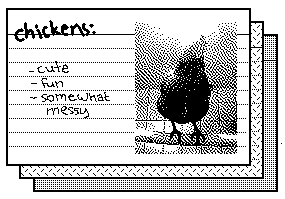

Decker cards can have _Widgets_; interactive elements like buttons:

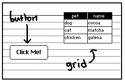

There are six types of widget in Decker:

- A _Button_ makes something happen when you click on it, like playing a sound or taking you to another card.
- A _Field_ contains text, either as a fixed label or an area you can type in.
- A _Slider_ represents a single number, chosen within a configurable range.
- A _Grid_ stores tabular data, like a little spreadsheet.
- A _Canvas_ stores an image, and can be drawn on, repositioned or hidden.
- A _Contraption_ is a combination of simpler widgets- see [Custom Widgets](#customwidgets).

Widgets are useful out of the box, but writing [scripts](#scripting) makes them much more powerful.

Using Decker
============
Decker always shows a menu bar across the top of the window. Most menus remain consistent, but some menus will appear or disappear contextually. Menu items showing a caret and a letter to the right (like `^q`) have a keyboard shortcut. Either "control" (PCs) or "command" (Macs) combined with this letter can be used to activate any such shortcut.

In most modal dialogs, the "escape" key will cancel or otherwise exit.

In order, the main menus are:

- _Decker_: global features and information, like toggling full-screen mode or exiting the application.
- _File_: information pertaining to the current deck, or importing and exporting other files.
- _Edit_: operations for altering the selected item, if any. Some options will change based on the selected _Tool_ (below).
- _Card_: operations for altering the current card or navigating between cards.
- _Tool_: choose between interacting with widgets, editing widgets, or drawing.
- _Help_: open links to reference documentation and useful websites. Maybe this is how you got here?

If you're exploring an existing deck, you will usually want to have the _Interact_ tool chosen, which allows you to click buttons and edit grids or fields. Widgets only produce [events](#events) and execute [scripts](#scripting) with this tool active.

With the _Interact_ tool chosen, pressing the left and right cursor keys will cycle between cards in the deck, as shortcuts for using _Card &#8594; Go To Previous_ and _Card &#8594; Go To Next_. Pressing tab or shift-tab will cycle forward or backward, respectively, between widgets on the current card. Pressing space or return with a button highlighted will have the same effect as clicking it. Fields and grids will offer additional menu options if they are selected.

With the _Widgets_ tool chosen, you can reposition and resize widgets, and create new widgets or modify their properties via options in the _Widgets_ menu. Click a widget to select it, or drag out a rectangle to select multiple widgets. Holding shift while clicking widgets will toggle their selection. Dragging selected widgets or will reposition them. You can also use the cursor keys to move selected widgets a single pixel at a time, or, in combination with shift, in grid steps. With a single widget selected, you can adjust its size with drag handles. With widgets selected, you can use the bracket keys (`[` and `]`) to bring objects forward or push them backward in drawing order.

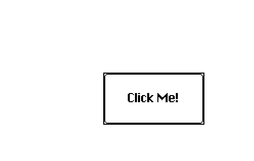

All of other tools relate to drawing on the card:

- _Select_: make rectangular selections to copy and paste images. Like the widgets tool, you can use the cursor keys to move a selection a single pixel at a time, or, in combination with shift, in grid steps. Hold shift while resizing selections to retain their original aspect ratio.
- _Lasso_: draw an arbitrarily-shaped selection to copy, paste, and reposition images. Like the widgets tool, you can use the cursor keys to move a selection a pixel at a time.
- _Pencil_: draw freehand, using the selected brush shape and pattern. (See _Style &#8594; Stroke..._ and _Style &#8594; Brush..._).
- _Line_: draw a straight line using the selected brush shape and pattern. Holding shift will snap to 45 degree angles.
- _Flood_: fill all pixels of the card background that are adjacent to the starting pixel and contain the same pattern. Right-clicking will use pattern 0 instead of "Stroke" color.
- _Box_: draw a rectangle using the selected brush shape and pattern. Holding shift will snap to a perfect square.
- _Filled Box_: like the box tool, but use the fill color (See _Style &#8594; Fill..._) for the interior.
- _Oval_: draw an oval using the selected brush shape and pattern. Holding shift will snap to a perfect circle.
- _Filled Oval_: like the oval tool, but use the fill color for the interior.
- _Polygon_: draw a filled shape, using the selected brush shape, pattern, and fill color. Note that if you don't want an outline you could simply make a selection with the Lasso tool and press "delete".

The F-keys on your keyboard are another way to switch between tools: F1 for Interact, F2 for Widgets, F3 for Select, and so on up to F12. Note that your operating system may reserve or overload some F-keys!

The _View_ menu will be available when the _Widgets_ or drawing tools are chosen:

- _Show Widgets_: Toggle displaying widgets on top of the card background while drawing.
- _Show Widget Bounds_: Toggle displaying a rectangular "bounding box" for each widget while editing.
- _Show Widget Names_: Toggle displaying the `name` property of each widget above it while editing.
- _Show Cursor Info_: Toggle displaying live numerical overlay of mouse position, offset, and selection bounds while editing.
- _Show Alignment Guides_: Toggle displaying indicators when the edges of a widget are aligned with other widgets on the card.
- _Show Grid Overlay_: Toggle displaying a configurable "graph paper" overlay while editing.
- _Snap to Grid_: Toggle making a number of tools discretize to the grid. This impacts the Select, Line, Box, Filled Box, Oval, and Filled Oval tools, as well as moving and resizing one widget at a time with the _Widgets_ tool.
- _Grid and Scale..._: Configure the width and height of the "cells" in the _Grid Overlay_, as well as the zoom scale in Fat Bits mode.
- _Show Animation_: Toggle animating the special patterns 28-31.
- _Transparency Mask_: Toggle displaying pattern 0 in a distinct color, revealing transparent elements. While the transparency mask is shown, using drawing tools with the first pattern will use pattern index 32 (opaque white) instead of the "true" pattern 0 (transparent white). Erasing with the pencil tool and deleting selections will still result in transparency.
- _Fat Bits_: Toggle displaying the card background zoomed-in, to aid in editing individual pixels.  Select the part of the card to zoom into with the _Select_ or _Lasso_ tool; in other cases, the center of the card is defaulted to.  In this mode, the cursor keys can be used to scroll the viewport and "escape" will exit Fat Bits mode.

The _Style_ menu will be available whenever drawing tools are chosen:

- _Stroke..._: Select a pattern for most drawing tools.
- _Fill..._: Select a background pattern used for the _Filled Box_ and _Filled Oval_ tool as well as empty space behind a deleted or moved selection.
- _Brush..._: Select a brush shape used for most drawing tools.
- _Color_: Toggle offering Decker's 16-color palette instead of its 28 1-bit drawing patterns. When enabled, imported images will be imported in 16 colors instead of dithered to 1-bit.
- _Transparency_: Toggle treating pattern 0 as transparent when moving selections. Also applies to imported and exported images!
- _Underpaint_: Toggle making all drawing tools leave pattern 1 alone. This is helpful for adding patterns or color "underneath" solid black lineart.
- _Tracing Mode_: Toggle drawing the Decker window in a semi-transparent fashion, to allow you to trace images underneath the window.

A number of shortcuts are available with any of the drawing tools selected:

- Pressing `m` toggles the visibility of Decker's main menu.
- Pressing `t` toggles transparency mode (_Style &#8594; Transparency_).
- Pressing `u` toggles underpaint mode (_Style &#8594; Underpaint_).
- Pressing `y` toggles tracing mode (_Style &#8594; Tracing Mode_).
- If you have imported a color image, you can press `j` or `k` to lighten or darken the image, respectively. This adjustment can only be performed while the box selection remains active.
- Pressing `9` or `0` will decrement or increment the current brush shape, respectively.
- Holding control or command while clicking will enter Fat Bits mode centered on the position you click, or exit Fat Bits mode.
- Right-clicking with any tool or holding shift before beginning a stroke will _erase_: this behaves like the pencil tool, but always draws using pattern 0.
- Middle-clicking (where available) with any tool will act like a pipette/eyedropper tool: set the stroke pattern to match the clicked pixel.

You can drag and drop files directly onto the Decker window, and it will take an appropriate action depending on the type of the file:

- `.html` or `.deck`: open the deck in the [Font/Deck Accessory Mover](#resources).
- `.gif`, `.png`, `.bmp`, `.jpg` or `.jpeg`: switch to the selection tool and paste the image onto the card. In "color" mode, Decker will posterize the image to the 16-color palette, and otherwise the image will be dithered to 1-bit.
- `.wav`: open the audio file in the [Audio Editor](#sound).
- `.csv`: switch to the widgets tool and create a new grid containing the data in the CSV file, as if parsed with `readcsv[text]`.
- `.psv`: switch to the widgets tool and create a new grid containing the data in the PSV file, as if parsed with `readcsv[text 0 "|"]`.
- `.hex`: attempt to import a newline-delimited series of hexadecimal `RRGGBB` palette colors. If 14 or fewer colors are provided, override patterns 33-46 and leave 32/47 (white and black) unchanged. Otherwise, make a best-guess attempt at selecting a "black" and "white" color from the provided palette and then place the next 14 colors into slots 33-46.

The Decker menu allows you to turn on "Touch Input", which modifies several aspects of the user interface to be more suitable for use on touch- or pen-based devices which may not have a physical keyboard:

- Nav Gestures: With the _Interact_ tool active, click anywhere outside a widget on the current card and drag in a cardinal direction until an arrow appears under your cursor. While the arrow is visible, releasing your drag will navigate to a card in that "direction", if any. Nav Gestures produce the same `navigate` event as the cursor keys, so their behavior can be modified by scripts on a per-deck or per-card basis.
- Touch Keyboard: An on-screen keyboard is provided whenever an editable field has focus, as well as in the script editor and some modal dialogs.

Decker automatically enables touch mode the first time it observes a touch event.

The _Decker &#8594; Toolbars_ menu item toggles the visibility of toolbars on the left and right edges of the display or window- use these interchangably with the _Tool_ and _Style_ menus. Or don't!

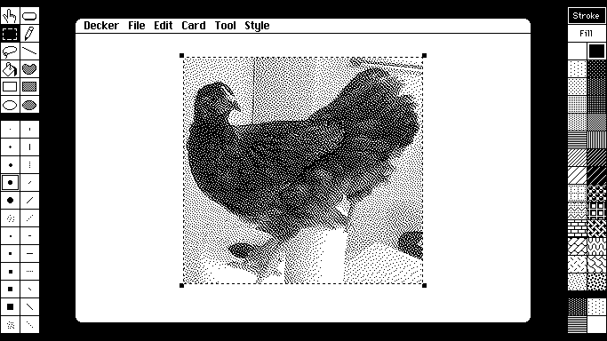


Web-Decker and Native-Decker
============================
Decker is available as a native application for MacOS, Linux, and Windows. If you save a deck with a `.html` extension, Decker produces a document that can be opened directly in a web browser- a self-contained "standalone deck". This web-based version of Decker can be referred to as "Web-Decker".

Web-Decker has generally the same tools and functionality as Native-Decker, but the constraints of running in a web browser require many small changes. Most importantly:

- Some keyboard shortcuts are unavailable, as they may be reserved by the web browser itself.
- Copying, cutting, and pasting from the keyboard _must_ be done using the native OS/Browser keyboard shortcuts. Copying and pasting using the menus may require you to confirm the action with a browser modal. When pasting via the keyboard, it _may_ be possible to paste images and sounds from the OS clipboard. Clipboard access is _very_ flaky and inconsistent between browsers: Web-Decker tries several strategies to interact with the OS clipboard, but if nothing works it will store clipboard contents in a local window-only clipboard instead, accessible via the browser console as the `local_clipboard` variable.
- Importing, reading, dragging and dropping, or pasting images and sounds supports _any_ graphics or audio formats understood by the web browser, which may include several formats Native-Decker does not understand.
- Opening or importing files uses the browser's native "Open" dialog instead of Decker's UI.
- Saving or exporting files _cannot_ display a file browser to choose a destination, so Web-Decker provides a simplified dialog which only prompts for a filename. For similar reasons there is no "Autosave" functionality, and `app.save[]` downloads a copy of the deck instead of saving in-place.
- Web-Decker does nothing if `app.exit[]` is called.
- Web-Decker sends output from `app.show[]` and `app.print[]` to `console.log()` instead of POSIX _stdout_.
- Web-Decker always fills the browser window. The toolbars are hidden by default, but can be toggled on (if space is available) from the _Decker_ menu.
- Web-Decker will always report `sys.platform` as `"web"`, irrespective of the operating system the browser is running on.
- The Web-Decker implementation of Lil uses the browser's garbage collector, so less information is available in `sys.workspace`.
- Most web browsers do not allow programs to play audio until the user has interacted with a page, so any `play[]` commands issued before a user has clicked, tapped, or pressed a keyboard key will have no effect.
- If Web-Decker is accessed via a URL containing a `#` suffix (as in a page anchor), it will attempt to `go[]` to the [URI-decoded](https://developer.mozilla.org/en-US/docs/Web/JavaScript/Reference/Global_Objects/decodeURI) suffix, making it possible to link to a specific card within a deck. In Native-Decker, the `--card` CLI flag offers similar functionality.
- Tracing Mode (_View &#8594; Tracing Mode_) is not available.
- [The Danger Zone](#thedangerzone) offers a different set of functionality.

In a nutshell, Web-Decker provides an excellent way to share your decks with other people, and a convenient way to play with Decker when you're unable or unwilling to install the native application. If you're making new decks, Native-Decker's saving functionality and keyboard shortcuts may provide a better experience. You can use both however you please- a deck is a deck!


The Widgets
===========
Let's take a look at each of Decker's widgets in detail.

Buttons
-------
Buttons are widgets that make something happen. They can have a variety of appearances:

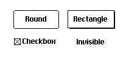

- _Rounded_ buttons are the default style.
- _Rectangular_ buttons have sharp corners and a shadowed bevel.
- _Checkbox_ buttons can be "on" or "off"; clicking them toggles the value.
- _Invisible_ buttons have no appearance (apart from their label text, if present). You can use these to make parts of the background of the card "clickable".

Double-clicking a newly created widget with the widgets tool, pressing space/enter, or choosing _Widgets &#8594; Properties..._ will open the property dialog for that widget. Every widget has its own property dialog for tuning relevant parameters.

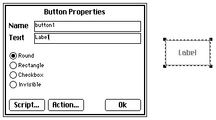

In this dialog, the "name" of the widget is an internal identifier used by [scripts](#scripting) for referring to the button. Giving your widgets meaningful names will make scripting a lot easier. Every widget type has a "name" property.

If you set a "shortcut" for a button (which may be a lowercase letter, a digit, or space), pressing and releasing that key on the keyboard will behave the same as clicking the button.

Clicking "Action..." brings up a special dialog that can help you give buttons behavior when you click on them:

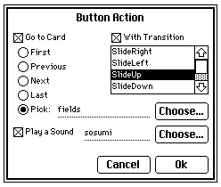

You can navigate to another card (relative to the current card or absolute), optionally with a transition animation, you can play a sound (perhaps recorded from your microphone or imported from an external file), or you can do both!

When you're finished, click "OK", and your button is ready to use with the interact tool. The "Action" dialog has written a script for you automatically, but you can see what it looks like by going back to the button properties dialog and clicking "Script...".

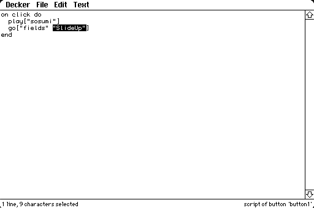

The script editor is another feature that is common to every widget type. When you open a blank script, a template will be automatically populated for you with various `on ... end` event handlers that can be filled in with whatever behavior you'd like. See [events](#events) for more information. When you're finished viewing or editing a script, close it with _File &#8594; Close Script_ or press escape. If your script has any syntax errors, you will be prompted to correct them or discard your changes.

You can also edit scripts for the card itself from the card properties dialog or _Card &#8594; Script..._.

If you enable "X-Ray Specs", you can see a simplified diagram of all the widgets on your card underneath the script. With X-Ray Specs on, holding Control or Command while clicking on a widget will switch to editing that widget's script, and clicking outside all widgets will switch to editing the card script.


Fields
------
Fields store text. They're useful both as _labels_ for items on a card and as a place for users to enter text.

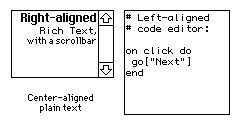

Like buttons, you can configure most of the settings for a field from its property dialog:

- _Rich Text_ fields can contain multiple fonts, inline images, and clickable hyperlinks.
- _Plain Text_ fields strictly contain text, with a single font.
- _Code_ fields are for representing code, and behave like the script editor. Note that unlike normal fields, pressing tab with the field active in interact mode will insert a tab character instead of cycling to the next widget on the card.

To modify the text in a field, use the interact tool and click inside to give it focus. Fields will supply an appropriate "Text" menu with extra editing commands when they're focused.

To make a field that a user isn't meant to modify, select the field with the widgets tool and lock it with _Widgets &#8594; Locked_. 

Rich text hyperlinks are only "clickable" when their field is locked. With scripting, a link can do anything a button can do when it's clicked, but by default if you use the name of a card as the link value, clicking the link will navigate to that card. If you use a URL, clicking the link will have Decker prompt you to open the URL in a web browser.


Sliders
-------
Sliders store numbers. They have a configurable minimum and maximum value (inclusive), and a _step_ size representing the smallest amount by which the slider can be changed. Like buttons, sliders come in several styles:

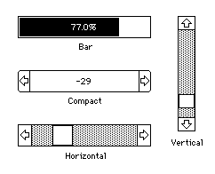

- _Horizontal_ sliders look like a horizontal scrollbar.
- _Vertical_ sliders look like a vertical scrollbar.
- _Bar_ sliders are a horizontal bar which fills from left to right to represent the value. These can work nicely as a progress bar.
- _Compact_ sliders are what some UI toolkits call a _spinner_: a numeric display of the value with buttons for incrementing or decrementing it by the step size. These are particularly useful for selecting within small ranges.

The "Bar" and "Compact" slider styles display the value as text, using a "format" string corresponding to the `format` primitive in the Lil programming language. Here are a few examples of format strings which might be useful:

- `%i`: an integer.
- `%f`: a floating-point (decimal) number.
- `%0.1f%%`: a floating-point number with one decimal place, followed by a "percent" sign, like `35.4%`.
- `%c`: currency, like `-$133.73`.
- `%02H`: a two-digit zero-padded uppercase hexadecimal number like `B5`.
- (an empty format string): don't display the value at all.


Grids
-----
Grids store tabular data.

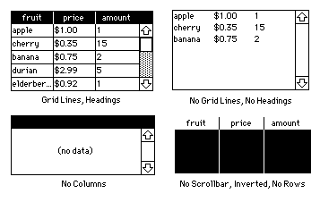

Grids can be drawn with or without column headers, with or without a scrollbar, and with or without grid lines. The "format" string is a sequence of characters which each control how values in one column will be displayed. The characters correspond to codes used by the `format` primitive in the Lil programming language, but take no parameters. The most useful are as follows:

- `s`: Plain string. The default.
- `u`: Uppercase string.
- `l`: Lowercase string.
- `b`: Boolean, shown as `true` or `false`.
- `f`: Floating-point number.
- `c`: Signed currency, with two decimal places, like `-$1.23`.
- `C`: Signed plain currency, with two decimal places, like `1.23`.
- `i`: Signed integer.
- `e`: Unix epoch int displayed as an [ISO-8601](https://en.wikipedia.org/wiki/ISO_8601) date-time.

Additionally, grids support a few special format codes:

- `L`: Lock. Format as a plain string (like `s`), but do not allow the user to edit cells in this column.
- `I`: Icon. Interpret the column as numeric and draw it using icons from the table below, and do not allow the user to edit cells in this column.
- `B`: Boolean Icon. Interpret the column as boolean and draw it as a check icon (true) or no icon (false).

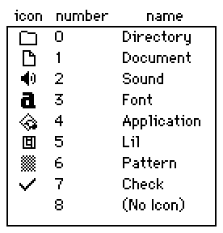

Numeric columns (format types `fcCihH`) are displayed right-aligned, and all other columns are displayed left-aligned.

For example, a grid containing a table with four columns given the format string `sfL` would display the first column as strings (`s`), the second column as floating-point numbers (`f`), the third column as a "locked" string column that cannot be edited (`L`), and since the fourth column does not have a format character specified it would _implicitly_ be formatted as a string column.

The grid properties dialog displays the contents of the grid's table encoded as JSON or CSV, and allows it to be edited directly. In JSON mode, tables will initially be shown as an object containing columns as lists (as given by the Lil `cols` operator), but the dialog also _accepts_ a list of objects or a list of lists (as accepted by the Lil `table` operator). In CSV mode, the table will be parsed and displayed based on the table's format string, if any. Switching modes will parse the table under the current representation and then re-format in the new representation.

In interact mode, you can select a particular row by clicking on it. If the grid is unlocked, you can additionally sort columns by clicking a header or edit a specific cell's value by double-clicking it. The user's input will be parsed based on the column's format type, if any. Double-clicking a boolean column (formatted as `b` or `B`) will directly toggle the value. Double-clicking a column formatted as `L` or `I` will have no effect. If the grid has headers and more than one column is displayed, you can drag the space between column headings to resize the columns. By default, every column is given equal horizontal space. You can restore default spacing by clicking "Reset Widths" in the grid properties dialog.

If a grid is set to "Select by Cell", clicking within the grid will highlight a specific cell, instead of an entire row. In this mode, the left and right arrow keys may be used to move between columns, and pressing space or return will edit the selected cell just like a double-click.

Additionally, you can use the _Edit &#8594; Query_ dialog to issue Lil queries against the contents of the grid, preview results, and update the grid if desired:

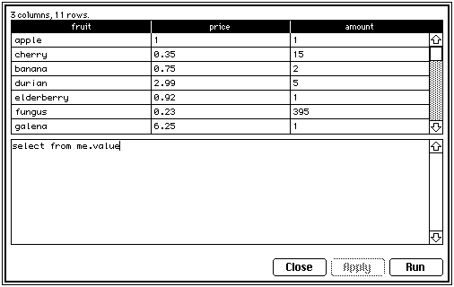

The query dialog is like a simpler, task-specific version of [the listener](#thelistener): type a Lil query, press shift+return or "Run" to execute it. The variable `me.value` references the data that is currently stored in the selected grid. Clicking "Apply" will store the results of your query in the grid.

You can use queries to filter down results:
```lil
select where amount>1 from me.value
```
Compute new columns:
```lil
update cost:price*amount from me.value
```
Make new tables from scratch:
```lil
insert name age hobby with
	"Alice"   23 "cryptography"
	"Bob"     25 "espionage"
	"Charlie" 17 "birdwatching"
end
```
Or a whole lot more! See the [Lil scripting language](lil.html) for details. The query script is executed exactly as if it were an event handler triggered on the selected grid widget.


Canvases
--------
A canvas is a rectangular widget that contains graphics. Canvases don't do very much on their own, or have much of an appearance on their own, but are very powerful in combination with scripts. See the [canvas interface](#canvasinterface) section for detail.

All widgets can be "shown" in one of four ways, configurable with the _Widgets_ menu: _None_, _Solid_, _Transparent_, or _Inverted_.

- _Show None_ widgets aren't drawn at all, and cannot be interacted with.
- _Show Solid_ widgets are drawn with an opaque background, generally pattern 0 (white).
- _Show Transparent_ widgets are drawn without a background, allowing other widgets or the card background to show through.
- _Show Invert_ widgets are generally drawn as white-on-black instead of black-on-white, making them suitable for display on top of a dark background.

The canvas widget has a special behavior for _Show Invert_: instead of being drawn in black-on-white, the pixels of the canvas will _invert_ the color of anything beneath them as by the Exclusive-OR (XOR) logical operation. Contraptions are similar: their background image is drawn like a canvas, and then any widgets that are part of the contraption are drawn on top, respecting their own internal `show` properties.

Keep in mind that a "Show None" widget is not the same thing as an "Invisible" button- invisible buttons are shown and interactive, they just don't look like anything! An Invisible button will normally invert its background while depressed, revealing its bounding box, but if it is set to "Show Transparent" it will be truly invisible except for any label text.

If you have an image in the clipboard, you can make a new canvas based on it by using _Edit &#8594; Paste as new Canvas_. This makes it easy to create "paper cutouts" that conceal part of a card and are hidden or revealed by scripts. You can likewise copy the image from a selected canvas to the clipboard to manipulate elsewhere with the drawing tools.

By default, if a canvas is unlocked, clicking and dragging on a canvas will allow the user to draw lines on it.


Contraptions
------------
A contraption is a "custom widget", built from simpler widgets, and defined in a _Prototype_. Contraptions can have almost any appearance, and may exhibit complex behaviors. Anywhere you have repetitive structure in a deck- like standardized forms, title cards in a presentation, or a heads-up-display for a game- you could use a contraption. Explore other people's decks; they might contain interesting contraptions you can use in your own creations!

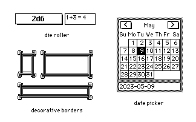

See the [Custom Widgets](#customwidgets) section for details on how to build and modify your own contraptions.

Cards
=====
The cards dialog can be found in _File &#8594; Cards..._, and provides an overview of the cards that make up the deck:

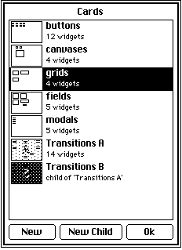

Clicking a card in the list will navigate to it immediately, and double-clicking will drill into its properties, allowing you to edit the card's name or script. You can also drag cards in the list or press shift and arrow keys together to reorder them.

Sound
=====
Buttons and scripts can play sound using the `play[]` built-in function. Several sounds can play at the same time. Sound is always stored at an 8khz sample rate, in mono, and individual sounds are capped at 10 seconds.

The sounds stored in the current deck can be listed with _File &#8594; Sounds..._

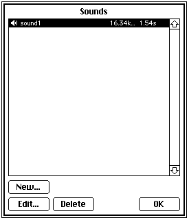

Double-clicking an item in this list will play a preview. Creating a new sound or editing an existing one will open the audio editor:

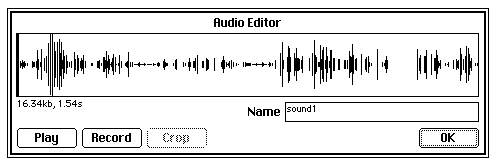

Dragging on the audio waveform will make a selection, which can then be cut, copied, cropped or cleared. Audio in the clipboard can be pasted, replacing the current selection. With a selection active, pressing "Play" will only play the selected region of the waveform.

Resources
=========
The Font/Deck Accessory mover is for transferring _resources_ between decks. You can open it with _File &#8594; Resources..._ or simply dragging and dropping the source deck onto the Decker window.

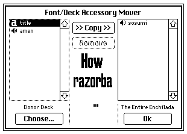

On the left is a list of resources in the _source_ deck, and on the right is a list of the resources in the _open_ deck. With a resource on the left selected, you can copy it into the open deck, and with a resource on the right selected you can delete it from the open deck. Selecting any resource will display a preview. Press "OK" or escape when you're finished.

Resources consist of:

- sounds.
- fonts, excluding the built-in fonts `menu`, `body`, and `mono`.
- contraption definitions.
- the pattern palette of the deck, if it has been customized from defaults.
- lil [modules](#modules) which extend Decker's capabilities.

The Listener
============
The Listener is a flexible tool for debugging scripts and performing bulk edits to a deck. You can toggle it with _Decker &#8594; Listener_. It appears as a small text box on the bottom edge of the display, with a scrolling command history:

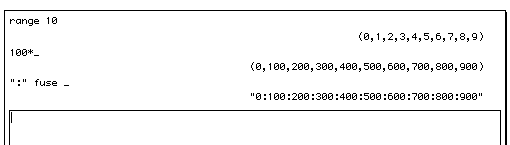

Type a Lil statement, such as `card.widgets`, and press shift+return or choose _Listener &#8594; Evaluate_ from the menu. Your input will appear left-justified, and the response from the Lil interpreter will appear right-justified beneath it. This sort of question-and-answer interaction with a programming language is sometimes called a Read-Evaluate-Print Loop (REPL). You can click on text you've entered previously in the command history to paste it into the text box.

The Listener automatically has access to a number of variables as context, depending on what you're doing when it is opened. The variable `me` will be bound as a _target_:

- If a single widget is selected with the widget tool, it is `me`.
- If the script editor is open for any widget, card, or the deck, the widget, card, or deck, respectively, will be `me`.
- Otherwise, `me` will be the current card.

The expressions you enter will be evaluated as if they were a suffix to the script of the target: they have access to `deck`, `card`, and any functions and variables defined in the target's script. As demonstrated in the examples above, the name `_` will be automatically bound to the value of the preceding expression, allowing you to chain together several step-by-step operations. You can view the contents of `_` as well as any local variables you've bound in the current Listener session by using the _Listener &#8594; Show Locals_ menu item.

If you are using the widget tool, the variable `selected` will contain a list of widget interfaces that are currently selected, allowing you to use code to manipulate parts of the deck programmatically. Consider, for example, re-titling the buttons in a selection with ascending numerals:

```lil
each b k i in selected
	b.text:i
end
```

While the listener is open, the name of every widget is drawn above it, for an easy at-a-glance reference. You can also enable these labels while using the widget tool with _Widgets &#8594; Widget Names_.

The [built-in functions](#built-infunctions) `show[]` and `print[]` can be used to log information to the Listener for later review. The `panic[]` function is like `show[]`, but it immediately halts any executing script and opens the Listener. The first argument to `panic[]`, if any, will be stashed in `_`, just like the result of an expression typed interactively; this mechanism can be used to retrieve any desired context from the `panic[]`ed scope.


Scripting
=========
A small amount of code can go a long way in Decker. Widgets, cards, and the deck itself can be given a _script_. Certain interactions with the deck, like clicking a button or altering a field, will trigger _events_. A script can define functions to respond to events and make something happen, like computing a value to place in a field, navigating to a different card, or drawing a plot on a canvas. Scripts are written in the [Lil](lil.html) programming language. Consult the Lil manual for details.

As a motivating example, consider a card containing a button and a field named `display`. The button has a script like:
```lil
on click do
	display.text: 3*display.text
end
```
Clicking the button will trigger a _click_ event. Since this script defines a function named `click`, it will have an opportunity to respond to that event. It accesses the text in `display` (which is available as a variable by name), multiplies it by three, and stores the result in the original field. Clicking the button several times in succession will repeat this action.

The most important thing to understand about Decker's scripting model is that _scripts are stateless_. When an event fires, scripts are invoked, and may manipulate both the deck and their own local or global variables as desired while running. However, _only_ changes to the deck itself will be persistent; Lil variables will always be reset to a known configuration when the next event fires.

Any data that needs to be preserved between events must be stored in widgets. Use widgets as an _embodied data model_: a visible, manipulable representation of your application's state. For example, fields can store plain or rich text (or arbitrary data encoded as XML or JSON), grids can store tabular or associative data, a canvas is a natural way to store an image, and a checkbox button is a natural way to store a boolean value. By avoiding "hidden" state, Decker avoids surprises and data loss when editing or saving a deck and its scripts. If an application _needs_ state that cannot be displayed to a user for some reason (like the answer to a guessing game), you can make invisible widgets, or place widgets on a out-of-the-way card.


Built-In Functions
==================
Decker provides a number of useful pre-defined functions:

| Name                   | Description                                                                                                               | Purpose    |
| :--------------------- | :------------------------------------------------------------------------------------------------------------------------ | :--------- |
| `show[...x]`           | Print a human-comprehensible representation of the value `x` to the Listener, and return `x`.                             | Listener   |
| `panic[...x]`          | Print a human-comprehensible representation of the value `x` to the Listener, and immediately halt the executing script.  | Listener   |
| `print[...x]`          | Display a string `x` in the Listener. (1)                                                                                 | Listener   |
| `play[x mode]`         | Play a sound. `x` can be either the name of a sound or a sound interface. (2)                                             | Decker     |
| `go[x y z]`            | Navigate to another card by _name_, _value_, or _index_ `x` with transition `y`, playing for `z` frames (3).              | Decker     |
| `transition[x]`        | Install a [transition](#transitions) `x` for use with `go[]`, and return a dictionary of installed transitions.           | Decker     |
| `brush[x y]`           | Install a [brush](#brushes) `x` for use with `canvas.brush`, and return a dictionary of installed brushes.                | Decker     |
| `sleep[x]`             | Wait for `x` 60hz frames before proceeding, minimum 1 frame. Allows for performing simple animation. (4)                  | Decker     |
| `array[x y]`           | Create a new [Array Interface](#arrayinterface) with size `x` and cast string `y`, or decode an array string `x`.         | System     |
| `image[x]`             | Create a new [Image Interface](#imageinterface) with size `x` (`(width,height)`), or decode an image string.              | System     |
| `sound[x]`             | Create a new [Sound Interface](#soundinterface) with a size or list of samples `x`, or decode a sound string.             | System     |
| `newdeck[x]`           | Create a new [Deck Interface](#deckinterface) from scratch, or decode an encoded deck string.                             | System     |
| `eval[x y z]`          | Parse and execute a string `x` as a Lil program, using any variable bindings in dictionary `y`. (5)                       | System     |
| `random[x y]`          | Choose `y` random elements from `x`. (6)                                                                                  | System     |
| `readcsv[x y d]`       | Turn a [RFC-4180](https://datatracker.ietf.org/doc/html/rfc4180) CSV string `x` into a Lil table with column spec `y`.(7) | Data       |
| `writecsv[x y d]`      | Turn a Lil table `x` into a CSV string with column spec `y`.(7)                                                           | Data       |
| `readxml[x]`           | Turn a useful subset of XML/HTML into a Lil structure.(8)                                                                 | Data       |
| `writexml[x fmt]`      | Turn a Lil structure `x` into an XML string, formatted with whitespace if `fmt` is truthy.(9)                             | Data       |
| `alert[text type x y]` | Open a modal dialog with the string or rtext `text`, and potentially prompt for input.(10)                                | Modal      |
| `read[type hint]`      | Open a modal dialog prompting the user to open a document, and return its contents (or `""`).(11)                         | Modal      |
| `write[x hint]`        | Open a modal dialog prompting the user to save `x`. Returns `1` if the file was saved successfully, `0` otherwise.(12)    | Modal      |

1) if `print[]` is provided more than one argument, the first argument will be interpreted as a _format string_, and each remaining argument will be treated as an element of a list of right arguments to `format`. The resulting string will then be printed on its own line. For example, `print["%s, %i" "first" 2]` is equivalent to `print["%s, %i" format ("first",2)]`.

2) if the second argument of `play[]` is the string `"loop"`, this function controls a "background" sound which will repeat indefinitely until it is stopped. Only one background sound can play at a time. If the first argument is the background sound that is already playing, this function will have no effect; the loop will continue unaffected. If the first argument is not a sound or a string giving the name of a sound, the background sound will be stopped. To summarize:
- `play[string]` play an ordinary sound once, looked up by name.
- `play[sound]` play an ordinary sound once.
- `play[string "loop"]` play a looped sound, looked up by name.
- `play[sound  "loop"]` play a looped sound.
- `play[0      "loop"]` stop the looped sound, if any.

3) If the target of `go[]` is a number, move to that card by index, counting from 0. If it is an instance of the card interface, navigate to the indicated card. If it is a string, it is either a special string or the name of a card. An invalid card name will cause no navigation. The special string `Next` moves to the next card (wrapping), `Prev` moves to the previous card (wrapping), `First` moves to the first card in the deck, `Last` moves to the last card in the deck, and `Back` moves to card that was active before the current card (if any), rolling back an internal navigation history. Removing or reordering cards in the deck will invalidate the history used by `Back`.

If the target of `go[]` begins with a URI protocol such as `http://`, `https://`, `ftp://`, `gopher://`, or `gemini://`, Decker will prompt the user for confirmation and then ask the operating system (or browser) to open an appropriate application (if any) to navigate to that URI. By design, there is no way to determine whether the user confirms, the OS finds an appropriate application, or the destination resouce is retrieved successfully. Opening a URI is strictly a _suggestion_, for user convenience, and not a means of accessing remote resources from a deck.

The transition `y`, should be the name of a transition function installed with `transition[]` (a string), one of the built-in transition animations (`"SlideRight"`, `"SlideLeft"`, `"SlideUp"`, `"SlideDown"`, `"WipeRight"`, `"WipeLeft"`, `"WipeUp"`, `"WipeDown"`, `"BoxIn"`, `"BoxOut"`), or a Lil function. Any other value will be ignored.

If specified, the transition time `z` is the number of frames (at 60 frames/second) the transition should take to complete, with a minimum of 1 frames. By default, transitions take 30 frames, or half a second.

4) If `sleep[]` is provided the string `"play"` as an argument, instead of waiting for some number of frames to pass, it will pause script execution until all sound clips triggered with `play[]` complete.

5) `eval[x y z]` returns a dictionary which may contain:
- `error`: a string giving any error message produced during parsing.
- `errorpos`: a pair giving a `(line,column)` position (both counting from 0) in `x` where any errors were encountered.
- `value`: the value of the last expression in the program. On a parse error, `value` will be nil.
- `vars`: a dictionary containing any variable bindings made while executing the program. (This also includes bindings from argument `y`.)

By default, code executed within `eval[]` does not have access to any variables from the caller that are not explicitly passed in via the second argument (`y`), including global functions and constants, nor can it modify variables of the caller; the code is executed in its own isolated scope. In the following example, we provide our `eval[]`ed code with the `show[]` function and a constant:
```lil
d.show:show
d.a:2
eval["show[a+3]" d]
```
If the third argument (`z`) is truthy, `eval[]` will instead execute _within_ the caller's scope, giving it the ability to read (and potentially write) every variable that was in scope at the point where `eval[]` was called. Use this with caution!

6) The behavior of `random[x y]` depends on the type of `x` and whether or not `y` is provided:
- if `x` is a number, treat it as if it were `range x`.
- if `x` is anything else, choose random elements from it.
- if `y` is missing, the result will be a single random element.
- if `y` is positive, choose a list of `y` random elements.
- if `y` is negative, choose a list of `|y|` random elements _without repeats_, provided sufficient elements in `y`.
- if `random[]` is called without any arguments, the result will be a single floating-point number between 0 and 1.

7) Column specs are strings in which each character indicates the type of a CSV column. `readcsv[]` and `writecsv[]` will ignore excess columns if more exist in the source data than in the column spec. Missing columns are padded with nil. If the column spec is not a string, these functions will read/write every column in the source data as strings. Any pattern type recognized by `parse` and `format` is permitted as a column spec character, but they are interpreted without flags or subsequent delimiters. Additionally, underscore (`_`) can be used in a column spec to skip a column. If a single-character delimiter `d` is provided, it is used instead of comma (`,`) between records.

8) `writexml[]` will convert anything which is not a dictionary, list, or _Array Interface_ into a string with the special characters (`"`,`'`,`<`,`>` and `&`) encoded as [XML entities](https://en.wikipedia.org/wiki/List_of_XML_and_HTML_character_entity_references#Predefined_entities_in_XML). Lists will be recursively converted and concatenated without inserting extra whitespace. Any _Array Interfaces_ will be interpreted as having cast `char` and embedded directly _without_ escaping XML entities; Arrays can thus be used as a way to produce arbitrary XML/HTML entities or insert text fragments that are already valid XML. Dictionaries will be interpreted as XML tags with the following keys:
- `tag`: the name of the XML tag.
- `attr`: a dictionary from tag attributes to string values. Values are entity-escaped and double-quoted.
- `children`: a list of child elements.

9) `readxml[]` is a soft, mushy, tolerant parser for a subset of XML which may also be useful for scraping information out of HTML fragments. The result will always be a list of dictionaries and strings, each representing an XML value in the same fashion as `writexml[]`. All tag names and attribute keys are converted to lowercase during parsing, for consistency. The XML prolog (`<?xml ...?>`) and extension/templating features (`<!...>`) are ignored. Entities not listed here- including all numeric entities- are left unchanged. Improperly-nested tags are handled in a best-effort fashion. This parser understands:

- Tags with lone, bare, single- or double-quoted attributes (`<foo lone bare=1 single='2' double="3">`). Lone attributes are interpreted as containing the value `1`, to make them truthy.
- Explicitly-closed or self-closing tags (`<foo></foo>`, `<bar/>`).
- Basic XML entities (`&quot;`,`&apos;`,`&lt;`,`&gt;`,`&amp;`) and `&nbsp;` in attribute values or body text.
- Comments (`<!-- skipped -->`) outside tags.
- Plain body text (`<foo>text</foo>`).
- [CDATA](https://en.wikipedia.org/wiki/CDATA) blocks (`<![CDATA[...]]>`) as body text.
- Child tags (`<foo><bar/><quux/></foo>`).
- Mixed body text and child tags (`<foo>one<bar/>two</foo>`).

10) `alert[text type x y]` blocks all script execution until the user dismisses the modal. It can prompt the user in several ways depending on the `type` argument, if provided:

- `"none"` (the default): Don't prompt the user for input and always return `1`.
- `"bool"`: Prompt the user with two buttons, "Cancel" and a verb given by `x` (or `"OK"`, by default). Return `1` if the verb-button is clicked, `0` on cancel.
- `"string"`: Prompt the user to enter a string. If `x` is present, use it as a default value. Return the input string.
- `"choose"`: Prompt the user to pick one element from a list or dictionary `x`, using `y` as a default value, if provided. If `x` is a dictionary. Return an element from `x`. If `x` is missing or empty, the user will _always_ be presented with the option `"0"`.

11) `read[type hint]` understands several types of file and will interpret each appropriately:

- Image files (`.gif`, `.png`, `.bmp`, `.jpg`, `.jpeg`) are read as _image interfaces_.
- Sound files (`.wav`) are read as _sound interfaces_.
- Deck files (`.deck`) are read as _deck interfaces_.
- anything else is treated as a UTF-8 text file and read as a string. A Byte-Order Mark, if present, is skipped. ASCII `\r` (Carriage-Return) characters are removed, tabs become a single space, "smart-quotes" are straightened, and anything else outside the range of valid DeckRoman characters becomes "unknown" (`�`).

The `type` argument allows you to specify the type of file(s) the user should be allowed to choose:

- `"array"`: any file. The result will be an _array_ interface with a default `cast` of `u8`.
- `"image"`: files with a `.gif`, `.png`, `.bmp`, `.jpg`, or `.jpeg` extension. The result will always be an _image interface_.
- `"sound"`: files with a `.wav` extension. The result will always be a _sound interface_.
- `"deck"`: files with a `.deck` or `.html` extension. The result will aways be a _deck interface_.
- `"text"`: files with a `.txt` or `.csv` extension. The result will always be a string.
- `"any"`: any file. The result may be an image, sound, or string.

If a sound file is unreadable (or the user cancels), it will be loaded as a sound with `size` `0`.

There are several possible `hint` arguments to control the interpretation of colors in an image:

- `"color"` (or no hint): convert to Decker's 16-color palette (patterns 32-47). Read only the first frame of an animated GIF.
- `"gray"`: convert to 256 grays based on a perceptual weighting of the RGB channels. Read only the first frame of an animated GIF.
- `"frames"`: 16 colors, but read all frames of an animated GIF.
- `"gray_frames"`: 256 grays, but read all frames of an animated GIF.

The `"frames"` or `"gray_frames"` hints will cause `read[]` of a GIF to return a dictionary containing the following keys:
- `frames`: a list of images.
- `delays`: a list of integers representing interframe delays in 1/100ths of a second.

If an image contains transparent pixels, they will be read as pattern 0.

12) `write[x hint]` recognizes several types of Lil value and will serialize each appropriately:
- _array interfaces_ are written as binary files. If `hint` is provided, use it as the file extension (for example `".png"`).
- _sound interfaces_ are written as a .WAV audio file, and a `.wav` extension will be appended to any filename without it.
- _image interfaces_ are written as GIF89a images, and a `.gif` extension will be appended to any filename without it.
- _deck interfaces_ are written as decks.
- A list of _image interfaces_ is written as an animated gif.
- A dictionary is written as an animated gif. The dictionary should contain the keys `frames` (a list of _image interfaces_) and `delays` (a list of integers representing interframe delays in 1/100ths of a second).
- anything else is converted to a string and written as a text file, using exactly the filename provided.


Constants
=========
Decker also provides pre-defined constants:

| Name            | Description                                                            |
| :-------------- | :--------------------------------------------------------------------- |
| `sys`           | An instance of the _system_ interface.                                 |
| `app`           | An instance of the _app_ interface.                                    |
| `bits`          | An instance of the _bits_ interface.                                   |
| `rtext`         | An instance of the _rtext_ interface.                                  |
| `pi`            | The ratio of a circle's circumference to its diameter. Roughly 3.141.  |
| `e`             | Euler's number; the base of the natural logarithm. Roughly 2.718.      |
| `colors`        | A dictionary of named pattern indices.                                 |

The `colors` dictionary defines named pattern indices for the default colors { `white`, `black`, `yellow`, `orange`, `red`, `magenta`, `purple`, `blue`, `cyan`, `green`, `darkgreen`, `brown`, `tan`, `lightgray`, `mediumgray`, `darkgray` }.


Interfaces
==========
Interfaces allow Lil programs to interact with deck resources and mutable data. They behave like opaque dictionaries: values may be accessed by indexing, and interfaces may also be assigned through. The `typeof` operator may be used to identify what kind of interface is at hand. Keys which expose simple data will be called _attributes_, and keys which expose functions will be called _methods_. Fields are read-only except when noted as "r/w" (read/write).

Decker's interfaces break down into several general categories:

- _Datatypes_ : [Font](#fontinterface), [Image](#imageinterface), [Sound](#soundinterface), [Array](#arrayinterface)
- _Utilities_ : [Bits](#bitsinterface), [System](#systeminterface), [App](#appinterface), [RText](#rtextinterface), [Pointer](#pointerinterface)
- _Deck Parts_ : [Deck](#deckinterface), [Card](#cardinterface), [Patterns](#patternsinterface), [Module](#moduleinterface), [KeyStore](#keystoreinterface), [Prototype](#prototypeinterface)
- _Widgets_ : [Button](#buttoninterface), [Field](#fieldinterface), [Slider](#sliderinterface), [Grid](#gridinterface), [Canvas](#canvasinterface), [Contraption](#contraptioninterface)

When describing methods and values, this document will use some conventions for brevity:
- `bool`: a number that is `0` or `1` (Boolean). 
- `int`: a number that is a whole integer (no decimal part), possibly negative.
- `pos`: a list of two ints indicating a horizontal (x) and vertical (y) offset in pixels, respectively.
- `size`: a list of two ints indicating a width and height in pixels, respectively.
- `anchor`: one of the following strings, used for describing relative layouts:

| | | |
| :- | :- | :- |
| `"top_left"`    | `"top_center"`    | `"top_right"`    |
| `"center_left"` | `"center"`        | `"center_right"` |
| `"bottom_left"` | `"bottom_center"` | `"bottom_right"` |

If an anchor argument is missing or invalid, `"top_left"` is used as a default.


System Interface
----------------
The _system_ interface exposes information about the Lil runtime. It is available as a global constant named `sys`.

| Name                       | Description                                                                                           |
| :------------------------- | :---------------------------------------------------------------------------------------------------- |
| `typeof x`                 | `"system"`                                                                                            |
| `x.version`                | Decker's version number as a string in `x.y` format.                                                  |
| `x.platform`               | The host operating system; one of {`"mac"`,`"unix"`,`"win"`,`"web"`,`"other"`}.                       |
| `x.seed`                   | The `random[]` number generator's numeric seed.(1)                                                    |
| `x.frame`                  | An integer that counts up every time a frame is rendered, at 60hz.                                    |
| `x.now`                    | The current GMT as a Unix epoch.                                                                      |
| `x.ms`                     | The current time in milliseconds- useful for timing intervals.                                        |
| `x.workspace`              | Dictionary of information about Lil's runtime memory usage.(2)                                        |

1) Assigning to `sys.seed` will initialize the random number generator behind the `random[]` function, causing it to produce consistent results thereafter.

2) Workspace statistics can provide some insight into performance, but all values should be taken as approximate- the act of retrieving this information will itself result in several allocations. Lil's garbage collector only runs periodically, so the number of truly "live" values at any given time may be lower than shown here.  The workspace dictionary contains:
- `allocs`: the number of Lil values which have been allocated.
- `frees`: the number of Lil values which have been freed.
- `gcs`: the number of garbage collection generations which have been carried out.
- `live`: the most recent count of the number of "live" (reachable) Lil values in the heap.
- `heap`: the size of Lil's heap, in value slots. This grows automatically as needed and shows a high-water mark.
- `depth`: the maximum observed stack depth so far, counting by activation records.


App Interface
-------------
The _app_ interface exposes control over the Decker application itself. It is available as a global constant named `app`.

| Name                       | Description                                                                                           |
| :------------------------- | :---------------------------------------------------------------------------------------------------- |
| `typeof x`                 | `"app"`                                                                                               |
| `x.fullscreen`             | Is Decker in fullscreen mode? On write, attempt to switch if possible; may not succeed. (r/w)         |
| `x.playing`                | If any audio is currently playing (not counting a background `loop`), `1`. Otherwise, `0`.            |
| `x.render[x]`              | Draw the visual appearance of card or widget `x` as an Image interface.                               |
| `x.save[]`                 | Save the current deck, in-place if possible. May prompt the user for a save location.                 |
| `x.exit[]`                 | Immediately close Decker without saving (see `x.save[]`).                                             |
| `x.show[...x]`             | Print a human-comprehensible representation of the value `x` to _stdout_, and return `x`.             |
| `x.print[...x]`            | Display a string `x` to _stdout_.                                                                     |

Note that `app.exit[]` doesn't do anything in Web-Decker. Exposing a button for closing Decker is very handy in locked decks, but you may want to hide or disable it when `sys.platform~"web"`.


Bits Interface
--------------
The _bits_ interface exposes utility routines for efficient bit-wise manipulation of 32-bit integers. It is available as a global constant named `bits`.

| Name                       | Description                                                              |
| :------------------------- | :----------------------------------------------------------------------- |
| `typeof x`                 | `"bits"`                                                                 |
| `x.or[...x]`               | Calculate the bit-wise OR  of two or more numbers or lists of numbers.   |
| `x.and[...x]`              | Calculate the bit-wise AND of two or more numbers or lists of numbers.   |
| `x.xor[...x]`              | Calculate the bit-wise XOR of two or more numbers or lists of numbers.   |

The `bits.and[]`, `bits.or[]` and `bits.xor[]` functions _conform_ scalar and vector arguments like Lil's built in arithmetic operators:
```lil
bits.and[3 (range 8)]    # (0,1,2,3,0,1,2,3)
         4%(range 8)     # (0,1,2,3,0,1,2,3)
```
If these functions are called with more than two arguments, each argument will be successively _reduced_ together. The following are equivalent:
```lil
bits.or[8 4 1]           # 13
bits.or[bits.or[8 4] 1]  # 13
```
If they are called with a _single_ argument, it will likewise be reduced:
```lil
bits.or[(8,4,1)]         # 13
```
Note that scalar-vector `bits.xor[]` can be used to perform a bit-wise NOT:
```lil
bits.xor[255 (range 8)]  # (255,254,253,252,251,250,249,248)
```


RText Interface
---------------
Rich text is a series of "runs" of text, each with its own formatting. Runs may contain a hyperlink or even an inline image. The field widget, `alert[]`, and canvas drawing functions understand rich text in addition to plain strings.

Rich text is represented as a table with columns `text`, `font`, and `arg`. The `text` column contains the text to draw for each run. The `font` column contains the name of the font for each run. If a `font` cell is not the name of a valid font, the run will use a default font instead. The `arg` column determines how each run will be drawn:

- if `arg` is an [image interface](#imageinterface), ignore the `text` and draw the image inline.
- if `arg` is a non-zero-length string, the run is a hyperlink. Hyperlinks are clickable if the field is `locked`, and clicking them will produce a `link` event with the contents of the corresponding `arg`.
- otherwise, the run is ordinary text.

The _rtext_ interface contains a number of helper routines for building and manipulating rtext tables. It is available as a global constant named `rtext`.

| Name                         | Description                                                                       |
| :--------------------------- | :-------------------------------------------------------------------------------- |
| `typeof rtext`               | `"rtext"`                                                                         |
| `rtext.end`                  | The end position of any rtext table.                                              |
| `rtext.make[text font arg]`  | Make a new single-row rtext table from `text`. `font` and `arg` are optional.     |
| `rtext.len[table]`           | The number of character positions in the text content of `table`.                 |
| `rtext.get[table x]`         | The row number of `table` containing character position `x`, or -1.               |
| `rtext.index[table (l,c)]`   | The character position of line `l` and column `c` of the text content of `table`. |
| `rtext.string[table (x,y)]`  | The text content of `table` between character positions `x` and `y`.              |
| `rtext.span[table (x,y)]`    | An rtext subtable containing content between character positions `x` and `y`.     |
| `rtext.split[delim table]`   | Break an rtext into a list of tables at instances of a delimiter string `delim`.  |
| `rtext.replace[table x y i]` | Replace every instance in `table` of `x` with `y`. If `i`, ignore case.           |
| `rtext.find[table x i]`      | Find every instance in `table` of `x`. If `i`, ignore case.                       |
| `rtext.cat[...x]`            | Concatenate rtext tables sequentially. Accepts any number of arguments.           |

Dictionary arguments to `rtext.cat[]` are promoted to tables, Image interfaces are turned into inline image spans, and any other arguments which are not already tables will be interpreted as strings and converted to text runs as by `rtext.make[x "" ""]`. Thus, with a single argument, `rtext.cat[]` can be used to _cast_ values to properly formed rtext tables. Sequential rows with matching `font` and (non-image) `arg` values will be coalesced together, and rows with empty `text` spans will be dropped.

Note that `rtext.index[]` measures lines and columns from 0, and only treats newline characters (`\n`) as starting a new line. In practice, rich text may additionally be word-wrapped to fit a field or other region, so _logical_ lines supplied here do not necessarily correspond to _visible_ lines as drawn with word-wrap.

The `rtext.replace[table x y i]` function expects `x` to be a key string or list of strings, which will be greedily matched against the text content of `table`. The argument `y` should be an rtext table or a list of such tables (or a string or list of strings). If more than one value is provided for both `x` and `y`, corresponding elements of `x` will be replaced with elements of `y`.

The `rtext.find[table x i]` function expects `x` to be a key string or list of strings, which will be greedily matched against the text content of the `table` (which may also be provided as a string). The result will always be a list of pairs of `(x,y)` character positions, each representing the start and end a span that was matched, consistent with input for `rtext.span[]`.

To measure the on-screen dimensions of an rtext, see `canvas.textsize[]`.


Pointer Interface
-----------------
The pointer interface represents the global state of the user's pointing device, such as a mouse, pen, or touchscreen. It is available as a global constant named `pointer`. Its attributes will update live at 60hz, even if a script is running. The coordinates of the pointer are always in "screen space"; pixels relative to the top-left corner of the card. If you want to compare pointer coordinates to the position of a widget, you should use `widget.offset` rather than `widget.pos`, to properly reflect the screen coordinates of widgets nested within contraptions or prototypes.

| Name       | Description                                                             |
| :--------- | :---------------------------------------------------------------------- |
| `typeof x` | `"pointer"`                                                             |
| `x.held`   | Bool. Is the pointing device held down?                                 |
| `x.down`   | Bool. Was the pointing device pressed since the last frame?             |
| `x.up`     | Bool. Was the pointing device released since the last frame?            |
| `x.pos`    | The `pos` of the pointing device on the current card.                   |
| `x.prev`   | The value of `x.pos` _before_ the most recent update.                   |
| `x.start`  | The `pos` where the pointing device was last pressed down.              |
| `x.end`    | The `pos` where the pointing device was last released.                  |


Deck Interface
--------------
The deck interface represents the global attributes of a Decker document. The open deck is available to Decker as a global constant named `deck`.

| Name              | Description                                                                                 |
| :---------------- | :------------------------------------------------------------------------------------------ |
| `typeof x`        | `"deck"`                                                                                    |
| `x.encoded`       | The content of this deck encoded as a string, suitable for decoding with `newdeck[]`.       |
| `x.version`       | Number. The version of the deck file format.                                                |
| `x.locked`        | Bool. Is this deck _locked_ (editing and drawing mode disabled)? r/w.                       |
| `x.name`          | String. A descriptive title for the deck. r/w.                                              |
| `x.author`        | String. The name of the author of the deck. r/w.                                            |
| `x.script`        | String. The Lil source code of the deck's script, or `""`. r/w.                             |
| `x.patterns`      | An instance of the _patterns_ interface.                                                    |
| `x.sounds`        | A dictionary of _sound_ interfaces stored in this deck, keyed by name.                      |
| `x.fonts`         | A dictionary of _font_ interfaces stored in this deck, keyed by name.                       |
| `x.cards`         | A dictionary of _card_ interfaces stored in this deck, keyed by name.                       |
| `x.card`          | The current _card_. Writing this attribute behaves the same as calling `go[x]`.             |
| `x.add[x y z]`    | Add a resource to this deck, and return it.                                                 |
| `x.remove[x]`     | Remove a resource, card, or widget from this deck. Returns 1 on success.                    |
| `x.copy[card]`    | Save a card and its contents as an opaque string starting with `%%CRD0`.                    |
| `x.paste[text]`   | Append a card and its contents from a `%%CRD0` string to this deck, returning the new card. |
| `x.purge[]`       | Reset the value-state of `volatile` widgets to their defaults.                              |
| `x.event[n ...x]` | Issue an event named `n` at this deck with argument(s) `x`.                                 |

`deck.add[x y z]` can add new cards, sounds, modules, prototypes and fonts to the deck:

- If `x` is a card, sound, or font interface, insert an exact copy of it using `y` as a name (or an appropriate default name).
- If `x` is a module or prototype and `y` is specified or no module/prototype of the same name exists in the deck, insert a copy of `x` as shown above. Otherwise, replace the existing module or prototype with `x`. The `version` of `x` is irrelevant; the same method may be used to "upgrade" or "downgrade" either resource.
- If `x` is `"card"`, insert a new blank card at the end of the deck, using `y` as a name (or an appropriate default name).
- If `x` is `"sound"`, insert a new sound, using an int `y` as a length (if present), and `z` as a name (or an appropriate default name).
- If `x` is `"font"`, insert a new font, using an int pair `y` as a size (if present), and `z` as a name (or an appropriate default name).
- If `x` is `"module"`, insert a new module, using `y` as a name (or an appropriate default name).
- If `x` is `"contraption"`, insert a new prototype, using `y` as a name (or an appropriate default name).

`deck.remove[x]` will conversely remove existing widgets, cards, sounds, modules, prototypes or fonts from the deck. The argument `x` must be an interface value. The built-in fonts may not be removed from a deck. Removing a font will adjust any existing widgets which use it as their `font` attribute with the built-in "body" font. Decks will always have at least one card; attempting to remove the final card will have no effect. Removing `patterns` will reset the deck's palette to the defaults. When a card or widget is removed from its deck, the interface becomes inert: it will ignore all reads and writes of attributes.

Patterns Interface
------------------
The patterns interface stores a global palette and set of 1-bit textures used by Decker itself, as well as the canvas widget. The open deck's patterns interface is available to Decker as a global constant named `patterns`. Any pattern aside from 0 (transparent) and 1 (solid black) may be altered on the fly. There are names for each of the default color slots starting at 32 in the global `colors` constant. The animated patterns (28, 29, 30 and 31) automatically cycle between their indices at 15hz.

| Name       | Description                                                     |
| :--------- | :-------------------------------------------------------------- |
| `typeof x` | `"patterns"`                                                    |
| `x[2-27]`  | An 8x8 _image interface_ comprised of patterns 0 and 1. r/w.    |
| `x[28-31]` | A list of up to 256 pattern indices for animated patterns. r/w. |
| `x[32-47]` | A 24-bit `RRGGBB` color represented as an int. r/w.             |

The default patterns and colors are as follows:

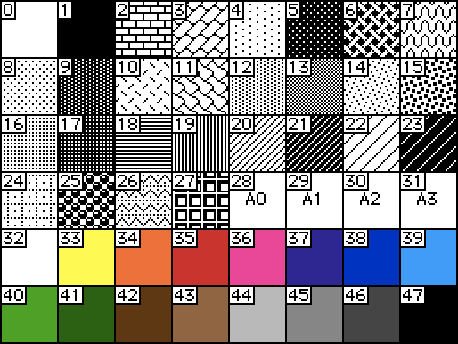

The following example overrides one of each type of palette entry:
```lil
patterns[12]:image["%%IMG0AAgACH6BpaWBmcN+"]    # a custom pattern from an image
patterns[28]:35,36,37,38,37,36                  # a sequence of pattern indices
patterns[38]:"%h" parse "FFDAB9"                # a hex-encoded 24-bit RGB color (peachpuff)
```


Array Interface
---------------
Arrays are dynamically created interfaces, each representing a mutable buffer of bytes that can be interpreted as a variety of machine-oriented integer _casts_. The `array[]` built-in function can be used to make a new array from scratch. Arrays are suitable for representing and manipulating binary files or as temporary storage when Lil's immutable collections are ill-suited to the task at hand.

```lil
a:array[4 "u8"] # make a new unsigned byte array of size 4
a[0,4]:65       # spread assignment of 65 to 4 bytes, starting at index 0
a.cast:"char"   # change interpretation of array to characters
a[0,4]          # read 4 characters, starting at index 0: "AAAA"
```

Every array has a _cast_ which controls how it is interpreted: signed or unsigned, 8-, 16- or 32-bit, and big- or little-endian packing, where appropriate:

| Cast     | Range                     | Description                        |
| :------- | :------------------------ | :--------------------------------- |
| `"u8"`   | 0...255                   | unsigned 8-bit int                 |
| `"i8"`   | -128...127                | signed 8-bit int                   |
| `"u16b"` | 0...65535                 | unsigned 16-bit int, big-endian    |
| `"u16l"` | 0...65535                 | unsigned 16-bit int, little-endian |
| `"i16b"` | -32768...32767            | signed 16-bit int, big-endian      |
| `"i16l"` | -32768...32767            | signed 16-bit int, little-endian   |
| `"u32b"` | 0...4294967295            | unsigned 32-bit int, big-endian    |
| `"u32l"` | 0...4294967295            | unsigned 32-bit int, little-endian |
| `"i32b"` | -2147483648...2147483647  | signed 32-bit int, big-endian      |
| `"i32l"` | -2147483648...2147483647  | signed 32-bit int, little-endian   |
| `"char"` | n/a                       | ASCII/DeckRoman character          |

While arrays do not benefit from the full range of operators Lil can bring to bear on lists and numbers, the array interface provides a number of useful methods for reading and writing data, including ways to perform efficient fills and copies.

| Name                   | Description                                                                                                              |
| :--------------------- | :----------------------------------------------------------------------------------------------------------------------- |
| `typeof x`             | `"array"`                                                                                                                |
| `x.encoded`            | The content of this array (and its _cast_) losslessly encoded as an opaque string, suitable for decoding with `array[]`. |
| `x.cast`               | A string indicating the interpretation of the content of this array. r/w.                                                |
| `x.size`               | The number of elements in this array, respecting the _cast_. r/w, unless the array is a _slice_ (see below).             |
| `x.here`               | An integer count of bytes from the beginning of this array used by `x.struct[]`. r/w.                                    |
| `x[offset]`            | Read one or more values, respecting the _cast_.                                                                          |
| `x[offset]:y`          | Write one or more values `y`, respecting the _cast_.                                                                     |
| `x.slice[offset cast]` | Create a lightweight view of a subset of this array, potentially with a different cast.                                  |
| `x.copy [offset cast]` | Create a new, distinct array by copying a subset of this array, potentially with a different cast.                       |
| `x.struct[shape x]`    | Read or write structured values starting at `here` and post-incrementing `here` based on `shape`.                        |
| `x.cat[...x]`          | Append one or more numbers, strings, lists, or arrays to this array, starting at and post-incrementing `here`.           |

Several parts of the array interface take an `offset` argument. An `offset` may be either a single number (an index from the beginning of the array), or a pair of numbers (an index from the beginning of the array and a length). A single index refers to reading or writing a single value, whereas an index and length refer to reading or writing multiple values. For reads, multiple numbers will be read as a list, and any number of `char`s will be read as a Lil string. For writes, any sort of listy value (list, string, or _array_) will be truncated or padded with 0 to fit the specified length, and a single number will be replicated to fill the specified length.

When reading or writing data interpreted as `char`, it will be converted into valid Lil strings, which are unable to represent many ASCII values, so some information will be lost, using the same UTF-8 conversions as `read[]` applied to a text file. If you need to preserve or generate arbitrary ASCII bytes, or any other string encoding, use the `u8` or `i8` casts instead!

The `struct[]` function is designed for progressively building or parsing a binary format. The `shape` argument is a dictionary from string names to _Type Specs_:

| Type Spec         | Description                                                                         |
| :---------------- | :---------------------------------------------------------------------------------- |
| `string`          | The name of a _cast_. 1 element of that type.                                       |
| `(string,number)` | The name of a _cast_ and a length. N elements of that type as a Lil list or string. |
| `number`          | A bitfield, interpreted as an unsigned number composed of 1 to 31 bits.             |
| `dictionary`      | A nested `shape`. Recursively specify more _Type Spec_ mappings.                    |

If only a shape is provided, `struct[]` will read each _Type Spec_ entry in `shape` in turn, starting at an offet in the array given by `here`, building up a result dictionary containing an identical set of keys and appropriate result values. Sequential bitfields are concatenated together, and any unaccounted bits in the final byte will be 0-padded or skipped when handling the next field. If a second argument is provided, `struct[]` will instead _write_ data: each key in the `shape` will look up a corresponding value in `x` and write it to the array. In either case, `here` will be incremented by the total size of the `shape` in bytes, allowing the next read or write to pick up where the previous left off. Manually modifying `here` can skip to a different section of the array as needed.

As an additional convenience, `struct[]` will accept a plain `string` or `(string,number)` _Type Spec_ as a shape, for reading or writing a single field at a time. Bitfields may not be read or written individually in this manner.

As an example of using `struct[]`, the following decodes the header of a [GIF89a](https://www.w3.org/Graphics/GIF/spec-gif89a.txt) image file (`src.gif`) and, if present, its global colortable:
```lil
bin:read["src.gif" "array"]

gif.magic      :"char",6  # "GIF89a" magic number.
gif.size       :"u16l",2  # (width,height) in pixels.
gif.gct.present:1         # flag: is there a global colortable?
gif.gct.res    :3         # color resolution (almost always 7; 8-bits per channel).
gif.gct.sorted :1         # flag: are the colors sorted by importance? (almost always zero).
gif.gct.size   :3         # number of entries in the global colortable.
gif.background :"u8"      # index of the background color.
gif.aspect     :"u8"      # pixel aspect ratio (almost always zero).

header: bin.struct[gif]
colors: bin.struct["u8",header.gct.present*3*2^header.gct.size+1]
```

The `cat[]` function can be viewed as a convenience wrapper for `struct[]` which makes it easier to concatenate together a series of values. Lists are interpreted as lists of numbers, all numbers are interpreted based on the `cast` of the destination array, strings are always interpreted as a series of `char` bytes, and appended arrays are interpreted based on their own `cast`. By the end of the following examples, `a`, `b`, and `c` contain equivalent data:
```lil
blob:array["%%DAT08J+SqQ=="]

a:array[0 "u16l"]
a.struct[("char",4) "TEXT"]
a.struct[("u16l",2) 345,9000]
a.struct[(blob.cast,blob.size) blob]

b:array[0 "u16l"]
b.cat["TEXT"]
b.cat[345,9000]
b.cat[blob]

c:array[0 "u16l"].cat["TEXT" 345,9000 blob]
```


Image Interface
---------------
Images are dynamically created interfaces, each representing a mutable rectangular buffer of pattern indices. The `image[]` built-in function can be used to make a new image from scratch.

| Name                   | Description                                                                                                              |
| :--------------------- | :----------------------------------------------------------------------------------------------------------------------- |
| `typeof x`             | `"image"`                                                                                                                |
| `x.encoded`            | The content of this image encoded as an opaque string, suitable for decoding with `image[]`.                             |
| `x.hist`               | A dictionary mapping the distinct patterns in this image to how many times they appear.                                  |
| `x.bounds`             | A dictionary containing the `pos` and `size` of a rectangle bounding the non-zero pixels (if any) of the image.          |
| `x.pixels`             | A list of lists of pattern indices of every pixel of the image. r/w.                                                     |
| `x.size`               | The `size` of the image in pixels. Resizing pads with `0` or truncates, as needed. r/w.                                  |
| `x[pos]`               | The pattern index of an (x,y) pixel of the image. Reads nil out of bounds, ignores out of bounds writes. r/w.            |
| `x.map[x y]`           | Replace every pixel of the image by indexing the dictionary `x`, using `y` as a default if provided.                     |
| `x.transform[x]`       | Update the image in place according to one of {`"horiz"`,`"vert"`,`"flip"`,`"left"`,`"right"`,`"dither"`}.               |
| `x.rotate[x]`          | Update the image in place, rotating it clockwise around its centerpoint by `x` radians.                                  |
| `x.translate[pos w]`   | Update the image in place, translating it by `pos` (x,y) pixels. If `w` is truthy, wrap the image at the edges.          |
| `x.scale[n a]`         | Update the image in place, nearest-neighbor scaling it by `n`, which can be a single number or `(x,y)` pair.             |
| `x.outline[p]`         | Update the image in place, setting pattern-0 pixels to pattern `p` when orthogonally adjacent to nonzero pixels.         |
| `x.merge[...x]`        | Consistent with `canvas.merge[]`: Replace every pixel of the image by compositing together images by index.              |
| `x.copy[pos size a]`   | Consistent with `canvas.copy[]`: grab and return a sub-image at `pos`/`size`, respecting anchor `a`.                     |
| `x.paste[image pos t]` | Consistent with `canvas.paste[]`: composite in another image at `pos`. If `t` is truthy, treat pattern 0 as transparent. |

The `image.hist` attribute can be used to efficiently calculate several properties of an image's palette:
```lil
count i.hist                                        # how many patterns appear in this image?
colors.red in i.hist                                # does this image contain any red pixels?
(list 0)~keys i.hist                                # is this image entirely blank?
3 limit extract key orderby value desc from i.hist  # what are the 3 most common patterns in this image?
```

The `image.bounds` attribute can be used to identify and trim empty areas from the edges of an image:
```lil
b:i.bounds
i.copy[b.pos b.size]
```
Many other useful variations are possible: selectively trimming individual edges, trimming one image based on a mask produced from another image, trimming several images to match one another, etc.

The `image.pixels` attribute is for bulk reads or writes of pixels. Reading will always produce a matrix (list-of-lists) of pattern indices. Writing will accept either a flat list of pixels, automatically wrapped to the dimensions of the image, or a matrix of pixels, which behaves as if the matrix were razed into a flat list. In either case, it is the caller's responsibility to ensure that the source data matches the dimensions of the image.

The `image.map[]` function is useful for re-paletting an image. For example, if we have an image `i` containing patterns 0 and 1, we could map them to red and green pixels, respectively, as follows:
```lil
i.map[(0,1) dict (colors.red,colors.green)]
```
Any other colors will stay the same, unless we provide a second argument with a "default fill":
```lil
i.map[(0,1) dict (colors.red,colors.green) colors.blue]
```
Some additional examples:
```lil
i.map[(() dict ()) 0]                           # replace all pixels with 0 (clear the image)
i.map[1,0]                                      # replace black with white, and white with black
image[i.size+4].map[() colors.red].paste[i 2,2] # add a 2 pixel red border around i
```

The `image.transform[x]` function modifies the entire image in place, depending on `x`:
- `"horiz"`: mirror the image horizontally, reversing the order of the pixels of each row.
- `"vert"`: mirror the image vertically, reversing the order of the pixels in each column.
- `"flip"`: transpose the image about the x/y axis, like the Lil `flip` operator on a list of lists.
- `"left"`: rotate the image 90 degrees to the left.
- `"right"`: rotate the image 90 degrees to the right.
- `"dither"`: dither a 256-gray image to 1-bit color, in patterns 0 and 1, using Bill Atkinson's algorithm.

Any other value will leave the image unchanged.

The `image.rotate[x]` function uses the [rotation by shearing](https://www.ocf.berkeley.edu/~fricke/projects/israel/paeth/rotation_by_shearing.html) method internally, and is therefore pixel-perfect and area-preserving. Repeated small rotations will accumulate distortion, but applying the same sequence of rotations in reverse will restore the original image.

The `image.scale[n a]` function takes an optional argument `a`. If `a` is present and truthy, the source image will be scaled to _result in_ an image of size `n`; otherwise (by default), the source image's original size will be multiplied by `n` to arrive at the final size:
```lil
image[10,20].scale[3,5 0] # the result will be 30x100 pixels
image[10,20].scale[3,5 1] # the result will be 3x5 pixels
```


Sound Interface
---------------
Sounds are dynamically created interfaces, each representing a mutable buffer of 8-bit signed 8khz monophonic waveform samples. The `play[]` function can play a sound, and the `sound[]` function can be used to make a new sound from scratch. The maximum length of a sound is 10 seconds.

| Name         | Description                                                                                                |
| :----------- | :--------------------------------------------------------------------------------------------------------- |
| `typeof x`   | `"sound"`                                                                                                  |
| `x.encoded`  | The content of this sound encoded as an opaque string, suitable for decoding with `sound[]`.               |
| `x.hist`     | A dictionary mapping the distinct sample values in this sound to how many times they appear.               |
| `x.size`     | An integer giving the number of samples in the sound. Resizing pads with `0` or truncates, as needed. r/w. |
| `x.duration` | A float giving the play time of the sound in seconds.                                                      |
| `x[y]`       | The value of sample `y`. Reads nil out of bounds, ignores out of bounds writes. r/w.                       |
| `x.map[x y]` | Replace every sample of the sound by indexing the dictionary `x`, using `y` as a default if provided.      |

The following example creates a new sound and then writes a 1 second long A-4 (440hz) sine wave to it:
```lil
s:sound[8000]
each x in range s.size
	s[x]:16*sin (440/8000)*2*pi*x
end
```

If a sound is indexed with a pair of numbers `(base,length)`, it will return a list of `length` samples, starting from the index `base`:
```lil
s[(10,5)]  # (123,118,114,112,112)
```

Conversely, if a sound is _assigned to_ with such a pair as the index, the region of the sound indicated will be _replaced_ by a list of samples given by the assignment value, expanding or shrinking the gap to suit the length of the replacement value.
```lil
s[(10,5)]:()                  # delete 5 samples starting at index 10, reducing the size of the sound by 5
s[(10,5)]:(11,22)             # replace 5 samples starting at index 10 with 2 samples, reducing the size of the sound by 3
s[(10,5)]:(11,22,33,44,55,66) # replace 5 samples starting at index 10 with 6 samples, increasing the size of the sound by 1
s[(10,0)]:(11,22)             # insert 2 samples starting at index 10, increasing the size of the sound by 2
```

The first example above could be rewritten without a loop as follows, taking advantage of the fact that `*`, `+`, and `sin` can be applied to an entire list at once:
```lil
s:sound[]
s[(0,0)]:16*sin (440/8000)*2*pi*range 8000
```

But the simplest way to create such a sound is to pass the list of samples directly to the `sound[]` function instead of a length:
```lil
s:sound[16*sin (440/8000)*2*pi*range 8000]
```

The `sound.hist` attribute can be used to efficiently calculate several properties of its samples:
```lil
(list 0)~keys s.hist  # is a sound entirely silent?
h:s.hist
max keys h            # maximum sample value
min keys h            # minimum sample value
```


Font Interface
--------------
Fonts are dynamically created interfaces, each representing the glyphs of a bitmapped variable-width typeface, for use with `canvas.text[]`. The font interface has a number of attributes:

| Name             | Description                                                                                   |
| :--------------- | :-------------------------------------------------------------------------------------------- |
| `typeof x`       | `"font"`                                                                                      |
| `x.size`         | A (width,height) pair giving the maximum size of any character in the font. r/w.              |
| `x.space`        | An integer giving the character spacing of the font in pixels. r/w.                           |
| `x.glyphs`       | A list of integers giving the ordinal indices of populated glyphs within the font.            |
| `x[0-255]`       | Access a copy of the glyphs of the font as Image interfaces, by ordinal index. r/w.           |
| `x["a"]` / `x.a` | Access a copy of the glyphs of the font as Image interfaces, by single-character value. r/w.  |
| `x.textsize[x]`  | Obtain a `size` for the outer dimensions of a string `x` when drawn in the font.              |

The glyph images of a font will always have the same height as the font, and represent the true width of the glyph without padding or spacing. Writing images to glyph slots will clip the image to respect the font's `size` as a maximum. Font glyphs are strictly monochrome- they may not contain patterns or colors. Accessing an invalid glyph index will return an empty image. Writes to invalid glyph indices are ignored. Writing nil, the number `0`, or an Image interface with width `0` to a glyph by index or character name will remove it from the font.

Decker comes with three built-in fonts:
- `body`, a variable-width body text font.
- `menu`, a variable-width bold font suitable for headings.
- `mono`, a monospaced font suitable for code or fixed-width layout.


Card Interface
--------------
The card interface gives access to the contents of a given card.

| Name              | Description                                                                                       |
| :---------------- | :------------------------------------------------------------------------------------------------ |
| `typeof x`        | `"card"`                                                                                          |
| `x.name`          | String. The name of the card. r/w.                                                                |
| `x.script`        | String. The Lil source code of the card's script, or `""`. r/w.                                   |
| `x.size`          | The `size` of this card in pixels.                                                                |
| `x.image`         | An _image_ interface representing the card's background. r/w.                                     |
| `x.widgets`       | A dictionary of widget interfaces on this card, keyed by name.                                    |
| `x.parent`        | The [Deck Interface](#deckinterface) containing this card.                                        |
| `x.index`         | The ordinal position of this card in the deck, counting from 0. r/w.                              |
| `x.add[x y z]`    | Add a widget to this card, and return it.                                                         |
| `x.remove[x]`     | Remove a widget `x` (or list/dict of widgets) from this card. Returns 1 on success.               |
| `x.copy[list]`    | Save a widget (or list/dict of widgets) on this card as an opaque string starting with `%%WGT0`.  |
| `x.paste[text]`   | Append the widgets within a `%%WGT0` string to this card, returning a list of the new widgets.    |
| `x.event[n ...x]` | Issue an event named `n` at this card with argument(s) `x`.                                       |

`card.add[x y]` can add a new widget to the card. If `x` is a string {`"button"`, `"field"`, `"slider"`, `"canvas"`, or `"grid"`}, insert a new widget of the appropriate type using `y` as a name (or an appropriate default name). If `x` is the string `"contraption"`, insert a new instance of the prototype with name `y` using `z` as a name (or an appropriate default name). If `x` is a widget interface, insert a copy of it, again using `y` as a name or an appropriate default.

When a widget is removed from its card, the interface becomes inert: it will ignore all reads and writes of attributes.

If `card.paste[]` is called with a string that contains a prototype definition with a newer `version` attribute than an existing prototype in the deck, the pasted definition will replace the existing one, upgrading all live contraption instances. If you wish to "downgrade" a prototype, see `deck.add[]`.


Button Interface
----------------
The button widget is a clickable button, possibly with a stateful checkbox.

| Name                    | Description                                                                                           |
| :---------------------- | :---------------------------------------------------------------------------------------------------- |
| `typeof x`              | `"button"`                                                                                            |
| `x.name`                | String. The name of this widget. r/w.                                                                 |
| `x.script`              | String. The Lil source code of the widget's script, or `""`. r/w.                                     |
| `x.locked`              | Bool. If true, the user cannot modify the value of this checkbox. r/w.                                |
| `x.animated`            | Bool. If true, this widget will be sent `view[]` events at 60hz while on the current card. r/w.       |
| `x.volatile`            | Bool. If true, this widget does not serialize its value-state when the deck is saved. r/w.            |
| `x.pos`                 | The `pos` of this widget relative to its container. r/w.                                              |
| `x.offset`              | The `pos` of this widget in screen coordinates.                                                       |
| `x.size`                | The `size` of the widget in pixels. r/w.                                                              |
| `x.show`                | Widget compositing mode; one of {`"solid"`, `"invert"`, `"transparent"`, `"none"`}. r/w.              |
| `x.font`                | The font used for drawing this widget. Can be set by font name or a font interface. r/w.              |
| `x.index`               | The ordinal position of this widget on the card, counting from 0. r/w.                                |
| `x.parent`              | The Card, Contraption or Prototype containing this widget.                                            |
| `x.text`                | String. The label shown on this button. r/w.                                                          |
| `x.value`               | Bool. Is this checkbox checked? r/w.                                                                  |
| `x.shortcut`            | String. A keyboard key which can be used as an alternative to pressing this button. r/w.              |
| `x.style`               | The style of button; one of {`"round"`, `"rect"`, `"check"`, `"invisible"`}. r/w.                     |
| `x.event[n ...x]`       | Issue an event named `n` at this widget with argument(s) `x`.                                         |
| `x.toggle[s v]`         | Toggle visibility of this widget between compositing mode `"none"` and `s`, iff `v`.                  |

The `toggle[]` function alters the `x.show` property of widgets:

- `x.toggle[]` sets the widget to show `"none"` if it isn't already, and otherwise sets it to `"solid"`.
- `x.toggle[s]` sets the widget to show `"none"` if it isn't already, and otherwise sets it to `s`.
- `x.toggle[s v]` sets the widget to show `"none"` if `v` is truthy and `v` is not the string `"none"`, and otherwise sets it to `s`.

In all cases, the `toggle[]` function returns the final value of `x.show`. This function makes a number of common scenarios for manipulating `x.show` simpler and more straightforward.

The `button.shortcut` attribute may be `""` (the default), or it may contain a single lowercase letter, digit, or space. If the keyboard key corresponding to such a character is pressed and released while in Interact mode (with no fields focused), the button will behave as if it were clicked. While it is technically possible to build simple purely keyboard-driven user interfaces in this manner by hiding the buttons, keep in mind that Decks may be used on tablet devices, kiosks, or phones which do not have a physical keyboard; this feature is intended as a _supplement to_ rather than a _replacement for_ ordinary buttons.


Field Interface
---------------
The field widget displays and possibly allows the editing of text.

| Name                    | Description                                                                                           |
| :---------------------- | :---------------------------------------------------------------------------------------------------- |
| `typeof x`              | `"field"`                                                                                             |
| `x.name`                | String. The name of this widget. r/w.                                                                 |
| `x.script`              | String. The Lil source code of the widget's script, or `""`. r/w.                                     |
| `x.locked`              | Bool. If true, the user cannot edit the text of this field. r/w.                                      |
| `x.animated`            | Bool. If true, this widget will be sent `view[]` events at 60hz while on the current card. r/w.       |
| `x.volatile`            | Bool. If true, this widget does not serialize its value-state when the deck is saved. r/w.            |
| `x.pos`                 | The `pos` of this widget relative to its container. r/w.                                              |
| `x.offset`              | The `pos` of this widget in screen coordinates.                                                       |
| `x.size`                | The `size` of the widget in pixels. r/w.                                                              |
| `x.show`                | Widget compositing mode; one of {`"solid"`, `"invert"`, `"transparent"`, `"none"`}. r/w.              |
| `x.font`                | The font used for drawing this widget. Can be set by font name or a font interface. r/w.              |
| `x.index`               | The ordinal position of this widget on the card, counting from 0. r/w.                                |
| `x.parent`              | The Card, Contraption or Prototype containing this widget.                                            |
| `x.text`                | String. The plain-text content of this field. r/w.                                                    |
| `x.images`              | List. Any inline Image interfaces that appear in the rtext content of this field. r/w.                |
| `x.data`                | Any. Lil values are encoded as text as by the `%J` pattern for `parse` and `format`. r/w.             |
| `x.value`               | Table. The rtext content of this field. r/w.                                                          |
| `x.scroll`              | Int. The number of pixels the viewport of the field is scrolled down. r/w.                            |
| `x.border`              | Bool. Draw an outline around this widget? r/w.                                                        |
| `x.scrollbar`           | Bool. Draw a scrollbar for this widget? r/w.                                                          |
| `x.style`               | The style of field; one of {`"rich"`, `"plain"`, `"code"`}. r/w.                                      |
| `x.align`               | The text alignment of the field; one of {`"left"`, `"center"`, `"right"`}. r/w.                       |
| `x.scrollto[x]`         | Scroll as needed to ensure that character position `x` of the field's text content is visible.        |
| `x.event[n ...x]`       | Issue an event named `n` at this widget with argument(s) `x`.                                         |
| `x.toggle[s v]`         | Toggle visibility of this widget between compositing mode `"none"` and `s`, iff `v`. (See [Button Interface](#buttoninterface)) |

If a field has a `style` other than `rich`, any rtext written to the `value` attribute will be coalesced into a single run of ordinary text with the default font.

See also: [rtext](#rtextinterface).

The `field.scrollto[x]` function accepts `x` as a character position, like most of the functions in the rtext interface. The `rtext.index[table (line,column)]` function can convert a logical line and column (as you might get in `eval[].errorpos`) to a character position. The `rtext.find[table key nocase]` function can find the spans within which any instances of a given keyword appear; the first of each such span is the character position where it begins. As a practical example, if we wanted to scroll a field `f` to ensure that the first instance of the string `"NEEDLE"` within it (case-insensitive) is visible, we might do something like:

```lil
s:first rtext.find[f.value "NEEDLE" 1] # the first match, if any
f.scrollto[first s]                    # the starting point of the matching span
```

The `field.data` and `field.images` attributes offer a convenient way to stash arbitrary Lil values (excluding functions and interfaces that are not an _Image_, _Sound_, or _Array_), or a list of Image values, respectively, in a Field. Note that reading `field.images` retrieves images _by reference_ from rtext content, whereas reading `field.data` always decodes a fresh copy of any contained images; the former is therefore more efficient when storing and retrieving large images.

When a Field widget has focus in Decker, it is generally not possible for scripts to modify its `.value` attribute; the user's in-progress input will take priority. The single exception to this is _clearing_ the field's contents with `x.value:""` (or an equivalent). If Decker's on-screen keyboard is active, clearing the focused field will additionally dismiss the on-screen keyboard. This feature can be used in combination with `change[]` and/or `run[]` event handlers to produce "command-line" interfaces in Decker, for applications like parser-based Interactive Fiction or programming REPLs like Decker's built-in Listener.


Slider Interface
----------------
The slider widget represents a single number, constrained within a configurable range.

| Name                    | Description                                                                                           |
| :---------------------- | :---------------------------------------------------------------------------------------------------- |
| `typeof x`              | `"slider"`                                                                                            |
| `x.name`                | String. The name of this widget. r/w.                                                                 |
| `x.script`              | String. The Lil source code of the widget's script, or `""`. r/w.                                     |
| `x.locked`              | Bool. If true, the user cannot change the value of this slider. r/w.                                  |
| `x.animated`            | Bool. If true, this widget will be sent `view[]` events at 60hz while on the current card. r/w.       |
| `x.volatile`            | Bool. If true, this widget does not serialize its value-state when the deck is saved. r/w.            |
| `x.pos`                 | The `pos` of this widget relative to its container. r/w.                                              |
| `x.offset`              | The `pos` of this widget in screen coordinates.                                                       |
| `x.size`                | The `size` of the widget in pixels. r/w.                                                              |
| `x.show`                | Widget compositing mode; one of {`"solid"`, `"invert"`, `"transparent"`, `"none"`}. r/w.              |
| `x.font`                | The font used for drawing this widget. Can be set by font name or a font interface. r/w.              |
| `x.index`               | The ordinal position of this widget on the card, counting from 0. r/w.                                |
| `x.parent`              | The Card, Contraption or Prototype containing this widget.                                            |
| `x.value`               | Number. The numeric content of this slider. r/w.                                                      |
| `x.step`                | Number. The minimum change to the value when manipulating this slider. Must be greater than 0. r/w.   |
| `x.interval`            | A list of numbers giving a minimum and maximum for the value, inclusive. r/w.                         |
| `x.format`              | A `format` string controlling how the value is shown in `"bar"` or `"compact"` styles. r/w.           |
| `x.style`               | The style of slider; one of {`"horiz"`, `"vert"`, `"bar"`, `"compact"`}. r/w.                         |
| `x.event[n ...x]`       | Issue an event named `n` at this widget with argument(s) `x`.                                         |
| `x.toggle[s v]`         | Toggle visibility of this widget between compositing mode `"none"` and `s`, iff `v`. (See [Button Interface](#buttoninterface)) |

Grid Interface
--------------
The grid widget represents an interactive spreadsheet-style view of a table.

| Name                    | Description                                                                                           |
| :---------------------- | :---------------------------------------------------------------------------------------------------- |
| `typeof x`              | `"grid"`                                                                                              |
| `x.name`                | String. The name of this widget. r/w.                                                                 |
| `x.script`              | String. The Lil source code of the widget's script, or `""`. r/w.                                     |
| `x.locked`              | Bool. If true, the user cannot select a row of the grid. r/w.                                         |
| `x.animated`            | Bool. If true, this widget will be sent `view[]` events at 60hz while on the current card. r/w.       |
| `x.volatile`            | Bool. If true, this widget does not serialize its value-state when the deck is saved. r/w.            |
| `x.pos`                 | The `pos` of this widget relative to its container. r/w.                                              |
| `x.offset`              | The `pos` of this widget in screen coordinates.                                                       |
| `x.size`                | The `size` of the widget in pixels. r/w.                                                              |
| `x.show`                | Widget compositing mode; one of {`"solid"`, `"invert"`, `"transparent"`, `"none"`}. r/w.              |
| `x.font`                | The font used for drawing this widget. Can be set by font name or a font interface. r/w.              |
| `x.index`               | The ordinal position of this widget on the card, counting from 0. r/w.                                |
| `x.parent`              | The Card, Contraption or Prototype containing this widget.                                            |
| `x.value`               | The table displayed in this grid. r/w.                                                                |
| `x.headers`             | Bool. Display table header row? r/w.                                                                  |
| `x.scrollbar`           | Bool. Draw a scrollbar for this widget? r/w.                                                          |
| `x.lines`               | Bool. Draw grid lines for this widget? r/w.                                                           |
| `x.bycell`              | Bool. Allow selection by cell, rather than only by row? r/w.                                          |
| `x.widths`              | A list of up to 255 widths of table columns, in pixels. r/w.                                          |
| `x.scroll`              | Int. The first row of the table to display. r/w.                                                      |
| `x.row`                 | Int. The index of the selected row of the table, or -1 for no selection. r/w.                         |
| `x.col`                 | Int. The index of the selected column of the table, or -1 for no selection. r/w.                      |
| `x.colname`             | String. The name of the selected column of the table, or nil for no selection. r/w.                   |
| `x.cell`                | Access `(x.col,x.row)` as a pair. r/w.                                                                |
| `x.rowvalue`            | Dict. The selected row of the table, or an empty dictionary for no selection. r/w.                    |
| `x.cellvalue`           | Anything. The selected cell value of the table, or nil for no selection. r/w.                         |
| `x.format`              | String. A column spec for formatting columns of the table. See `writecsv[]`. r/w.                     |
| `x.scrollto[r]`         | Scroll as needed to ensure that row `r` of the grid is visible.                                       |
| `x.event[n ...x]`       | Issue an event named `n` at this widget with argument(s) `x`.                                         |
| `x.toggle[s v]`         | Toggle visibility of this widget between compositing mode `"none"` and `s`, iff `v`. (See [Button Interface](#buttoninterface)) |

Note that both `grid.col` and `grid.cell` accept writes with the column specified _either_ by name or by index. An invalid column name or `-1` will clear the column selection.

Canvas Interface
----------------
The canvas widget represents a mutable drawing surface.

Like all other widgets, the `size` attribute of a canvas indicates the space it takes up on a card. Canvases also have an `lsize` (_logical_ size): the number of pixels stored internally for drawing. If `scale` is 1.0 (the default), the `size` and `lsize` are the same. Otherwise, the logical size of the canvas will be the size of the widget divided by the scale, rounding up to the nearest pixel. Modifying `scale` or `size` updates `lsize`, and modifying `lsize` will change `size`, respecting `scale`.

The canvas will scale _up_ logical pixels to display them on the card (resulting in a larger image), and the positions supplied by events (`click`, `drag`, and `release`) sent to the canvas will be scaled _down_, mapping them to the logical size. The main purpose of `scale` is to make it easy to show a zoomed-in canvas that a user can interact with and draw on directly.

| Name                    | Description                                                                                                       |
| :---------------------- | :---------------------------------------------------------------------------------------------------------------- |
| `typeof x`              | `"canvas"`                                                                                                        |
| `x[pos]`                | The pattern index of an (x,y) pixel of the canvas. Reads `0` out of bounds, ignores out of bounds writes. r/w.    |
| `x.name`                | String. The name of this widget. r/w.                                                                             |
| `x.script`              | String. The Lil source code of the widget's script, or `""`. r/w.                                                 |
| `x.locked`              | Bool. If false, the user can draw on this canvas in the current brush and pattern. r/w.                           |
| `x.animated`            | Bool. If true, this widget will be sent `view[]` events at 60hz while on the current card. r/w.                   |
| `x.volatile`            | Bool. If true, this widget does not serialize its value-state when the deck is saved. r/w.            |
| `x.pos`                 | The `pos` of this widget relative to its container. r/w.                                                          |
| `x.offset`              | The `pos` of this widget in screen coordinates.                                                                   |
| `x.show`                | Widget compositing mode; one of {`"solid"`, `"invert"`, `"transparent"`, `"none"`}. r/w.                          |
| `x.border`              | Bool. Draw an outline around this widget? r/w.                                                                    |
| `x.draggable`           | Bool. Allow the user to reposition this widget by dragging it in interact mode? r/w.                              |
| `x.size`                | The `size` of the canvas widget in pixels. r/w.                                                                   |
| `x.lsize`               | the _logical_ `size` (before scaling) of the canvas in pixels. r/w.                                               |
| `x.scale`               | The scaling factor of the canvas. r/w.                                                                            |
| `x.brush`               | The current brush index, used by `canvas.line[]` and `canvas.box[]`. Write accepts the _name_ of a custom brush.  |
| `x.pattern`             | The current drawing pattern, used by all drawing operations. r/w.                                                 |
| `x.font`                | The current drawing font. Can be set by font name or a font interface. r/w.                                       |
| `x.index`               | The ordinal position of this widget on the card, counting from 0. r/w.                                            |
| `x.parent`              | The Card, Contraption or Prototype containing this widget.                                                        |
| `x.clip[pos size a]`    | Restrict drawing to within the rectangle given by `pos`/`size`. If no args provided, unclip.                      |
| `x.clear[pos size a]`   | Erase a rectangle given by `pos`/`size` using pattern 0. if no args provided, clear the whole canvas.             |
| `x.rect[pos size a]`    | Fill a rectangle given by `pos`/`size` with the drawing pattern.                                                  |
| `x.invert[pos size a]`  | Invert the white and non-white pixels within the rectangle given by `pos`/`size`.                                 |
| `x.box[pos size a]`     | Draw a a rectangular outline given by `pos`/`size` with the current pattern and brush.                            |
| `x.fill[pos]`           | Flood-fill using the drawing pattern starting from `pos`.                                                         |
| `x.line[...x]`          | Draw a line connecting two or more points. If only a single point is given, draw a single instance of the brush.  |
| `x.poly[...x]`          | Draw a filled polygon.                                                                                            |
| `x.merge[...x]`         | Composite images by index based on the contents of the canvas.                                                    |
| `x.text[x pos a]`       | Draw a string or rtext `x` at `pos`, from an anchor position `a`.                                                 |
| `x.textsize[x w]`       | Obtain a `size` for the outer dimensions of a string or rtext `x`, optionally wrapped to width `w`.               |
| `x.copy[pos size a]`    | Grab an _image_ at `pos`/`size`.                                                                                  |
| `x.paste[img pos t]`    | Draw an _image_ at `pos`. If `t` is truthy, treat pattern 0 as transparent.                                       |
| `x.segment[img rect m]` | Draw an _image_ scaled to fit `rect`, based on margins `m`. Treat pattern 0 as transparent.                       |
| `x.event[n ...x]`       | Issue an event named `n` at this widget with argument(s) `x`.                                                     |
| `x.toggle[s v]`         | Toggle visibility of this widget between compositing mode `"none"` and `s`, iff `v`. (See [Button Interface](#buttoninterface)) |

The `canvas.line[]` and `canvas.poly[]` functions can take any number of arguments, which may `(x,y)` points, or lists of `(x,y)` points. For example, either of the following would draw an identical small triangle:
```lil
c.poly[(7,-3) (1,6) (10,9)]
c.poly[(list 7,-3),(list 1,6),(list 10,9)]
```

The `canvas.merge[]` function takes any number of images (or one list of images) as arguments and updates every pixel on the canvas (respecting `canvas.clip[]`) by treating the pattern at that pixel as an index into the set of provided images. Pattern indices in the original canvas with no corresponding image are set to 0. If any of the provided images are smaller than the canvas, they are tiled horizontally and vertically as needed. For example, given the four canvases shown below, the mask drawn in `before` using patterns 0 and 1 is used to merge together the images in `a` and `b`:
```lil
after.clear[]
after.paste[before.copy[]]
after.merge[a.copy[] b.copy[]]
```
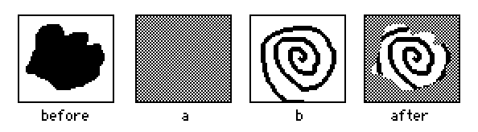

If the first argument to `canvas.merge[]` is a single-character string consisting of one of Lil's primitive arithmetic or logical operatiors (`+ - * & | < > =`), it will apply that operator between the pixel on the canvas and the corresponding pixel from the second argument image (truncating or repeating it to match) and update the canvas in-place. This permits many interesting types of blending:
```lil
after.merge["+" b.copy[]]
```

If the `pos` argument to `canvas.text[]` is a list of four coordinates instead of two, it is interpreted as the dimensions `(x,y,width,height)` of a rectangle. In this case, the string `x` will be automatically wrapped (preferring line breaks at whitespace) to fit in this rectangle, with overflow elided with a trailing ellipsis. If provided, the anchor `a` will control the alignment of the text within this rectangle. If `x` is an rtext table and `pos` is _not_ a rectangle, the anchor `a` is ignored, text is drawn top-left aligned, and lines are _not_ automatically wrapped.

If the `pos` argument to `canvas.paste[]` is a list of four coordinates instead of two, it is interpreted as the dimensions `(x,y,width,height)` of a rectangle. In this case, the `image` will be drawn scaled to fit that rectangle, using nearest-neighbor sampling. For example, to draw an image `i` in the top-left corner of the canvas at 2x scale:

```lil
c.paste[i (0,0),2*i.size]
```

The `canvas.segment[img rect m]` function interprets margins (`m`) like the background image of a [Prototype](#prototypeinterface): offsets inward from the left, top, right, and bottom edge of the rectangle, logically dividing it into 9 regions. The four corners retain their original size. The left and right center regions are repeated (or truncated) vertically, the top and bottom center regions are repeated (or truncated) horizontally, and the centermost region is repeated (or truncated) horizontally _and_ vertically.


Contraption Interface
---------------------
Contraptions are custom widgets, defined in a [Prototype](#prototypeinterface). See the [Custom Widgets](#customwidgets) section for more detail.

| Name                    | Description                                                                                           |
| :---------------------- | :---------------------------------------------------------------------------------------------------- |
| `typeof x`              | `"contraption"`                                                                                       |
| `x.name`                | String. The name of this widget. r/w.                                                                 |
| `x.script`              | String. The Lil source code of the widget's script, or `""`. r/w.                                     |
| `x.image`               | An _image_ interface representing the contraption's background, inherited from its Prototype.         |
| `x.locked`              | Bool. Behavior of this property is entirely up to the Prototype. r/w.                                 |
| `x.animated`            | Bool. If true, this widget will be sent `view[]` events at 60hz while on the current card. r/w.       |
| `x.volatile`            | Bool. Behavior of this property is entirely up to the Prototype. r/w.                                 |
| `x.pos`                 | The `pos` of this widget relative to its container. r/w.                                              |
| `x.offset`              | The `pos` of this widget in screen coordinates.                                                       |
| `x.size`                | The `size` of the widget in pixels. r/w.                                                              |
| `x.show`                | Widget compositing mode; one of {`"solid"`, `"invert"`, `"transparent"`, `"none"`}. r/w.              |
| `x.font`                | The font used for drawing this widget. Can be set by font name or a font interface. r/w.              |
| `x.index`               | The ordinal position of this widget on the card, counting from 0. r/w.                                |
| `x.parent`              | The Card containing this widget.                                                                      |
| `x.def`                 | The Prototype of this contraption.                                                                    |
| `x.event[n ...x]`       | Issue an event named `n` at this widget with argument(s) `x`.                                         |
| `x.toggle[s v]`         | Toggle visibility of this widget between compositing mode `"none"` and `s`, iff `v`. (See [Button Interface](#buttoninterface)) |

Contraption interfaces may expose additional attributes. Reads or writes to properties aside from those listed above (such as `.zami`) will invoke the `script` of the Prototype corresponding to this Contraption, calling either a function `get_zami` on a read, or `set_zami` (with a value) on a write. Inside an attribute handler both `me` and `card` are bound to the target Contraption instance, for consistency with event handlers.


Module Interface
----------------
Modules are chunks of reusable Lil code. See the [modules](#modules) section for more detail.

| Name                    | Description                                                                                             |
| :---------------------- | :------------------------------------------------------------------------------------------------------ |
| `typeof x`              | `"module"`                                                                                              |
| `x.name`                | String. The name of this module. r/w.                                                                   |
| `x.data`                | A _keystore_ interface containing supplemental storage for this module. (See below.)                    |
| `x.description`         | String. A human-readable description of the purpose of this module. r/w.                                |
| `x.version`             | Number. The revision number of this module. Higher numbers are considered "newer". r/w.                 |
| `x.script`              | String. The Lil source code of the module's script. r/w.                                                |
| `x.value`               | Dictionary. The contents of the module as returned by the final expression in the `script`.             |
| `x.error`               | String. If there was a problem initializing this module, a description of the problem. Otherwise, `""`. |

Whenever a module's `script` attribute is modified (or when a module is instantiated by loading a deck or copying it from another deck), the script is executed. Module scripts have access to all of Decker's usual [constants](#constants) and [built-in functions](#built-infunctions), as well as a reference (named `data`) to the module's _keystore_, but do _not_ have access to the deck interface unless it is provided to the module explicitly via function arguments.

If the script executes successfully, the final expression's value is cast to a dictionary and exposed as the module's `value` attribute. If anything goes wrong, an error message is exposed as the module's `error` attribute.

Module scripts are given a small amount of time to execute; if this limit is exceeded, Decker will assume the script is malformed and halt it, indicating the failure with an `error` message: "initialization took too long."

KeyStore Interface
------------------
Modules each have a _keystore_, which behaves much like a mutable dictionary of supplementary data. The contents of the keystore is serialized along with the module whenever a deck is saved or a module is copied.

| Name                    | Description                                                                                            |
| :---------------------- | :----------------------------------------------------------------------------------------------------- |
| `typeof x`              | `"keystore"`                                                                                           |
| `x.keys`                | List of strings. Every key in this store with an associated value. Read-only.                          |
| `x[key]`                | Get the data associated with a string `key`.                                                           |
| `x[key]:y`              | Set data associated with a string `key` to `y`.                                                        |

A keystore is subject to several constraints:

- Keys are coerced to strings.
- Since it has a special meaning (above), the key `"keys"` cannot be used for storing data.
- Values must be recursively composed of LOVE-compatible data: numbers, strings, lists, dictionaries, tables, or _Image_, _Sound_, or _Array_ interfaces. Other values will be converted to nil.
- Setting a value to nil will remove the key-value binding from storage.

Prototype Interface
-------------------
Prototypes are definitions from which [Contraptions](#contraptioninterface) are made. See the [Custom Widgets](#customwidgets) section for more detail. Note that the structure of a Prototype is very similar to a [Card](#cardinterface).

| Name                    | Description                                                                                            |
| :---------------------- | :----------------------------------------------------------------------------------------------------- |
| `typeof x`              | `"prototype"`                                                                                          |
| `x.name`                | String. The name of the Prototype. r/w.                                                                |
| `x.description`         | String. A human-readable description of the purpose of this Prototype. r/w.                            |
| `x.version`             | Number. The revision number of this prototype. Higher numbers are considered "newer". r/w.             |
| `x.script`              | String. The Lil source code of the Prototype's script, or `""`. r/w.                                   |
| `x.template`            | String. The Lil source code that can be used as a default for newly-created Prototype instances. r/w.  |
| `x.size`                | The `size` of this Prototype in pixels. r/w.                                                           |
| `x.image`               | An _image_ interface representing the Prototype's background. r/w.                                     |
| `x.show`                | The string `"solid"`.                                                                                  |
| `x.font`                | The default font `body`.                                                                               |
| `x.parent`              | Equivalent to `deck.card`.                                                                             |
| `x.resizable`           | Bool. Can instances of this Prototype be resized? r/w.                                                 |
| `x.margin`              | A list of 4 integers. See below for details. r/w.                                                      |
| `x.widgets`             | A dictionary of widget interfaces in this Prototype, keyed by name.                                    |
| `x.attributes`          | A table of editable attributes exposed by this Prototype (see below). r/w.                             |
| `x.add[x y]`            | Add a widget to this Prototype, and return it.                                                         |
| `x.remove[x]`           | Remove a widget `x` from this Prototype. Returns 1 on success.                                         |
| `x.update[]`            | Refresh any applicable Contraption instances in the current deck.                                      |

`prototype.add[x y]` can add a new widget to the Prototype. If `x` is a string {`"button"`, `"field"`, `"slider"`, `"canvas"`, or `"grid"`}, insert a new widget of the appropriate type using `y` as a name (or an appropriate default name). If `x` is a widget interface, insert a copy of it, again using `y` as a name or an appropriate default.

When a widget is removed from its Prototype, the interface becomes inert: it will ignore all reads and writes of attributes.

If a prototype is not `resizable`, contraptions will strictly inherit their `size` from the prototype. Otherwise, when the `size` of a contraption is modified, all the internal widgets will reflow based on the configuration of `margin`. The `margin` specifies four offsets inward from the left, top, right, and bottom edge of the prototype's bounding box, respectively. As a contraption is resized, corners of any widget which fall within a margin will retain their distance from the corresponding edge of the bounding box, and any other corners will be repositioned proportionally based on their original positions in the prototype. With appropriate margins, it is possible to achieve a wide variety of useful automatic layouts. Fully-collapsed (0) margins leave reflowing strictly on a proportional basis. The sum of the margins defines the minimum size of a contraption.

In addition to controlling the position and size of widgets, `margin` controls how the background image of contraptions is rendered, by logically dividing it into 9 regions. As a contraption is resized, the four corners retain their original size. The left and right center regions are repeated vertically, the top and bottom center regions are repeated horizontally, and the centermost region is repeated horizontally _and_ vertically. Note that `canvas.segment[]` permits user scripts to efficiently perform the same style of 9-segment image scaling.

The `attributes` table provides information about the attributes of contraption instances based on this Prototype which should be editable by users. It contains a `name` column with (string) attribute names, a `label` column with (string) display names for attributes, and a `type` column indicating the editor that should be provided for that attribute:

| Attribute Type | Description           | Editor                              |
| :------------- | :-------------------- | :---------------------------------- |
| `"bool"`       | A boolean (0/1) value | Checkbox.                           |
| `"number"`     | A Lil number          | Field.                              |
| `"string"`     | A Lil string          | Field.                              |
| `"code"`       | A Lil string          | Large field in "code" editing mode. |
| `"rich"`       | An rtext table        | Large field in "rich" editing mode. |

Modifying the attributes of a Prototype will automatically update Contraption instances in the current deck. Modifying the attributes of widgets contained in this Prototype will require explicitly calling `prototype.update[]`. In either case, when a definition is updated, the `name`, `pos`, `show`, `locked`, `animated`, `volatile`, `font`, and `script` attributes of Contraptions will be preserved, as well the `value`, `scroll`, `row`, `col`, and image content of the widgets they contain (as applicable) if they have been modified from their original values in the prototype, but everything else will be regenerated from the definition. The _state_ of contraptions is kept, and the _behavior and appearance_ is changed.


Events
======
When processing an event, Decker first executes scripts (if present) for all of the _ancestors_ of the event _target_. The deck is always first. If the target is a widget, its script is executed after the card which contains it. If any scripts are malformed and do not parse correctly (as could be verified with `eval[]`), they will be ignored. Each successive script runs in a nested environment chained to the previous, such that `send` may be used to access any definitions made in ancestor scripts which are shadowed by the current script.

When the deck script executes, the following constants will be defined:

- `me`: the target of the event.
- `deck`: the deck interface itself.
- `patterns`: the global patterns interface.
- `pointer`: the global pointer interface.
- All cards will be available as variables by their `name`.
- All module _values_ will be available as variables by their `name`.

When a card or widget script executes, the following constants will be defined in addition to the above:

- `card`: the card interface for the current card.
- All widgets on the current card will be available as variables by their `name`.

Finally, Decker will find the most recent function definition which matches the event name and execute it with an appropriate argument. Thus, if a button's script does not define a `click[]` function, Decker will effectively look for a definition in the containing card, and then finally the deck. If no definition is found, the event will be discarded harmlessly.

For widgets within a contraption, `card` will be the contraption. While editing/previewing a Prototype, `card` will be the prototype.

Events are as follows:

| Target      | Name         | Argument                                     | When                                                           |
| :---------- | :----------- | :------------------------------------------- | :------------------------------------------------------------- |
| button      | `click`      | None.                                        | The user clicks the button or activates its _shortcut_.        |
| grid        | `click`      | Row number.                                  | The user selects a row in the grid.                            |
| grid        | `order`      | Column name as a string.                     | The user clicks a header cell on the grid.                     |
| grid        | `change`     | `grid.value` (table).                        | The user alters the data in the the grid.                      |
| grid        | `changecell` | Replacement value (string).                  | The user edits a cell in the grid.                             |
| canvas      | `click`      | `pos` on the canvas.                         | The user depresses their pointing device on a canvas.          |
| canvas      | `drag`       | `pos` on the canvas.                         | The user moves their pointing device while held on a canvas.   |
| canvas      | `release`    | `pos` on the canvas.                         | The user releases their pointing device on a canvas.           |
| field       | `link`       | Link contents (string).                      | The user clicks a link in rich text.                           |
| field       | `run`        | Selection or `field.text` (string).          | The user presses shift+return with the field active.           |
| field       | `change`     | `field.text` (string).                       | The user alters the field, debounced to 1/4 second.            |
| slider      | `change`     | `slider.value` (number).                     | The user alters the slider, debounced to 1 frame.              |
| card        | `navigate`   | One of {`"up"`,`"down"`,`"left"`,`"right"`}. | The user performs a navigation input.                          |
| card        | `view`       | None.                                        | The card is navigated to, or the user enters interaction mode. |
| contraption | `view`       | None.                                        | The surrounding card is sent a `view` event (see above).       |
| widget      | `view`       | None.                                        | The surrounding card is active, repeatedly at 60hz.            |
| card        | `loop`       | Previous _sound interface_ or nil.           | The card is navigated to, or the background loop completes.    |

Editing a cell in a grid produces a `changecell` event, which provides an opportunity to parse/validate input, produce side-effects, or cancel applying the change entirely. The `row`, `col`, and `colname` attributes of the target grid (`me`) can be referenced to identify the cell being altered.

If a canvas is not "draggable", events are relative to pointer movement on the canvas: The canvas will fire `click` only if the pointer is depressed within the bounds of the canvas. If a canvas is sent a `click`, it will receive a `release` when the pointer is released, even if the pointer is no longer over that canvas- the `pos` provided may be out of bounds. If a canvas is sent a `click`, it will be sent `drag` events every time the pointer is moved within the bounds of the canvas up until the `release`.

If a canvas _is_ "draggable", tapping on the canvas will fire `click`, moving it will continuously fire `drag`, and releasing it will fire `release`. In all three cases, the provided `pos` will be the _original_ position of the canvas, before the drag operation began. Having this position makes it easy for a draggable canvas to "snap back" to its original position at the end of a drag, or make decisions based on where it came from. Since dragging and dropping often involves checking whether widgets overlap, the following routines may be handy:
```lil
on overlaps a b do min(a.pos<b.pos+b.size),b.pos<a.pos+a.size   end    # widget a overlaps widget b
on inside   a b do min(a.pos>b.pos),(a.pos+a.size)<b.pos+b.size end    # widget a is fully inside widget b
```

The `navigate` event will fire when the user presses cursor keys on the keyboard without a field selected or performs a navigation gesture.

The `loop` event handler is fired when the user initially visits a card or when a background audio loop stops. If it returns a _sound interface_ or the name of a sound in the deck, that sound will become the next background loop. In this manner, you can sequence sound clips together to form continuous background sound. The `loop` event handler _must_ complete its work quickly (much like a [transition](#transitions) function) or it and the background loop will be halted.

Decker will supply the following "default" event handlers so that links, navigation, grid interaction, and drawing on canvases will have useful behaviors out of the box. These defaults can be overridden (or wrapped) by definitions in scripts on the deck, card, or relevant widget:
```lil
on link x do
	go[x]
end

on navigate x do
	if x~"right" go["Next"] end
	if x~"left"  go["Prev"] end
end

on drag pos do
	if !me.locked|me.draggable
		me.line[(pointer.prev-me.pos+me.container.pos)/me.scale pos]
	end
end

on order col do
	if !me.locked
		me.value:select orderby me.value[col] asc from me.value
	end
end

on changecell x do
	f:me.format[me.col] f:if count f f else "s" end
	me.cellvalue:("%%%l" format f) parse x
	me.event["change" me.value]
end

on loop prev do
	prev
end
```

While a script is executing (or performing a `sleep[]`), no additional events can be fired until it completes. The `pointer` interface will, however, continue to update to reflect the current state of the pointing device.

Widgets, Cards, and the Deck itself all expose a function called `event[name ...args]`, which can be used to issue synthetic events at that target. The `name` may be the name of an existing event or any function in that target's script. When calling an event handler via `event[]` it will have all of the normal "magic" constants available as when called by Decker itself.


Modules
=======
Modules offer a way to re-use Lil scripts between decks. If someone else has packaged code as a module, using it in your own decks is as simple as using the [Font/Deck Accessory Mover](#resources) to copy it over. The module will then be available as a deck-level global variable- a dictionary, probably containing functions- that you can call from the Listener or your own scripts.

If you're an advanced user, you might want to make your own modules. Make a new deck, create an empty module from the Listener:
```lil
deck.add["module" "logger"]
```

Save the deck, open it in your favorite text editor, and modify the `{module:logger}` section like so:
```
{module:logger}
description:"a utility module for logging"

{data}
version:1.01
log:<"time":[],"message":[]>

{script}
log:data.log

mod.put:on _ x do
	log:insert time message with sys.now x into log
	data.log:log
	log
end

mod.get:on _ do
	log
end
{end}
```

The `{module:logger}` line indicates the beginning of a module named `logger`. The `description:"..."` is what the Font/DA mover displays as a preview for the module. The (optional) `{data}` section contains supplementary user-defined key-value pairs that can be accessed and modified by the module. Everything between `{script}` and `{end}` is the source code for the module itself. (Curly braces and some forward slashes need to be escaped- see the [Decker file format](format.html) for details!)

In this module, the variable `log` is initialized with a table drawn from the module's [keystore](#keystoreinterface), and an (implicit) dictionary named `mod` is created, containing a pair of functions which manipulate `log`. Since the last line of the script is an assignment to `mod`, the return value of the script is the `mod` dictionary.

The script in a module is only executed _once_, when a deck is loaded. For large scripts, this can be much more efficient than defining functions in `deck.script`, which have to be processed again every time an event occurs. Since the `put` and `get` functions retain their closure, they both have access to the shared `log` variable, even after being packed together into a dictionary. As demonstrated in this example, modules _can_ be stateful, unlike ordinary scripts. It's important to note, however, that this state can be fragile: unless it is stashed with `data.key:...` it will _not_ be automatically preserved if the deck is saved and reopened later!

It's a great idea to provide documentation and examples for your new module in the deck it's packaged within. You might also want to perform automated tests of your module while developing it. That's where the "Lilt" command-line utility comes in. Using Lilt, you can read and write decks "headlessly", and interact with them as if you were using Decker's listener:
```
% lilt
  d:read["logger.deck"]
<deck>
  d.modules
{"logger":<module>}
  log:d.modules.logger.value
{"put":on _ x do ... end,"get":on _ do ... end}
  log.put["first"]
+------+---------+
| time | message |
+------+---------+
| 0    | "first" |
+------+---------+
  log.put["second"]
+------+----------+
| time | message  |
+------+----------+
| 0    | "first"  |
| 1    | "second" |
+------+----------+
```

Custom Widgets
==============
Let's walk through the process of defining a new contraption. If you aren't comfortable with programming, don't be intimidated! While Lil scripting is important for taking full advantage of contraptions, it is important to note that you can still make useful contraptions without writing any code.

Our First Prototype
-------------------
The _File &#8594; Prototypes..._ menu will open a dialog listing the contraption prototypes available in your deck. Click "New..." to create a new prototype. You will see the blank prototype centered in your screen, and a new "Prototype" menu.

First, let's give our prototype a name and description, so that it's easy to find in the future. Click the _Prototype &#8594; Properties..._ menu item. Our goal is to make a _counter_ with a field containing a number and a button which increments it. Update the "Name" and "Description" fields. We'll talk about "Template Script" later.

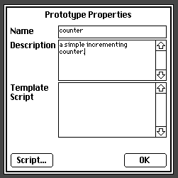

Next, let's set a size for our prototype. Choose the Widgets tool and drag the handle at the bottom-right corner of the prototype until you're satisfied with the size. (Note: if you have a specific pixel size in mind, you can also directly set the prototype size via the Listener- for example, `me.size:100,50`.)


Now we can add widgets to our prototype, in exactly the same way we'd add them to a card. Create a Field named `val` and a button named `inc`:

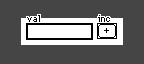

The `inc` button will need a short script:
```lil
on click do
 val.text:val.text+1
end
```

If you switch to "Interact" mode, you can try out the prototype immediately: clicking the button should increment the value in the field. When you're satisfied, be sure to set the field back to be blank or "0": the values in the widgets of a prototype will be the defaults for every contraption instance we make later!

Backgrounds and Resizability
----------------------------
Let's give our prototype a bit of decoration by drawing a border using the "Box" tool. You can draw on the background of a prototype just like a card.

By default, contraption instances have a fixed size, matching the prototype. If you make your contraption "Resizable" (_Prototype &#8594; Resizable_), every contraption instance can be resized with the "Widgets" tool. Enable this property, check _Prototype &#8594; Show Margins_, and then ensure that you're using the Widgets tool. You should now see four draggable handles on the top and left edge of the prototype.

When a contraption is resized, the background is logically divided into 9 pieces based on the margins. The corners are kept their original size, the top and bottom edge are repeated horizontally, the left and right edge are repeated vertically, and the center is repeated horizontally and vertically. Another way to think of it is that the part of the prototype _between_ the margins for each axis will be stretched out, while the rest is kept the same size. Widgets behave similarly: any widget corners that fall outside of the margins will keep a fixed position relative to the edges of the prototype, while the rest will be scaled proportionally.

A real example may be clearer. Set the margins of your prototype like so:

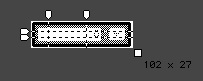

Now let's make a few contraptions from our prototype! You can use the _Prototype &#8594; Close_ menu item or press "escape" on the keyboard to leave the prototype editor. Back on a normal card, switch to the "Widgets" tool and click the _Widgets &#8594; New Contraption..._ menu item. Choose your "counter" contraption and click "Create". Make a few counters, and play with resizing them. Observe how our border adapts to each size. You might find it useful to design contraptions that are _purely_ reusable, resizable decorative borders!

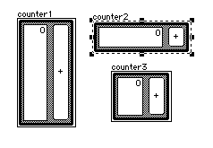

You can copy and paste contraptions like any other widget. In fact, if you copy a contraption to the clipboard, you can paste it into another deck and it will bring along the prototype definition! If the `version` of the prototype in a pasted clipboard snippet is newer than a prototype that already exists in the deck, the new definition will replace the old one.


Custom Attributes
-----------------
So far, we've defined a useful, if simple, contraption with minimal code. We could stop here, but there are a few more details we could add that would make our contraptions behave more like the built-in widget flavors. Hop back into the prototype editor via _File &#8594; Prototypes..._ or by double-clicking on a contraption instance and clicking "Prototype..." in its Properties dialog.

Field widgets have a `.text` and `.value` attribute; we used the former in the script we wrote previously. To expose an attribute like this on our `counter`, we'll add code to our prototype's script. Choose _Prototype &#8594; Script_ from the menu and enter the following:
```lil
on get_value do
 val.text+0
end

on set_value x do
 val.text:x
end
```

Say we have a counter contraption named `count1`. When code outside our contraption refers to `count1.value`, the function `get_value` is called in the prototype script. Conversely, when code outside our contraption does `count1.value:5`, the function `set_value` is called in the prototype script with the argument `5`.

Our `get_value` uses `+0` to force the string value of the interior field `val` to a number, and our `set_value` writes a number `x` to the same field. Just like within a card, the widgets of a contraption store the _state_ of the contraption, and any `get_` and `set_` functions we write translate external arguments and requests into manipulations of internal widgets. From the inside, a contraption acts like a little card, and from the outside it appears like a widget.

If you want to expose an immutable attribute, don't define a `set_` corresponding to your `get_`. For example, you might want to expose a utility function that external scripts can call:
```lil
on reset do       # a normal function, callable from inside the prototype
 val.text:0
end

on get_reset do   # an accessor that returns the internal function to outside users
 reset            # note that we're returning the function, not calling it (reset[])!
end
```

Some of our custom attributes might be things that users of the contraption would like to be able to adjust without writing scripts. When you're done configuring the prototype script, close the script editor and choose _Prototype &#8594; Attributes..._ from the menu.

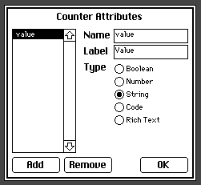

From this dialog you can add metadata for any of the attributes you wrote `get_` and `set_` functions for. The "name" of an attribute should be the part that comes immediately after `get_`; in our case, "value". The "label" can be a longer/more detailed human-readable name. The "type" indicates which sort of picker should be provided for manipulating this attribute: a boolean becomes a checkbox, a number or string become small field, and code or rich text becomes a larger field of the appropriate style.

With the "value" attribute set up as above, exit the prototype editor and double-click one of your contraption instances to see the new field in its Properties panel:

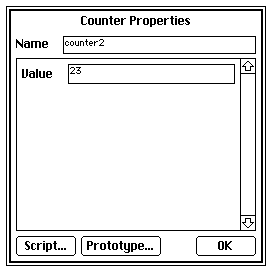

Try making a change here, and watch it be reflected on the contraption when you close the dialog!

Custom Events
-------------
It is also possible to make your contraptions produce events, just as a button widget produces a `click` event when it is clicked, or a field widget produces a `change` event when its contents is edited.

From the perspective of prototype scripts or the scripts on widgets within a prototype, the global variable `card` is a reference to _the contraption instance_ rather than the card containing the contraption. To send an event to a user script on the contraption instance, we will use `card.event[]`. Modify the script on the `inc` button as follows:
```lil
on click do
 val.text:val.text+1
 card.event["change" get_value[]]
end
```

Now every time `inc` is clicked, it will send a `change[]` event to the contraption instance. If a user has not defined a handler for this event, it will do nothing harmlessly, just like a button that doesn't define `on click...` in its script.

To help users know that a "change" event is available, we can provide a default "template" script for newly-created contraptions. Edit the template for your prototype via the _Prototype &#8594; Properties..._ menu item:
```lil
on change x do
 
end
```

Exit the prototype editor, and modify the script of one of your contraption instances. The script editor should provide your template as a starting point. Try filling it in and then interacting with the contraption to confirm the event fires:
```lil
on change x do
 alert["counter is now %i" format x]
end
```

When designing custom event and custom attribute logic, try to follow the examples and conventions of Decker's built-in widgets when it makes sense. Having consistency makes your widget's behavior easier to understand and remember!


Limitations
-----------
Contraptions and prototypes have a few important limitations to keep in mind:

- Prototypes cannot contain contraptions. In other words, contraptions are non-recursive.
- Unlike a card, contraption instances cannot add or remove "child" widgets dynamically.
- The [Contraption Interface](#contraptioninterface) does not have a `.widgets` attribute: using `card.widgets` to enumerate and search inner widgets by name will work in the Prototype editor, but will _not_ work in actual contraption instances!
- Custom attribute reads and writes (from the outside) run in a brief quota, just like transition functions and module startup. If they take too long to execute, they halt and return nil.
- Custom attributes cannot be invoked recursively or directly call other custom attributes. If this is attempted, they halt and return nil. For example, a script inside a prototype should use `get_value[]` instead of `card.value` to access the `value` attribute.


Volatility
==========
Widgets store the persistent state of a deck. All information with a lifetime longer than an event handler script is represented somewhere in a widget, a card, or the deck itself. Some widgets, however, contain _derived state_ that is not essential; for example, the numbers in a total display computed from the contents of a grid, or the image on an animated canvas which is redrawn on every frame.

Any widget may be marked as "volatile", manually through the _Widgets &#8594; Volatile_ menu item or programmatically via the `.volatile` attribute. When a deck is saved and reloaded, volatile "value-state" of widgets- the `value`, `scroll`, `row`, `col` and image content- is discarded, including widgets contained within contraptions. Note that much like `.locked`, the `.volatile` attribute of a contraption instance _itself_ doesn't do anything; it's up to the prototype's scripts to forward this property appropriately to inner widgets that may somehow "inherit" this property.

Within a work session, the value-state of any volatile widgets may also be "purged", manually through the _File &#8594; Purge Volatiles_ menu item or programmatically via the `deck.purge[]` method. When volatiles are purged manually, the current card will automatically be sent a `view[]` event to allow the card to regenerate volatile state as it sees fit.

Careful use of volatility can significantly reduce the size of saved decks and provide a useful mechanism for "resetting" games and similar applications between test runs. It can, however, also introduce subtle bugs if used improperly- say, if a script relies upon reading a volatile widget's state as a "source of truth" when it may have been purged and not re-calculated. If a widget represents a "cache" of an expensive operation, it may not be desirable to make it volatile, even if that data _could_ be regenerated. If you aren't _certain_ a widget's contents is ephemeral, avoid applying this feature.


Animation
=========
Let's say we're on a card containing a canvas named `canvas`. The card also has a script which defines a function named `pinwheel[]` for clearing the canvas and drawing a shape on it, with the shape's size and rotation controlled by a parameter `t` (_time_):
```lil
on pinwheel t do
  canvas.clear[]
  c:canvas.size/2                   # center of canvas
  r:c[0]*.6+.4*sin 0.05*t           # radius of the pattern
  a:(0.01*t)+(pi/0.5*16)*range 16   # angle per wedge
  p:flip c+flip r*unit a            # points around a circle
  each x i in p
    if 2%i canvas.poly[c x p[(count p)%1+i]] end    # draw every other wedge
  end
end
```
By calling this function repeatedly and varying the time, it will create a series of different images which produce the illusion of motion, like a flipbook.

Try making a button with a script like the following and clicking it. (Warning: if you are photosensitive, this example might be very uncomfortable to look at; maybe just skip ahead to the next one?)
```lil
on click
  frame:0
  while 1
    pinwheel[frame]
    frame:frame+1
  end
end
```

The first thing you'll notice is that once you click the button, it turns inactive, and most of Decker's menus disappear. The `while` loop in this script will run forever until you manually halt it with _Script &#8594; Stop_.

You'll also notice that the animation looks strange- parts of the pinwheel seem to flicker and appear or disappear randomly. We're actually drawing and erasing the shape _much_ too fast!

Decker allows Lil scripts to run for a certain amount of time each frame, before pausing them briefly to handle redrawing the window and servicing menus. From the script's perspective, it is being paused at arbitrary points inside that `while` loop, so the shape may not be fully-drawn when it's shown to the user. Instead, we should use the `sleep[]` function to tell our script to wait until it's time to draw the next frame- this will look much smoother:
```lil
on click
  frame:0
  while 1
    pinwheel[frame]
    frame:frame+1
    sleep[]
  end
end
```

This approach to animation can be very convenient and flexible- just write ordinary code with loops and conditionals and insert a few `sleep[]` calls whenever you finish drawing a frame. The disadvantage, though, is that while our animation script is running, everything else in Decker grinds to a halt. The user can't click on buttons, edit fields, or even navigate to another card! Our single escape-hatch is the `pointer` interface, which gives us live-updating information about the mouse (or whatever pointing device is available) even while our script is running.

As a simple example, we could stop our `while` loop when the user clicks the mouse anywhere:
```lil
on click
  frame:0
  while !pointer.held
    pinwheel[frame]
    frame:frame+1
    sleep[]
  end
end
```

But there's another way: harnessing the `view` event. The `view` event is fired once whenever a user is shown a card, usually as a result of opening a deck or navigating to a card. The `go[]` command will also schedule this behavior, even if we're asking to "navigate" to the card we're already on:
```lil
on view do
  pinwheel[sys.frame]
  go[card]
end
```

Since each event is an independent script execution, we can't count frames in a local variable like we did before, but we can use `sys.frame` (or `sys.ms`, for that matter) to get a regularly incrementing timer. If we need control over exactly when our animation starts and finishes, we could stash our own frame counter in an invisible field widget.

The `view` event is fired at most once per frame, so we don't need any explicit `sleep[]` calls, and as long as our script finishes quickly enough, the user will have a chance to interact with widgets and trigger other events between scheduled `view` events. Our animation automatically starts playing when we navigate to the card, and the `view[]` event will stop being triggered if we navigate away to a different card. Note that if a script takes too long, you will see the same behavior as the original `while` loop: the user will be unable to interact with the card until the script is stopped.

The `go[]` is the essential component here, since it _indirectly_ triggers a future `view[]`. If we just called the `view[]` function _directly_,
```lil
on view do
  pinwheel[sys.frame]
  view[]                     # bad idea!
end
```
it would be equivalent to the first example!

The `go[card]` method of animation is convenient, but it still requires us to write a card-level script. Furthermore, this method cannot be used from within a contraption, as contraption prototype scripts do not have access to the deck or the current card. There's one more option: the `animated` property. Any widget can be flagged as `animated` from the _Widgets_ menu. Animated widgets are automatically sent a `view` event on every frame so long as the card they appear on is visible. If we make our canvas "animated", it will only need the following script:
```lil
on view do
 pinwheel[sys.frame]
end
```
The `animated` property allows you to make widgets self-updating in an entirely self-contained way: their behavior can be fully contained in their own scripts, allowing them to be copied and pasted between cards or decks without requiring any additional "plumbing".

You can use `animated` anywhere you want a "live updating" widget. Consider, for example, a field that continuously recomputes its value from other widgets:
```lil
on view do
 me.text: price.text*(1+taxes.text)
end
```
This approach "pulls" values from other fields, whereas you might otherwise "push" values from fields when they're edited, using their `change` event. As always, build your applications in the way that makes the most sense to you!

Widgets whose values are continuously updated from elsewhere and therefore do not contain meaningfully persistent data are good candidates for being marked as [volatile](#volatility).


Transitions
===========
Whenever a user or script navigates to a new card with `go[]`, Decker can perform a brief transition animation, like a horizontal slide or wipe. Transitions add visual flair and aid users in finding their way around a deck by providing spatial relationship cues. Decker comes with a number of pre-defined transitions, and you can add more (or override existing ones) by writing appropriate Lil functions and installing them by calling the `transition[]` function, or by providing a function directly as the second argument to `go[]`.

The Lil function you install as a transition will be called several times when an animation is required, with four arguments:
- `canvas`: a _canvas interface_ the size of the current card.
- `imageA`: an _image interface_ of the current card, including all widgets.
- `imageB`: an _image interface_ of the destination card, including all widgets.
- `tween`: a decimal number in the range 0 to 1, inclusive, where 0 indicates the beginning of the animation and 1 indicates the end of the animation.

On each call, your function should use the resources provided to draw an image on the `canvas`, which will be automatically `clear[]`ed between frames. Transition functions must complete their work quickly: if they exceed a brief quota, they will be halted prematurely, and whatever is on the `canvas` will be used as-is. Transition functions _must_ smoothly handle any number of intervening `tween` values, but are guaranteed to be called with a `tween` of exactly 0 and 1 on the first and last frames, respectively.

Decker supplies the following pre-defined transitions:
```lil
transition[on SlideRight c a b t do  c.paste[a c.size*t,0   ] c.paste[b c.size*(t-1),0]      end]
transition[on SlideLeft  c a b t do  c.paste[a c.size*(-t),0] c.paste[b c.size*(1-t),0]      end]
transition[on SlideDown  c a b t do  c.paste[a c.size*0,t   ] c.paste[b c.size*0,t-1  ]      end]
transition[on SlideUp    c a b t do  c.paste[a c.size*0,-t  ] c.paste[b c.size*0,1-t  ]      end]
transition[on WipeRight  c a b t do  c.rect[0,0        c.size*t,1    ]          c.merge[a b] end]
transition[on WipeLeft   c a b t do  c.rect[0,0        c.size*(1-t),1]          c.merge[b a] end]
transition[on WipeDown   c a b t do  c.rect[0,0        c.size*1,t    ]          c.merge[a b] end]
transition[on WipeUp     c a b t do  c.rect[0,0        c.size*1,1-t  ]          c.merge[b a] end]
transition[on BoxIn      c a b t do  c.rect[c.size/2   c.size*t   "center"]     c.merge[a b] end]
transition[on BoxOut     c a b t do  c.rect[c.size/2   c.size*1-t "center"]     c.merge[b a] end]
```

Transitions can be defined in any script, at any time, but it usually makes the most sense to set them up at the top level of a deck script or a [module](#modules). If custom transitions are bundled into a module, it is very easy for other users to re-use them in their own decks!

Brushes
=======
Both Decker's drawing tools and Canvas widgets support drawing lines (and shapes composed of lines, like polygons or boxes) using a "brush". The following brush shapes are built in:

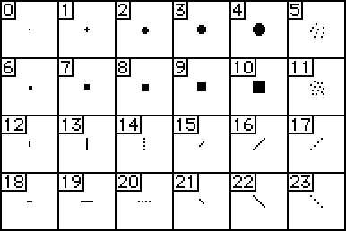

It is also possible to install new brushes using the `brush[]` function. This can be called in three ways:

- `brush[name image]`: define a _static brush_ with a given string `name` using the `image` as a mask.
- `brush[function]`: define a _functional brush_, with a name corresponding to the name of the supplied function.
- `brush[]`: retrieve a dictionary of custom brushes, keyed by name.

Static brushes work like the built-in brushes: as a line is drawn, the mask is continuously "stamped" along it. Functional brushes call the supplied function repeatedly, and each time it should return a mask image. Functional brushes _must_ complete their work _very quickly_: if they exceed a brief quota, they will be halted prematurely, and nothing will be drawn. Likewise, if the function returns anything that is not an image, nothing will be drawn at that step. A brush function is called with two arguments:

- `delta`: a pair of numbers indicating the `(x,y)` offset of the current line's end from its origin. This can be used to determine the magnitude of the line, its direction, or both. 
- `newLine`: a boolean; `1` for the first call of a new line, otherwise `0`.

An example static brush:
```lil
brush["Oval" image["%%IMG0AAwADAHgB/AP8B/wP/B/4H/g/8D/gP8A/gB8AA=="]]
```

Remember that you can obtain the encoded strings used by `image[]` by drawing something in Decker and copying it to the clipboard!

An example functional brush, a round brush which gets smaller for faster strokes:
```lil
# 11 round brush images ranging from 8px to 1px:

b:"%J" parse "[
 %%IMG0AAgACDx+/////348,
 %%IMG0AAcAB3z+/v7+/nw=,
 %%IMG0AAcABzh8/v7+fDg=,
 %%IMG0AAYABnj8/Pz8eA==,
 %%IMG0AAYABjB4/Px4MA==,
 %%IMG0AAUABXD4+Phw,
 %%IMG0AAQABGDw8GA=,
 %%IMG0AAMAA+Dg4A==,
 %%IMG0AAMAA0DgQA==,
 %%IMG0AAIAAsDA,
 %%IMG0AAEAAYA=,
]"

# pre-computing the above table outside the function avoids
# unnecessary work every time Sumi[] is called!

brush[on Sumi delta do
	b[10 & .5 * mag delta]
end]
```

The mask images used for static and functional brushes will _usually_ consist of patterns 0 and 1: 0-pixels are "transparent" and left alone, and 1-pixels take on the selected drawing pattern. It is also possible to use a mask image containing other pattern indices: 47 will become pattern 1 ("always black"), and any other patterns will be kept the same.

Like transition functions, brushes can be defined in any script, at any time, but it usually makes the most sense to set them up at the top level of a deck script or a [module](#modules).

Playing Sound
=============
The `play[]` function is the main way of triggering audio playback in Decker. It can be called with a [Sound Interface](#soundinterface) or the name of a sound in the deck:
```lil
play["amen"]
play[deck.sounds.amen]
```

There are two ways to wait for a sound to finish. The `sleep["play"]` function blocks execution until no sounds are playing, which may take many frames:
```lil
play["firstClip"]
sleep["play"]
play["secondClip"]
```
The `app.playing` property is truthy if sound is playing. You can use this as a "non-blocking" way to wait for sounds to stop:
```lil
play["firstClip"]
while app.playing
	doSomethingElse[]
	sleep[1]
end
play["secondClip"]
```

So far, we've looked at "one-shot" sound effects. You can have several such sounds playing at one time. If you provide a second argument to `play[]`, you can instead control the "background loop", a single sound that can be easily repeated:
```lil
play["amen" "loop"]
```

By default, the background loop will repeat until it is explicitly stopped or replaced with another sound. If you repeatedly "loop-play" the same sound, it will not restart the sound- this is convenient for common applications. If you do wish to reset a looping sound mid-loop, you can stop it and then immediately restart it. To stop the background loop, provide an invalid sound to `play[]`:
```lil
play[0 "loop"]
```

It is also possible to control the background loop by providing a handler for the card-level `loop` event. This handler is called whenever cards are initially visited (as by `go[]`, for example) as well as each time the background loop completes. The loop handler is passed the previous background loop sound, if any, and the return value will become the new background loop. You can probably see now why the default loop handler is:
```lil
on loop prev do
	prev
end
```

The simplest way to use this event is to give cards a default background loop when you visit them:
```lil
on loop do
	"amen"
end
```
Or to silence any existing background loop when you visit the card:
```lil
on loop do
	0
end
```
But you might want to have other side effects, or choose the next background loop sound based on some algorithm:
```lil
on loop do
	iteration_count.value:iteration_count.value+1
	random["clip1","clip2","clip3"]
end
```
The `loop` event handler _must_ complete quickly; if it exceeds a small quota, it will be halted along with the background loop.

The Danger Zone
===============
Normally, Decker has no direct access to the local filesystem; access is exclusively mediated through a user's informed and manual consent within functions like `read[]` and `write[]`.

If you compile Native-Decker from source using the `DANGER_ZONE` flag, you can enable the _danger_ interface, which contains a variety of goodies which could potentially cause harm to the host computer, reveal sensitive information, or expose non-portable, operating-system-specific information and functionality. Don't enter the _danger zone_ unless you know what you're getting into, and be careful using it with scripts you didn't write!

When enabled, the _danger_ interface is available as a global constant named `danger`:

| Name                     | Description                                                                                 |
| :----------------------- | :------------------------------------------------------------------------------------------ |
| `typeof danger`          | `"danger"`                                                                                  |
| `danger.env`             | A dictionary of environment variable keys and their string values. Read-only.               |
| `danger.homepath`        | A string containing the path to the user's home directory. Read-only.                       |
| `danger.dir[path]`       | List the content of a directory as a table of `dir`, `name`, `type`.                        |
| `danger.path[x y]`       | Canonical path `x` (joined with `y`, if given).                                             |
| `danger.shell[x]`*       | Execute string `x` as a shell command and block for its completion.                         |
| `danger.read[path hint]` | Read a file `path` using `hint` as necessary to control its interpretation.                 |
| `danger.write[path x]`   | Write a value `x` to a file `path`. Returns `1` on success.                                 |


The `danger.path[]` function can perform a number of useful operations:

- `danger.path["."]` returns the current working directory.
- `danger.path[x ".."]` returns parent directory of path `x`, if any.
- `danger.path[x]` canonicalizes a path `x`.
- `danger.path[x y]` concatenates a path `x` with a name `y`, respecting the filesystem's separator symbol, and canonicalizes the result.

Note that on Windows `danger.path[]` will permit the construction of paths that do not actually exist on the filesystem, and is only concerned with structurally canonicalizing them. On MacOS, Linux, BSD, etc, canonicalization is performed as by `realpath()`. Windows paths begin with a drive letter (e.g. `C:\Users\`); `danger.dir[""]` on Windows will enumerate available drives, and thus for consistency `danger.path["C:\\" ".."]` (and likewise for other drives) will return `""`. Your mileage may vary, safety not guaranteed, etc, etc.

The `danger.shell[]` function returns a dictionary containing:
- `exit`: the exit code of the process, as a number. If the process halted abnormally (i.e. due to a signal), this will be -1.
- `out`: _stdout_ of the process, as a string.

Among other things, it is possible to combine `danger.shell[]` with common command-line utilities like `curl` to fetch information over a network:
```lil
t:"%j" parse danger.shell["curl https://www.quandl.com/api/v3/datasets/WIKI/AAPL/data.json?rows=10"].out
table t.dataset_data.column_names dict flip t.dataset_data.data
```

Note that this function executes subcommands _synchronously_; a long-running shell invocation can lock up Decker! The `danger.shell[]` function is not available on Windows.

---

Web-Decker also offers its own _danger_ interface which exposes a low-level bridge to JavaScript. If Native-Decker is compiled with support for _the danger zone_, the corresponding interface will also be enabled for all web exports. Alternatively, the feature may be manually enabled for any instance of Web-Decker by calling the `endanger()` function from the browser's JS console or modifying the `DANGEROUS=0` constant in the `.html` file to `DANGEROUS=1`.

| Name                     | Description                                                                                 |
| :----------------------- | :------------------------------------------------------------------------------------------ |
| `typeof danger`          | `"danger"`                                                                                  |
| `danger.js[x args...]`   | Evaluate a string `x` as JavaScript, optionally called with arguments `args`                |

If `danger.js[x]` is called with a single argument, it will evaluate `x` as JavaScript and return the result. If the result of evaluating `x` is a JS function and additional arguments are supplied, those arguments will be passed to the function and it will be called. Lil values are automatically translated to JS values and vice-versa. Numbers, strings, lists, and dictionaries are recursively converted as copies, with appropriate coercion between the respective type systems. Array interfaces are converted into `Uint8Array` objects and vice-versa (irrespective of `cast`) using a shared underlying data store, allowing both Lil and JS to observe future mutations to such a data structure. Array _slices_ are not converted. Resizing Array interfaces from Lil may reallocate the internal buffer, breaking any shared references. Deck, Card, or Widget interfaces are passed unmodified, but should be treated as opaque values from the JS side. Functions are wrapped in thunks: Lil functions are exposed to JS as JS functions accepting and returning JS values, and JS functions are exposed to Lil as Lil functions accepting and returning Lil values. Any other values- including arbitrary JS objects and Lil tables or otherinterfaces- are converted to a JS `null` or a Lil `nil`, respectively.

Thunked Lil functions called from JS do not include any execution quota limits, and can therefore lock up Decker if used improperly. If any errors are thrown when evaluating `x`, it will return nil and print error messages to the JS console; if more elaborate error handling is desired, implement it JS-side. Directly calling internal Decker functions is not advised, as these do not necessarily represent a stable API; prefer passing Lil functions into JS to allow it to manipulate the Decker environment whenever possible. Decker reserves a global JavaScript Object named `ext` where injected JS may attach functions or data without risk of colliding with Decker's global definitions. Decker also offers a function named `ext_add_constant(k,v)` which can be used to install functions or data in Lil's global scope, binding a JS string `k` with a JS value (which will be converted as described above). When feasible it is _recommended_ that users package their JS extensions as Lil modules and expose thunked JS functions in the module dictionary instead of installing new global functions with `ext_add_constant()`.

A few examples:
```lil
danger.js["2+3"]
# 5

danger.js["x=>3*x" 7]
# 21

danger.js["ext.util=x=>(x+'').toUpperCase()"]
danger.js["ext_add_constant('my_util',x=>ext.util(x))"]
my_util["some string"]
# "SOME STRING"

danger.js["f=>f(f(47))" (on twice x do x,x end)]
# (47,47,47,47)
```


Startup
=======
If you start Native-Decker from the commandline, you can specify a path to a deck to open:
```
% ./decker examples/decks/fonts.deck
```
Native-Decker accepts several other optional CLI flags:
- `--no-sound`: Disable sound playback and recording entirely.
- `--no-scale`: Disable upscaling the display in windowed mode. Useful for recording screenshots.
- `--no-touch`: Disable touch input unless explicitly opted-in.
- `--fullscreen`: Open in fullscreen mode.
- `--unlock`: Force the deck (if any) to be "unlocked" initially.
- `--card x`: Open the deck (if any) to a specified card name.

If a file path is not specified (or you open Decker by double-clicking the application), Decker will next check for the existence of a file named `start.deck` in the same directory as the executable (or on MacOS within the `.app/Resources/` directory of the application bundle), opening it if available. This can be helpful if you wish to build a personal "home deck", or if you wish to distribute your own decks along with a Decker runtime.

If neither an explicit file path nor a `start.deck` is available, Decker will open the built-in "guided tour" deck.


See Also
========
- The [Lil scripting language](lil.html)
- The [Decker file format](format.html)
