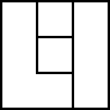

title:Lil: A Scripting Language

Lil: A Scripting Language
=========================
Lil is part of the technology that powers _Decker_, a multimedia creative tool inspired by _HyperCard_. Decker uses Lil for adding custom behavior to decks and the widgets within. Lil is designed to be learned in layers, but it is a richly multi-paradigm language which incorporates ideas from imperative, functional, declarative, and vector-oriented languages.

```lil
on mode a do   # line comment
	r:()
	each x in a
		r[x]:1+r[x]
	end
	first extract key orderby value desc from r
end

mode[1,2,2,3,4,2,1]
```



Lil's implementation needs to be fairly small, as an interpreter is shipped with every standalone Decker document along with the rest of the runtime. At the same time, Lil should be prepared for the everyday needs of Decker users, with primitives to handle common use-cases and a minimum of boilerplate.

The language therefore tries to thread the needle between a design which is simple and a design which is ergonomically pleasant. There are a small number of datatypes, features and primitives which compose in many useful ways. The query syntax generalizes to manipulation of dictionaries, lists, and strings, and replaces many individual primitive operations in other languages with a single algorithmic framework. Simple things are easy, and complex things are possible.

{{TOC}}

Lil, A Primer
-------------
Let's begin by looking at a few practical examples of Lil scripts you might encounter or compose while using Decker, to give you a loose impression of the language. Consider the following script on a button widget:

```lil
on click do
 # adventure awaits!
 go["DungeonEntrance" "BoxIn" 15]
end
```

The `on NAME do ... end` structure is how you define a function. Buttons in Decker call a function named "click" when they're clicked. The octothorpe (`#`) indicates a line-comment: the remainder of the line `# adventure awaits!` is a hint for human readers, but has no significance to Lil. The function `go` is built into Decker; it moves to a different card. The square brackets (`[]`) indicate that we're calling `go` and providing arguments. The arguments to `go` are the name of a destination card represented as a string, a second string indicating a transition animation, and a number indicating how many frames the transition lasts. Lil strings are enclosed in double-quotes (`""`). The arguments within the brackets are separated by whitespace, not commas!

In another button script, clicking the button is only meant to navigate to another card if the user has previously found a "key", represented as a checkbox widget named `haskey` on a card named `inventory`:
```lil
on click do
 if inventory.widgets.haskey.value
  play["DoorSqueak"]
  go["TheCrypt"]
 else
  alert["The door is locked!"]
 end
end
```
The `if CONDITION ... else ... end` structure is how Lil handles conditional logic. You can omit the `else` or add extra clauses with `elseif`. The "dot-notation" sequence (`inventory.widgets.haskey.value`) is how we access the hierarchical parts of a deck: the value of the `haskey` checkbox of the `widgets` contained in the `inventory`.

For more elaborate conditions you can form expressions using `&` (logical AND), `|` (logical OR), `!` (logical NOT) and the familiar arithmetic comparison operators `=`, `<` and `>`. Note that Lil _does not_ have "combined" operators like `!=`, `>=` or `<=`. Expressions in Lil are always carried out with uniform right-to-left operator precedence; use parentheses to group subexpressions:
```lil
on click do
 i:inventory.widgets
 goldCoins:i.money
 hasPass:i.trollPass.value
 if hasPass & (goldCoins.value>5)
  alert["The troll charges you 5 gold coins."]
  goldCoins.value:goldCoins.value-1
  go["TrollTavern"]
 else
  alert["The troll gruffly refuses you entry."]
 end
end
```
The colon `:` is Lil's assignment operator. You can stash numbers, strings, or even references to widgets in variables like `i`, `goldCoins` and `hasPass` to avoid repeating yourself. You can also modify the fields of widgets, like `inventory.widgets.money`, using assignments.

If you're looking to add simple interactive behaviors to your decks, you may already know enough to get started. The rest of this reference manual will focus on Lil itself, separately from its usage within Decker. You can find more practical examples and scripting tutorials among the `.deck` files packaged with Decker.


Types and Conversions
---------------------
There are 8 types of value in Lil: numbers, strings, lists, dictionaries, tables, functions, interfaces, and the nil value.

- _Numbers_ are floating-point values, possibly with a sign: `42 37.5 -29999`.
- _Strings_ are a sequence of characters, written enclosed in double-quotes. The special characters backslash, double-quote, and the newline character (`\n`) are preceded with a backslash escape: `"apple" "foo\nbar"`. The binary `fuse` and `format` operators can both be used for concatenating strings.
- _Lists_ are ordered sequences of values which can be indexed by numbers. The empty list is written as `()`, and the unary operator `list` constructs a single-element list from any value. Lists can be joined with the `,` operator.
- _Dictionaries_ are ordered sequences of pairings between _keys_ and _values_, both of which can be any type. Dictionaries can be made by the binary operator `dict`, or a list can be promoted to a dictionary by assigning at non-numeric keys. Dictionaries can be unioned together with the `,` operator. The `keys` operator gets the keys of a dictionary, and the `range` operator gets the values of a dictionary.
- _Tables_ are a rectangular array of values for which every column has a string as its _key_. Tables can be made with the unary operator `table` or with the `insert` statement. The binary operators `,` (append), `join` (natural join), and `cross` (cartesian join) offer a selection of tabular joins.
- _Functions_ have a name, take arguments, and return a result. They are declared with `on`, and may be freely passed around or stored in variables. `first` of a function gives its name, and `keys` of a function gives a list of its named arguments.
- _Interfaces_ are opaque dictionary-like values used to represent system resources or Input/Output devices. Accessing or writing to an interface may produce side-effects.
- `nil` represents the _absence_ of a value: an undefined variable, an out-of-bounds index (_outdex_), a failed attempt at parsing a value. The `unless` and `fill` operators can be used to substitue a default value for a _nil_. Otherwise, _nil_ will happily coerce to contextual "empty" values.

Lil has a soft, spongy, dynamic type system in which values do their best to convert to a more relevant type as the need arises.

- When a number is required, nil becomes `0`, strings are parsed, and lists or dictionaries attempt to convert their first _element_. Otherwise, the number 0 is used.
- When a string is required, nil becomes `""`, numbers are formatted, and lists are recursively converted to strings and joined. Otherwise, the empty string is used.
- When a list is required, nil becomes `()`, strings are treated as a list of their characters (each a length-1 string), dictionaries are treated as their value list, tables are treated as the list of their rows (each a dictionary), and anything else (number, function, interface) is enclosed in a length-1 list.
- When a dictionary is required, strings and lists become dictionaries from their indices to their _elements_, tables become dictionaries of their columns, and otherwise an empty dictionary is used.
- When a table is required, nil becomes the empty table, lists become a single-column "value" table, and dictionaries become two-column "key" and "value" tables. Anything else is interpreted as if it were a list.

When indexing into values, we will uniformly refer to _elements_:

- An _element_ of a number is itself.
- An _element_ of a string is a character, which itself is a length-1 string.
- An _element_ of a list is one of its items.
- An _element_ of a dictionary is one of its values.
- An _element_ of a table is one of its rows, as a dictionary.
- An _element_ of an _empty_ string, list, dictionary, or table is nil.

The number zero (`0`), nil, and the empty string (`""`), empty list (`()`), or empty dictionary are all _falsey_, and any other value (including _any_ table, function, or interface) is _truthy_.


Lil, the Imperative Language
----------------------------
Lil scripts are a sequence of expressions, including literal values, references or assignments to variables, conditionals (`if`), `each` and `while` loops, and function declarations (`on`).

Variable and function names may contain any alphanumeric characters (as well as `?` and `_`), but must not start with a digit. Variable assignments use the symbol `:`, read as "gets" or "becomes":
```lil
a: 23
longer_name: "a string"
```

If a value has never been explicitly placed in a variable, it contains _nil_. You can access or assign to elements of a list or dictionary by subscripting with brackets:
```lil
(11,22,33)[1]
"String"[2]
l[4]:2
d["fruit"]:"apple"
```

For convenience, indexing may also be performed with "dot notation", where a name after the dot is treated as a string index. These expressions are equivalent:
```lil
d["fruit"]:"cherry"
d.fruit:"cherry"
```

If you index a list with integers within range of its `count` it will act like a list. If you index a list like a dictionary- with keys that are _not_ integers within range of its `count`- it will become a dictionary.
```lil
b: 5              # b contains the number 5
b[0]: 5           # b becomes a length-1 list containing the number 5
c                 # c contains nil
c.fruit: "yes"    # c now contains a dictionary with the key "fruit" and the value "yes"
```

When the leftmost part of an assignment expression is an expression- not just a variable name- the value of that expression is _amended_ and a new value with appropriate changes is returned:
```lil
(11,22,33)[1]:44  # produces the list (11,44,33)
"Cat"[1]:"ive"    # produces the string "Civet"
().baz:99         # amend the empty list at index "baz" (promoting it to a dictionary) with the value 99,
                  # producing the single-element dictionary {"baz":99}
(11,22).baz:33    # extend (11,22) into a dictionary, and bind "baz", giving {0:11,1:22,"baz":33}
```

Note the important distinctions between these similar-looking cases:
```lil
foo:11,22,33

foo[1]:44     # get the value in "foo", amend it at index 1, and store the amended list in "foo" again.

(foo)[1]:44   # the parenthesized portion is a subexpression which gets the value in "foo".
              # amend it at index 1, and return the amended list, leaving "foo" unchanged.

(foo[1]):44   # this is not syntactically valid!
              # assignment to a subexpression must have a dotted or bracketed index.
```

If you index with a dot followed immediately by another dot or open-bracket it means "each element". Use this for drilling into nested lists or dictionaries:
```lil
t:("AB","CD","EFG")

t[1]        # "CD"             # the 1st element of t
t.[1]       # ("B","D","F")    # the 1st element of each element of t

d.a.key:"apple"
d.b.key:"pear"

d           # {"a":{"key":"apple"},"b":{"key":"pear"}}
d.a         # {"key":"apple"}
d.a.key     # "apple"
d..key      # {"a":"apple","b":"pear"}
```

---

Lil has a number of unary and binary operators- see [appendix 1](#appendix1:unaryprimitives) and [2](#appendix2:binaryprimitives) for details. Many, like `+` and `*`, should be familiar from mathematics or other programming langugages. The most important thing to remember in Lil is that expressions have uniform operator precedence: expressions are always carried out right-to-left, unless explicitly parenthesized:
```lil
3*2+5    # 21
3*(2+5)  # 21
(3*2)+5  # 11
```

You can make decisions with `if`. The keyword `if` is followed by a conditional expression, one or more statements, and finally the keyword `end`. The statements inside the `if ... end` will only be executed if the conditional expression has a truthy value. You can also optionally include an `elseif` keyword (followed by a conditional expression) or just an `else` keyword to divide the body of the `if` into multiple cases.
```lil
if 1>2
	"narp"  # this doesn't happen
end

if 5
	"yarp"  # 5 is truthy, so this does happen!
end

if 5
	"also yarp"  # this happens...
else
	"also narp"  # but this does not!
end

if 1>2
	"narp"    # this doesn't happen
elseif 1<2
	"yarp"    # but this does,
else
	"narp"    # so this doesn't
end
```

You can iterate over the elements of a value with an `each` loop. The keyword `each` is followed by zero or more variable names, the keyword `in`, an expression giving the _source_ to iterate over, one or more statements forming the "body" of the loop, and finally the keyword `end`. The _source_ is always treated as a dictionary, and for each iteration of the loop the variable names provided are assigned to the _value_, _key_, and _index_ of the current pairing in that dictionary. For a list, _key_ and _index_ will naturally be identical. Here are a few examples of `each` loops:
```lil
each x in 3,5,7
	x
end

each val key in d
	val,key
end

r:0
each x in range 10
	r:r+x
end
```

You can also repeat a body of code an indefinite number of times with a `while` loop. The keyword `while` is followed by a conditional expression, one or more statements forming the "body" of the loop, and finally the keyword `end`. The conditional expression is evaluated before each iteration of the loop, and the loop stops if this ever results in a falsey value. Here's an example:
```lil
a:5
while a>3
	print[a]     # prints 5, then 4, then stops.
	a:a-1
end
```

To declare a function, use the keyword `on` followed by a name, zero or more argument names, the keyword `do`, one or more statements comprising the "body" of the function, and finally the keyword `end`. To call a function, use its name and a set of bracketed expressions corresponding to the arguments it takes. Extra arguments are ignored, and missing arguments are bound as nil:
```lil
on pair x y do
	x,y
end

pair[3 5]    # returns a list of 3 and 5
pair[3]      # returns a list of 3 and nil
pair[3 5 7]  # returns a list of 3 and 5

pair[3,5]    # careful: ',' joins items into lists- it is not an argument separator!
pair 3 5     # wrong: this is three separate statements, not a function call!
```

If you want to define a function that takes a variable number of arguments- a so-called _variadic_ or _ambivalent_ function- declare the function with a single named argument prefaced with `...`. When the function is called, this argument will contain a list of every argument provided to the function:
```lil
on several ...x do 1-x end
several[11 22 33]
# (-10,-21,-32)
```


Lil, the Functional Language
----------------------------
As we've seen above, thinking about Lil as an everyday garden-variety imperative language is perfectly sufficient for writing scripts. Some characteristics, though, make it well-suited to the _functional_ style of programming, in which we aim to minimize mutation, compose our program from functions which do not have "side-effects", and make use of so-called "higher-order" functions- functions which take functions as arguments.

Values in Lil are truly _values_. They have copy-on-write semantics: an assignment to part of a value creates an entirely new value, leaving any other references to the original value unchanged:
```lil
a:1,2,3
b:a
b[1]:5
show[a]  # 1,2,3
show[b]  # 1,5,3
```

Statements in Lil are always _expressions_. That is, they always return a value and can be composed within larger expressions. Assignments evaluate to the value being assigned. `if` returns the value of the last statement in its taken half. (A missing `else` just means the falsey half evaluates to nil.) `while` likewise evaluates to the last statement on the last iteration of its body:
```lil
x:y:z                       # assign both x and y the value of z
a: if x>5 99 else 33 end    # assign a to either 99 or 33
c: while b<100 b:b*2 end    # assign c to 128
```

The `each` loop collects together the results of _each_ iteration of the loop and returns them. If the input was a dictionary, the output will be a dictionary with the same keys. Otherwise, the output will be a list. Some other languages call this operation _map_:
```lil
each x in 3,5,7   # (300,500,700)
	x*100
end

t.foo:"one"
t.bar:"three"

each v in t       # {"foo":3,"bar":5}
	count v
end
```

You can pass functions to other functions by name:
```lil
on apply func do
	func["two"]
end
on twice x do
	x,x
end
apply[twice]    # ("two","two")
```

Since `on...end` is an expression, you can also directly substitute it into the call, just as with "anonymous" or "lambda" functions in other languages.
```lil
apply[on thrice x do x,x,x end]
```
One advantage of functions always having a bound name is that there's no special combinator plumbing required for anonymous recursion. If the name never matters, consider using the name `_` to signal your intent.

Lil uses _lexical scope_: variables will resolve to the closest nested binding available, and the local variables of a caller to a function will not be visible or modified by the callee (unless the callee's definition is nested in the caller):
```lil
global:333
on quux x do
	v:99
	x[77]
	print[v]           # 99
end
on zami x do
	v:23
	print[global,v,x]  # 333,23,77
end
quux[zami]
```

Furthermore, functions close over variables in their lexical scope, allowing for encapsulated "objects" with their own mutable state:
```lil
on counter x do
	on inc do
		x:x+1
	end
end
a:counter[100]
b:counter[200]
print[a[]]        # 101
print[a[]]        # 102
print[b[]]        # 201
print[a[]]        # 103
show[list x]      # (nil)
```
Whenever an assignment is carried out, if the variable name in question has been assigned to in any surrounding lexical scope, the assignment will update the _closest_ definition. If the name has never been assigned to before, a new local variable will be created at the current scope. The `on`, `each`, and query (`select`, `update`, `extract`) statements always create new local variables for their arguments, loop variables, or columns, and can thus _shadow_ (take precedence over) outer local variables of the same name. When in doubt, use unique names; it's much less confusing!

It is also possible to _explicitly_ define a local variable by using the keyword `local`, a name, a colon (`:`), and an expression giving the local's initial value:
```lil
duplicate:"Alpha"
on func do
	local duplicate:"Beta"
	show[duplicate] # "Beta"
end
func[]
show[duplicate] # "Alpha"
```

Finally, if you're mentally wed to the idea of expressing algorithms recursively, you may be pleased to discover that Lil supports _tail-call elimination_. If a recursive function calls itself (or another function) as the final operation in the function, it will not consume extra stack space:
```lil
on addrec x y do
	if x>0
		1+addrec[x-1 y]  # addition happens after call returns. not tail-recursive!
	else
		y
	end
end

on addtail x y do
	if x>0
		addtail[x-1 y+1]  # tail-recursive call.
	else
		y
	end
end
addtail[80000 5]  # this won't blow the stack.
```

Lil, the Query Language
-----------------------
So far, we haven't looked much at tables. While one can operate on tables by indexing them or iterate over their contents with an `each` loop, the real power of tables comes from Lil's query syntax, which resembles a simplified version of SQL. Unlike some of their SQL counterparts, `select`, `extract`, `update`, and `insert` are all pure operations which strictly return a _new_ value as a result.

A query consists of an operation, a sequence of column expressions (possibly with names), any number of `where`, `by`, and/or `orderby` clauses, the keyword `from`, and then finally an expression giving the source table. If the source is non-tabular, it will be converted into its table equivalent automatically. The operations are:

- `select`: query a table and obtain a table of results.
- `extract`: query a table and obtain a list or dictionary of results.
- `update`: produce an amended version of a table, preserving its overall structure and order.

If a query has multiple clauses, they're carried out right-to-left, just like Lil expressions. You can think of each clause as taking a table and a column expression, evaluating the expression within the context of the table (binding each table column as a variable), and using the resulting column to transform the input table into a different table. The clauses are:

- `where x`: filter the table to only the rows of `x` which are truthy.
- `orderby x dir`: sort the rows of the table such that they would put the values of `x` in order; `dir` can either be `asc` (ascending) or `desc` (descending). Lists are sorted lexicographically, numbers are sorted by value, and anything else is sorted lexicographically by its string equivalent.
- `by x`: group the rows of the table by the dictinct values of `x`, producing 1 or more "subtables". Once the source table has been grouped, all subsequent clauses and result column expressions are applied to the subtables individually. If more than one `by` clause appears in a query, the subtables will be "ungrouped" into a single table before re-grouping.

When column expressions are evaluated, several "magic" columns and variables are automatically defined:

- `index`: integer list; the _original_ row number in the input table for each row in the current table.
- `gindex`: integer list; the row number for each row in the current group (subtable); this is "reset" after each clause is carried out.
- `group`: integer list; the group number for each row in the current group (subtable); this is `0` for all rows in an ungrouped query.
- `column`: dictionary; all of the columns in the current table or subtable, keyed by name.

When "ungrouping" or collecting the final result columns, the table is _rectangularized_: each group will have as many result rows as the column of maximum `count`. Grouping may change the order of rows- see `update` if you want to preserve it.

Given a simple table:
```lil
people.name:"Alice","Sam","Thomas","Sara","Walter"
people.age:25,28,40,34,43
people.job:"Developer","Sales","Developer","Developer","Accounting"
people:table people
```

Let's perform some selections:
```lil
select from people       # select all columns, like "select *" in SQL
# +----------+-----+--------------+
# | name     | age | job          |
# +----------+-----+--------------+
# | "Alice"  | 25  | "Developer"  |
# | "Sam"    | 28  | "Sales"      |
# | "Thomas" | 40  | "Developer"  |
# | "Sara"   | 34  | "Developer"  |
# | "Walter" | 43  | "Accounting" |
# +----------+-----+--------------+

select name from people      # select a specific column
# +----------+
# | name     |
# +----------+
# | "Alice"  |
# | "Sam"    |
# | "Thomas" |
# | "Sara"   |
# | "Walter" |
# +----------+

select firstName:name dogYears:7*age from people     # compute and rename columns
# +-----------+----------+
# | firstName | dogYears |
# +-----------+----------+
# | "Alice"   | 175      |
# | "Sam"     | 196      |
# | "Thomas"  | 280      |
# | "Sara"    | 238      |
# | "Walter"  | 301      |
# +-----------+----------+

select name where name like "S*" from people     # where takes a boolean (0/1) column
# +--------+
# | name   |
# +--------+
# | "Sam"  |
# | "Sara" |
# +--------+

select name index orderby name asc from people     # orderby takes a column of values and "asc" or "desc"
# +----------+-------+
# | name     | index |
# +----------+-------+
# | "Alice"  | 0     |
# | "Sam"    | 1     |
# | "Sara"   | 3     |
# | "Thomas" | 2     |
# | "Walter" | 4     |
# +----------+-------+

select name job by job orderby name asc from people     # sort names within each group
# +----------+--------------+
# | name     | job          |
# +----------+--------------+
# | "Alice"  | "Developer"  |
# | "Sara"   | "Developer"  |
# | "Thomas" | "Developer"  |
# | "Sam"    | "Sales"      |
# | "Walter" | "Accounting" |
# +----------+--------------+

select name job orderby (job join name) asc from people     # sort by multiple columns
# +----------+--------------+
# | name     | job          |
# +----------+--------------+
# | "Walter" | "Accounting" |
# | "Alice"  | "Developer"  |
# | "Sara"   | "Developer"  |
# | "Thomas" | "Developer"  |
# | "Sam"    | "Sales"      |
# +----------+--------------+
```

All result columns will be repeated to match the `count` of the longest result. Thus, if all the new columns yield a non-listy result, the group is effectively collapsed into a summary row:
```lil
select employed:(count name) job by job from people
# +----------+--------------+
# | employed | job          |
# +----------+--------------+
# | 3        | "Developer"  |
# | 3        | "Developer"  |
# | 3        | "Developer"  |
# | 1        | "Sales"      |
# | 1        | "Accounting" |
# +----------+--------------+

select employed:(count name) job:(first job) by job from people
# +----------+--------------+
# | employed | job          |
# +----------+--------------+
# | 3        | "Developer"  |
# | 1        | "Sales"      |
# | 1        | "Accounting" |
# +----------+--------------+
```

When computing columns, you're working with lists of elements, and taking advantage of the fact that primitives like `<` and `+` automatically "spread" to lists. When performing comparisons, be sure to use `=` rather than `~`! If you want to call your own functions- say, to average within a grouped column- write them to accept a list like so:
```lil
on avg x do (sum x) / count x end

select job:(first job) avg_age:avg[age] by job from people
# +--------------+---------+
# | job          | avg_age |
# +--------------+---------+
# | "Developer"  | 33      |
# | "Sales"      | 28      |
# | "Accounting" | 43      |
# +--------------+---------+
```
The same applies to any functions called in a `where`, `by`, or `orderby` expression. The predefined aggregation functions `sum`, `prod`, `raze`, `min`, and `max` may come in handy!

---

The `update` statement has the same syntax and clauses as `select`, but behaves differently: results are merged with the original table, and the original order of rows is preserved. `orderby` can be used with `update`, but will only impact the inputs to column expressions, not the order of the result rows.
```lil
update job:"Engineer" where job="Developer" from people
# +----------+-----+--------------+
# | name     | age | job          |
# +----------+-----+--------------+
# | "Alice"  | 35  | "Engineer"   |
# | "Sam"    | 28  | "Sales"      |
# | "Thomas" | 50  | "Engineer"   |
# | "Sara"   | 44  | "Engineer"   |
# | "Walter" | 43  | "Accounting" |
# +----------+-----+--------------+
```
As with `select` you can compute new named columns- values will be filled in with nil for rows masked off by a `where` clause.
```lil
update manager:random[name] where job="Developer" from people
# +----------+-----+--------------+---------+
# | name     | age | job          | manager |
# +----------+-----+--------------+---------+
# | "Alice"  | 25  | "Developer"  | "Sara"  |
# | "Sam"    | 28  | "Sales"      | nil     |
# | "Thomas" | 40  | "Developer"  | "Sara"  |
# | "Sara"   | 34  | "Developer"  | "Sara"  |
# | "Walter" | 43  | "Accounting" | nil     |
# +----------+-----+--------------+---------+
```
The `fill` primitive can be useful for substituting default values into the nil elements of columns or entire tables at once:
```lil
t:update manager:random[name] where job="Developer" from people

select name "manager":"Julia" fill manager from t
# +----------+----------+
# | name     | manager  |
# +----------+----------+
# | "Alice"  | "Thomas" |
# | "Sam"    | "Julia"  |
# | "Thomas" | "Thomas" |
# | "Sara"   | "Thomas" |
# | "Walter" | "Julia"  |
# +----------+----------+

"n/a" fill t
# +----------+-----+--------------+----------+
# | name     | age | job          | manager  |
# +----------+-----+--------------+----------+
# | "Alice"  | 25  | "Developer"  | "Thomas" |
# | "Sam"    | 28  | "Sales"      | "n/a"    |
# | "Thomas" | 40  | "Developer"  | "Thomas" |
# | "Sara"   | 34  | "Developer"  | "Thomas" |
# | "Walter" | 43  | "Accounting" | "n/a"    |
# +----------+-----+--------------+----------+
```

---

When mixing queries with other types of code, it may be very useful to execute a query and get back simple lists, strings, or numbers. The `extract` statement is another variation on `select` which unpacks its result directly into a value, instead of a result column in a table:
```lil
jobs:extract first job by job from people
# ("Developer","Sales","Accounting")
```

`extract` gives you access to a variety of useful operations for tables, dictionaries, or even lists:
```lil
extract value orderby value asc from jobs              # sort a list
# ("Accounting","Developer","Sales")

extract index orderby value asc from jobs              # grade a list
# (2,0,1)

extract value orderby index desc from jobs             # reverse a list
# ("Accounting","Sales","Developer")

extract list index by value from "ABBAAC"              # group a list
# ((0,3,4),(1,2),(5))

extract list value by floor index/3 from "ABCDEFGHI"   # partition a list (see 'window')
# (("A","B","C"),("D","E","F"),("G","H","I"))

extract first value by value from "ABBAAC"             # distinct items in a list
# ("A","B","C")
```
If names are specified, all results are collected into a dictionary:
```lil
extract a:first age b:last age orderby age asc from people
# {"a":(25),"b":(43)}
```
If no columns are specified, the result will be the first column of the table:
```lil
extract orderby value asc from "BEDAC"
# ("A","B","C","D","E")
```


---

The `insert` statement adds new rows to a table. It is followed by a sequence of one or more column names terminated by the `with` keyword, and then a series of expressions supplying the values of each row. The insert statement concludes with `end`, when creating a new table from scratch, or `into` followed by an expression evaluating to a "source" table when appending to an existing table.

```lil
insert name job age with "John" "Writer" 32 end
# +--------+----------+-----+
# | name   | job      | age |
# +--------+----------+-----+
# | "John" | "Writer" | 32  |
# +--------+----------+-----+

insert name job age with "John" "Writer" 32 into people
# +----------+-----+--------------+
# | name     | age | job          |
# +----------+-----+--------------+
# | "Alice"  | 25  | "Developer"  |
# | "Sam"    | 28  | "Sales"      |
# | "Thomas" | 40  | "Developer"  |
# | "Sara"   | 34  | "Developer"  |
# | "Walter" | 43  | "Accounting" |
# | "John"   | 32  | "Writer"     |
# +----------+-----+--------------+
```

As a special case, if the value to insert into is a number, treat it as an empty table; `insert ... into 0` is equivalent to `insert ... end`.

---

Lil also offers two basic joining operations: `join` (natural join), and `cross` (cartesian/cross join):
```lil
jobs:insert job salary with
	"Sales"      85000
	"Developer"  75000
	"Accounting" 60000
	"Facilities" 50000
end
# +--------------+--------+
# | job          | salary |
# +--------------+--------+
# | "Sales"      | 85000  |
# | "Developer"  | 75000  |
# | "Accounting" | 60000  |
# | "Facilities" | 50000  |
# +--------------+--------+

people join jobs
# +----------+-----+--------------+--------+
# | name     | age | job          | salary |
# +----------+-----+--------------+--------+
# | "Alice"  | 25  | "Developer"  | 75000  |
# | "Sam"    | 28  | "Sales"      | 85000  |
# | "Thomas" | 40  | "Developer"  | 75000  |
# | "Sara"   | 34  | "Developer"  | 75000  |
# | "Walter" | 43  | "Accounting" | 60000  |
# +----------+-----+--------------+--------+

guests:insert name with "Alice" "Joan" "Oscar" "Thomas" end
# +----------+
# | name     |
# +----------+
# | "Alice"  |
# | "Joan"   |
# | "Oscar"  |
# | "Thomas" |
# +----------+

select a:name b:name_ where name < name_ from guests cross guests
# +---------+----------+
# | a       | b        |
# +---------+----------+
# | "Alice" | "Joan"   |
# | "Alice" | "Oscar"  |
# | "Joan"  | "Oscar"  |
# | "Alice" | "Thomas" |
# | "Joan"  | "Thomas" |
# | "Oscar" | "Thomas" |
# +---------+----------+
```
For a row-wise join- concatenating tables with the same columns- you can use `,`. You can likewise `take` or `drop` rows or columns from a table. If the left argument to `take` is a list of numbers, it picks out those rows very much like a generalization of `select`:
```lil
"name" take people
# +----------+
# | name     |
# +----------+
# | "Alice"  |
# | "Sam"    |
# | "Thomas" |
# | "Sara"   |
# | "Walter" |
# +----------+

("age","job") take people
# +-----+--------------+
# | age | job          |
# +-----+--------------+
# | 25  | "Developer"  |
# | 28  | "Sales"      |
# | 40  | "Developer"  |
# | 34  | "Developer"  |
# | 43  | "Accounting" |
# +-----+--------------+

3 drop people
# +----------+-----+--------------+
# | name     | age | job          |
# +----------+-----+--------------+
# | "Sara"   | 34  | "Developer"  |
# | "Walter" | 43  | "Accounting" |
# +----------+-----+--------------+

(0,2,3) take people
# +----------+-----+-------------+
# | name     | age | job         |
# +----------+-----+-------------+
# | "Alice"  | 25  | "Developer" |
# | "Thomas" | 40  | "Developer" |
# | "Sara"   | 34  | "Developer" |
# +----------+-----+-------------+
```
The `flip` of a table transposes its data, promoting the first column (or, if it exists, a column named `key`) from the original table to column keys for the result:
```lil
expenses:insert kind jan feb with
	"tax"   11 55
	"gas"   22 66
	"power" 33 77
	"food"  44 88
end
# +---------+-----+-----+
# | kind    | jan | feb |
# +---------+-----+-----+
# | "tax"   | 11  | 55  |
# | "gas"   | 22  | 66  |
# | "power" | 33  | 77  |
# | "food"  | 44  | 88  |
# +---------+-----+-----+

flip expenses
# +-------+-----+-----+-------+------+
# | key   | tax | gas | power | food |
# +-------+-----+-----+-------+------+
# | "jan" | 11  | 22  | 33    | 44   |
# | "feb" | 55  | 66  | 77    | 88   |
# +-------+-----+-----+-------+------+
```
The `key` column makes the `flip` of a table a reversible operation. If you don't need the original keys, you can discard them with `drop`:
```lil
"key" drop flip expenses
# +-----+-----+-------+------+
# | tax | gas | power | food |
# +-----+-----+-------+------+
# | 11  | 22  | 33    | 44   |
# | 55  | 66  | 77    | 88   |
# +-----+-----+-------+------+
```

---
In some situations you may wish to construct or query tables containing columns which have names that are reserved keywords (like `count` or `range`) or are not valid Lil identifiers (like `a name with spaces`). To define such a column, enclose the name in double-quotes:
```lil
denormal: select "with \"escapes":index "count":value from "ABC"
# +---------------+-------+
# | with "escapes | count |
# +---------------+-------+
# | 0             | "A"   |
# | 1             | "B"   |
# | 2             | "C"   |
# +---------------+-------+

insert "pet name" "pet species" with
	"Galena"  "Chicken"
	"Pippi"   "Chicken"
	"Chester" "Toad"
end
# +-----------+-------------+
# | pet name  | pet species |
# +-----------+-------------+
# | "Galena"  | "Chicken"   |
# | "Pippi"   | "Chicken"   |
# | "Chester" | "Toad"      |
# +-----------+-------------+
```
To _reference_ these columns in a query, every column expression has the variable `column` bound to the entire table (or subtable, when grouping) within column expressions. As usual, you can access specific columns by indexing this table with a string:
```lil
select where column["with \"escapes"]>0 from denormal
# +---------------+-------+
# | with "escapes | count |
# +---------------+-------+
# | 1             | "B"   |
# | 2             | "C"   |
# +---------------+-------+

first extract column from denormal
# +---------------+-------+-------+--------+-------+
# | with "escapes | count | index | gindex | group |
# +---------------+-------+-------+--------+-------+
# | 0             | "A"   | 0     | 0      | 0     |
# | 1             | "B"   | 1     | 1      | 0     |
# | 2             | "C"   | 2     | 2      | 0     |
# +---------------+-------+-------+--------+-------+
```
Extracting `column` may occasionally be useful for debugging complex queries!

---

In general, use `select` for narrowing down or summarizing tables, `update` for making changes to a table while preserving or extending its existing structure, `extract` for pulling data out of a table for use elsewhere, and `insert` to make new tables or append to existing ones.

It may also be helpful to think in terms of how the shape of output tables relates to input tables for various table operations:

| Query Statement | Output Rows | Output Columns  |
| :-------------- | :---------- | :-------------- |
| `select`        | <= input    | any number      |
| `update`        |  = input    | >= input        |
| `insert`        | >= input    | =  input        |
| `extract`       | <= input    | n/a             |
| `join`          | <= x * y    | < x + y         |
| `cross`         |  = x * y    | = x + y         |
| `flip`          | x columns   | x rows          |


Lil, the Formatting Language
----------------------------
The `parse` and `format` primitives are used for breaking strings apart into Lil values, and formatting Lil values into a customizable string representation, respectively. Both take as their left argument a _format string_ with a concise notation for controlling these processes. In many cases, these format strings are symmetrical: the `parse` of the `format` under the same Format string will be an identity operation, and vice versa:
```lil
f: "0x%04h"       # a four-digit zero-padded lowercase hexadecimal number with an '0x' prefix
f format 123      # "0x007b"
f parse "0x007b"  # 123
```

Format strings consist of a sequence of _patterns_ and _literals_. Patterns always begin with a `%` character, may contain several optional _flags_, and end in an alphabetic character. Pattern _flags_ configure the details of how each pattern behaves, and may appear in the structure `%[name]*-0N.DX`, where `N` and `D` may be 1 or more digits 0-9, and `X` is a pattern type. All flags are optional. If present, their meanings are as follows:

- `name` may contain any number of non-`]` characters. If any pattern in a format string has an explicit name, any other patterns without an explicit name are assigned a default name corresponding to their index, starting from `0`.
- `*` this pattern will be validated, but will not produce output values. When formatting, instead of consuming an input value, these patterns will use nil.
- `-` specifies left-justification for `N`, as decribed below. The default is right-justification. The `%r`/`%o` patterns use `-` to invert the set of valid characters.
- `0` specifies padding with `0` for `N`, as described below. The default is padding with spaces.
- `N` indicates that the value will be padded to at least `N` characters, using the justification and padding character selected with `-` and `0`.
- `.D` for `%f`/`%c`, the value should be formatted with exactly `D` decimal places. The `%r`/`%o` patterns use `D` to indicate a number of valid characters. For any other type, the formatted string will be truncated at `D` characters, respecting justification.

Pattern types are as follows:

| Type | Parsed                                                         | Formatted                                            |
| :--- | :------------------------------------------------------------- | :--------------------------------------------------- |
| `%`  | literal `%` character. `*` is implied.                         | `%`                                                  |
| `n`  | number of chars that have been read.                           | nothing.                                             |
| `m`  | matched? value is `1` iff the format has matched so far.       | nothing.                                             |
| `z`  | value is `1` iff the format matches and read the whole input.  | nothing.                                             |
| `s`  | string. read N chars or until next literal.                    | any string, up to `D` chars.                         |
| `u`  | uppercase string. just like `s`, but converts to uppercase.    | any string, up to `D` chars, converted to uppercase. |
| `l`  | lowercase string. just like `s`, but converts to lowercase.    | any string, up to `D` chars, converted to lowercase. |
| `r`  | repeat. 0 or more (or `N`) characters within a valid set.      | any string, exactly `N` chars if specified.          |
| `o`  | optional. 0 or 1 (or `N`) characters within a valid set.       | any string, exactly `N` chars if specified.          |
| `a`  | ASCII. reads like `s`; value is list of DeckRoman ordinals.    | list of DeckRoman ordinals converted to a string.    |
| `b`  | reads like `s`; value is `1` iff first char is in `tTyYx1`.    | any value to `true` or `false` based on truthiness.  |
| `f`  | Lil float. allows any number of decimals.                      | show `D` decimal places or however many are needed.  |
| `c`  | currency. parses values like `-$1.23` to Lil floats.           | show `D` or 2 decimal places, like `-$1.23`.         |
| `C`  | plain currency. parses values like `-1.23` to Lil floats.      | show `D` or 2 decimal places, like `-1.23`.          |
| `i`  | signed integer.                                                | signed integer.                                      |
| `h`  | hexadecimal integer. parses lower- or uppercase.               | format int as hexadecimal in lowercase.              |
| `H`  | hexadecimal integer. parses lower- or uppercase.               | format int as hexadecimal in uppercase.              |
| `j`  | a [JSON](https://www.json.org) value.                          | any value to a JSON string.                          |
| `J`  | a superset of JSON (LOVE) that supports any Lil value.         | any value to a LOVE string.                          |
| `q`  | quoted. a Lil string literal, like `"foo\nbar"`.               | any string to a Lil string literal.                  |
| `v`  | variable. a Lil variable name, like `ice_9`.                   | any string.                                          |
| `e`  | read ISO-8601 date-time into a unix epoch int.                 | format unix epoch int as ISO-8601 date-time.         |
| `p`  | read ISO-8601 date-time as a dictionary of time parts.         | format dict as ISO-8601.                             |

When parsing, each pattern will be matched against input in sequence, consuming some number of input characters and producing output values, and literals will be expected; if at any point a pattern or literal fails to match against input, parsing will cease, and any subsequent patterns in the format string will yield nil. Thus, a given format string will always yield a fixed number of results, no matter the input. In the case where there is _exactly one_ value-yielding pattern in the format string, `parse` output will simply be that value instead of a list.
```lil
"%f %s %i" parse "12 apples"                        # (12,"apples",nil)
"%f %ss" parse "12 apples"                          # (12,"apple")
("amount","noun") dict "%f %ss" parse "12 apples"   # {"amount":12,"noun":"apple"}
"[%s]" parse "[something]"                          # "something"
```

The right argument to `parse` may be list of strings; in this case the output will be a list of _rows_, where each row contains the values from parsing one input string. The `flip` of this would give _columns_ instead. Here's an example of parsing a table of fixed-width records:
```lil
form: "%6s%6c%2i"
data: "apple  $1.00 1\ncherry $0.3515\nbanana $0.75 2"

r: form parse "\n" split data
#(("apple ",1,1),("cherry",0.35,15),("banana",0.75,2))

table r
#+----------+------+----+
#| c0       | c1   | c2 |
#+----------+------+----+
#| "apple " | 1    | 1  |
#| "cherry" | 0.35 | 15 |
#| "banana" | 0.75 | 2  |
#+----------+------+----+

flip r
#(("apple ","cherry","banana"),(1,0.35,0.75),(1,15,2))

t: table ("name","price","amt") dict flip r
#+----------+-------+-----+
#| name     | price | amt |
#+----------+-------+-----+
#| "apple " | 1     | 1   |
#| "cherry" | 0.35  | 15  |
#| "banana" | 0.75  | 2   |
#+----------+-------+-----+

("\n",form) format t              # round-trip
#"apple  $1.00 1\ncherry $0.3515\nbanana $0.75 2"
```

When formatting, literals will be included in the output string and each pattern will control conversion of one value from the input list, with a few exceptions as explained below. Missing arguments will be interpreted as nil.
```lil
"%i,%a,%i" format 1,(list 65,66,67)  # "1,ABC,0"
```

The left argument to `format` may be a list of strings; in this case it is a series of alternating delimiters and format strings, with the last item always being a format string. Each format string is "pushed" one layer deeper into the right argument of `format`, and (if present), the delimiter will be used to `fuse` these intermediate strings, allowing a simple statement to recursively format a complex structure:
```lil
                    ()  format 11,22                   # (11,22)                # (identity)
                "%03i"  format 11,22                   # "011"                  # format the first item and discard unused(!)
          (list "%03i") format 11,22                   # ("011","022")          # format each
           (":","%03i") format 11,22                   # "011:022"              # fuse (format each)
    ("<%s>",":","%03i") format (list 11,22),(list 33)  # ("<011:022>","<033>")  # format each (fuse (format each))
("@","<%s>",":","%03i") format (list 11,22),(list 33)  # "<011:022>@<033>"      # fuse (format each (fuse (format each)))
```
Recursive formats will "explode" tables into lists of row-lists:
```lil
t: insert alpha beta with "one" 11 "two" 22 end
#+-------+------+
#| alpha | beta |
#+-------+------+
#| "one" | 11   |
#| "two" | 22   |
#+-------+------+

(list "%u - %i") format t
#("ONE - 11","TWO - 22")
```

If `N` is specified, the `%s`,`%a` and `%b` patterns will read up to `N` characters of input when parsing. Otherwise, the next character in the format string will be interpreted as a delimiter, and input characters will be read until that delimiter is encountered. (Note that if `%s`/`%a`/`%b` is immediately followed by a pattern, the delimiter will be `%`!) If `%s` appears at the end of the format string, it will simply read the remainder of the input string.

The `%p` pattern operates on a dictionary with numeric fields for `year`, `month`, `day`, `hour`, `minute`, `second`:
```lil
"%p" parse  "2021-02-03T04:05:58Z"  # {"year":2021,"month":2,"day":3,"hour":4,"minute":5,"second":58}
"%p" format ().year:1984            # "1984-00-00T00:00:00Z"
```

The `%n` pattern can be used for progressive parsing. It also offers a way of finding the first index of a given character in a string:
```lil
data: "one,two,three"
"%s,%n" parse data         # ("one",4)
"%s,%n" parse 4 drop data  # ("two",4)

"%*sA%n" parse "BBCABA"    # the index of the first 'A' is 4
```

The `%m` and `%z` patterns can be used to identify the success or failure of an entire pattern.
```lil
"%i%m" parse "23"                      # (23,1)  # successful parse
"%i%m" parse "0"                       # (0,1)   # successful parse of 0
"%i%m" parse "orange"                  # (nil,0) # mismatch
```

The `%r` pattern is followed by one or more "valid" characters, the count given by `D` (or 1 by default). This pattern matches and collects input if and only if the input characters are within this set of valid characters. The `-` flag inverts this behavior, such that the pattern matches and collects only characters which are _not_ in the valid set. If `N` is specified, exactly N characters must be matched; otherwise `%r` will accept zero or more valid characters. The `%o` pattern is exactly like `%r`, but if `N` is unspecified it will accept zero or _one_ valid characters:
```lil
"%.2r01"     parse "01110201"     # "01110"          # grab any leading number of binary digits
"%*.2r01%z"  parse "010","012"    # (1,0)            # string consists only of binary digits?
"%r-%i"      parse "----45"       # ("----",45)      # grab any prefix of minus signs
"%o-"        parse "A","-A","--A" # ("","-","-")     # grab at most one minus sign
"%*o-%i"     parse "-45"          # 45               # discard any sign, and read an unsigned int
"#%-r\n\n%s" parse "# comment\nA" # (" comment","A") # read a Lil-style line comment until a newline
```

The `%q` and `%v` patterns are useful for manipulating Lil source code, parsing/matching and formatting Lil string literals and Lil variable names, respectively:
```lil
"%v[%q]%m" parse "func[\"foo\"]"    # ("func","foo",1)
"%q" format "a string"              # "\"a string\""
```

The `%j` pattern can be used to format or parse data as JSON. When formatting JSON, Lil dictionary keys will be cast to strings, tables will be cast to their rows (as by `rows`), and anything other than a number, string, list, or dictionary will become a JSON `null`:
```lil
"%j" format (11,22) dict (33,44)    # "{\"11\":33,\"22\":44}"
"%j" format list 11,22              # "[11,22]"
"%j" format table 11,22             # "[{\"value\":11},{\"value\":22}]"
"%j" format on x do 2+x end         # "null"
```
When parsing JSON, the value `true` will become the number `1`, `false` will become the number `0`, and `null` will become nil. This JSON parser is highly tolerant and will among other things accept non-string JSON values as dictionary keys, single-quoted strings, missing `,` and `:` delimiters, and some missing trailing delimiters. [Postel's Law](https://en.wikipedia.org/wiki/Robustness_principle), baby!
```lil
"%j" parse "[true,false,null,1]"   # (1,0,nil,1)
"%j" parse "{11:22,33:44"          # {11:22,33:44}
"%j" parse "{'foo':22}"            # {"foo":22}
```

The `%J` pattern handles a _superset_ of JSON called Lil Object-Value Encoding (LOVE) which can represent all of Lil's basic datatypes and certain Interface types losslessly. Beyond the behavior of `%j`, `%J` supports dictionaries with keys of any Lil type, represents tables in `<>` (otherwise like a string-keyed dictionary of columns), and recognizes "Data Block" encodings for _Images_, _Sounds_, and _Arrays_, as described in _The Decker File Format_:
```lil
"%J" format ((list 11,22),(list 33,44)) dict "one","two" # "{[11,22]:\"one\",[33,44]:\"two\"}"
"%J" format insert a b with 11 22 33 44 end              # "<\"a\":[11,33],\"b\":[22,44]>"
"%J" format image[3,4]                                   # "%%IMG0AAMABAAAAAA="
```

If any patterns specify names, the result of `parse` will be a dictionary, and `format` will likewise expect a dictionary as its right argument:
```lil
"%[one]i %[two]i" parse "34 56"                     # {"one":34,"two":56}
"%[one]i %[two]i" format ("one","two") dict 34,56   # "34 56"
```

---

The `like` operator offers another way of performing string matching, based on so-called _glob patterns_, which are a simplified subset of regular expressions. A Lil glob pattern is a string which may contain the special characters `.`, `*`, `#` or backticks. In a Lil glob pattern, a dot (`.`) matches any single character, an octothorpe (`#`) matches any single digit (0-9), a star (`*`) matches zero or more of any character, a backtick "escapes" a subsequent special character, treating it like a normal character, and any other character matches exactly itself. (You may find that SQL engines you're familiar with offer similar features with their own set of special characters.)

For example, we can use `.` and `#` to describe a "mask" of characters to accept within a broader pattern:
```lil
"Apple" like "A..le"                       # 1
"(555)-867-5309" like "(###)-###-####"     # 1
```

We can use backtick escapes when we need to match against a special character:
```lil
"2*3" like "#`*#"                          # 1
```

And we can use `*` to perform prefix, infix, or postfix matches for fuzzy searching:
```lil
"The Best Orange" like "The*"      # prefix
"The Best Orange" like "*Best*"    # infix
"The Best Orange" like "*Orange"   # suffix
```

If the left argument to `like` is a list of strings, it will produce a list of results indicating whether each string matched the pattern. This allows it to be used conveniently in queries:
```lil
t:("widget","plastic dingus","whatsit","extruded plastic dingus","dingus")

t like "*dingus"
# (0,1,0,1,1)

select where value like "*dingus" from t
# +---------------------------+
# | value                     |
# +---------------------------+
# | "plastic dingus"          |
# | "extruded plastic dingus" |
# | "dingus"                  |
# +---------------------------+
```

If the right argument to `like` is a list of patterns, the result will match if _any_ of the provided patterns match:
```lil
t:("apple pie","key lime pie","banana cream pie","apple computer")

t like ("apple*","banana*")
# (1,0,1,1)

select where value like ("apple*","banana*") from t
# +--------------------+
# | value              |
# +--------------------+
# | "apple pie"        |
# | "banana cream pie" |
# | "apple computer"   |
# +--------------------+
```

Lil, the Vector Language
------------------------
Lil has a number of features influenced by "Vector-oriented" languages like APL, J, K, and Q. The essence of vector-oriented languages is thinking about manipulating entire data structures _at once_, rather than manipulating their elements serially.

The most obvious vector-oriented feature in Lil is _conforming_, in which a number of primitive operators like `+` and `-` can be applied either to single numbers or entire lists. This functionality is essential to how Lil manipulates columns within queries.

Let's start with a unary operator. Applied to a list, `-` "penetrates" to each list element:
```lil
-(5)                # -5
-(10,-35)           # (-10,35)
```

With a binary operator, a non-list item will "spread" and be paired with each element in a list. Given two lists, corresponding element from each list are "paired up":
```lil
100+10              # 110
100+(10,20)         # (110,120)
(100,200)+10        # (110,210)
(100,200)+(10,20)   # (110,220)
```

The same pattern is carried out recursively; you can operate on arbitrarily high-dimensional data this way. Sometimes you may still need an `each` or `flip` to get your operands to line up the way you want:
```lil
2*(list 1,2,3),(list 3,4)
# ((2,4,6),(6,8))

2 cross 3
# ((0,0),(1,0),(0,1),(1,1),(0,2),(1,2))

each x in 2 cross 3 (27,19)+x end
# ((27,19),(28,19),(27,20),(28,20),(27,21),(28,21))

flip(27,19)+flip 2 cross 3
# ((27,19),(28,19),(27,20),(28,20),(27,21),(28,21))
```

Conforming is why Lil has two different equality operators: `=` (equals) conforms, and `~` (match) does not. Consider these cases:
```lil
22=11,22,33          # (0,1,0)
22~11,22,33          # 0

(11,22,33)=11,22,33  # (1,1,1)
(11,22,33)~11,22,33  # 1

()=11,22             # ()
()~11,22             # 0
```
In many situations, `=` and `~` are equivalent. Prefer `~` when you don't _need_ conforming behavior; it signals your intent more clearly to a reader, since it is easy to tell without context that the result will be a single number.

If two lists do not have the same length, Lil will truncate or repeat the right argument (`y`) to correspond to the length of the left argument (`x`), as if by `(count x) take y`:
```lil
(11,22,33,44)+(100,200)               # (111,222,133,244)
(11,22,33,44)+(100,200,300,400,500)   # (111,222,333,444)
(100,200)+(11,22,33,44)               # (111,222)
```
This behavior can be useful for finding relative relationships in a list, comparing it to a "shifted" copy of itself:
```lil
v:1,2,2,5,3,6,7,7

(1 drop v)=v                          # (0,1,0,0,0,0,1)    # same as previous?
(1 drop v)>v                          # (1,0,1,0,1,1,0)    # strictly increasing?
(1 drop v)-v                          # (1,0,3,-2,3,1,0)   # relative change
```
If you're familiar with Q or K, you might recognize this pattern as similar to the applications of the [eachprior](https://code.kx.com/q/ref/maps/#each-prior) adverb.

Another application is applying a "mask" pattern to an entire list:
```lil
(11,22,33,44,55)*(0,1)                # (0,22,0,44,0)      # mask off odd items
(11,22,33,44,55)*(1,0)                # (11,0,33,0,55)     # mask off even items
```

Yet another useful consequence of this behavior is that enlisting the right argument when conforming two lists can be used to compute a matrix giving the _cartesian product_: every combination of the elements of the left and right lists. Compare this with `cross`, which produces a flat list of pairings:
```lil
(11,22,33) +      100,200             # (111,222,133)
(11,22,33) + list 100,200             # ((111,211),(122,222),(133,233))
      (100,200) cross 11,22,33        # ((100,11),(200,11),(100,22),(200,22),(100,33),(200,33))
sum @ (100,200) cross 11,22,33        # (111,211,122,222,133,233)
```

You can also conform dictionaries. Lil takes the union of keys in the dictionaries and applies the operator between dictionary elements (or nil if the entry is missing). As when taking the union of dictionaries with `,`, conforming "prefers" the order of keys in the left argument:
```lil
x:("White","Brown","Speckled") dict 10,34,27
y:("Brown","White","Blue"    ) dict  9,13,35

x+y  # {"White":23,"Brown":43,"Speckled":27,"Blue":35}
y+x  # {"Brown":43,"White":23,"Blue":35,"Speckled":27}
```

If you use a conforming operator between a dictionary and non-dictionary value, the non-dictionary value will be spread to every element of the dictionary and then conformed recursively as usual. Thus, if _either_ argument is a dictionary, the result will be a dictionary:
```lil
d: ("Alpha","Beta") dict (list 5,7),(list 3)

d+100      # {"Alpha":(105,107),"Beta":103}
(10,20)*d  # {"Alpha":(50,140),"Beta":(30,60)}
```

Combining conforming operators with reducing operators like `sum` and `raze` offers many elegant and direct solutions to problems. Compare each of these approaches to counting how many times a value `needle` can be found in a list `haystack`:
```lil
needle:   "apple"
haystack: ("frog","apple","chicken","toadstool","apple","rice","fish")

c:0 each x in haystack if x~needle c:c+1 end end c     # imperative

c:0 each x in haystack c:c+x~needle end c              # imperative, without a conditional

count extract value where value=needle from haystack   # query

count needle take haystack                             # functional (filter)

sum needle=haystack                                    # vector-oriented (spread-conforming =)
```

Transforming iterative code into parallel, vector-oriented algorithms makes Lil _much_ faster and more efficient, and may result in simpler and clearer code. Consider the following two approaches for replacing values in an array that are less than 5 with the number "99":
```lil
each v in x                # iterative loop
 if v<5 99 else v end
end

m:x<5                      # compute a "mask" of 0 or 1
(99*m) + x*!m              # multiply and add to combine masked and unmasked values
```

The `@` operator is another powerful tool. Given a data structure on the left and a list of indices on the right it picks the element at each index. This operation can be used to replicate, filter, or permute the elements of the source:
```lil
"ABC" @ 0,0,1,2,1,2,0
# ("A","A","B","C","B","C","A")

("AB" dict 11,22) @ "BAAB"
# (22,11,11,22)
```

If the left argument is a function, it is applied to each element of the right argument, like a more concise `each` loop:
```lil
on triple x do x,x,x end

each x in 11,22,33 triple[x] end
# ((11,11,11),(22,22,22),(33,33,33))

triple @ 11,22,33
# ((11,11,11),(22,22,22),(33,33,33))
```

This also works if the "left argument" is a primitive unary operator, "pushing" the operator onto each element of a list or dictionary:
```lil
first "Cherry","Olive","Orange","Lime"
# "Cherry"

first @ "Cherry","Olive","Orange","Lime"
# ("C","O","O","L")

count ("Alpha","Beta") dict (list 11,22,33),(list 44,55)
# 2

count @ ("Alpha","Beta") dict (list 11,22,33),(list 44,55)
# {"Alpha":3,"Beta":2}
```


Lil, the Decker Language
------------------------
Lil contains a number of language features and builtins specifically intended for interaction with the Decker environment.

The `send` statement is followed by the name of a function, and then a set of arguments in brackets, just as if the function were being called. Instead of calling the named function directly, `send` finds the _next closest_ binding (or the most recently _shadowed_ binding, if you like) for the name and calls _that_ function. This is particularly useful for event handlers which need to "bubble" events up to a more general handler, like a card's `link` definition deferring to the deck's `link` definition.

The `send` statement can also be handy to _override_ built-in functions like `go[]` with your own code, so that you have a chance to perform some work before, after, or instead of their default behavior. Defining these overrides in the deck's script will make them apply for events triggered from any card or widget:
```lil
on go x do
	# provide our own novel 'special name':
	if x~"Random"
		x:random[deck.cards]
	end

	# use 'send' to call the original definition:
	send go[x]
end
```

An _interface_ appears similar to a dictionary, but indexing or assignment through an interface may have side-effects, and the values in fields may change over time:
```lil
sys                  # <system>
"%e" format sys.now  # "2021-11-12T02:00:59Z"
"%e" format sys.now  # "2021-11-12T02:01:07Z"

time:sys             # <system>
time.now             # 1636682495
```
Interfaces cannot be defined from Lil programs- they are furnished by a host application like Decker. Consult Decker's manual for a description of the interfaces you can use in your scripts. Many "utility" interfaces offer considerably more efficient ways of performing operations than with raw Lil alone: of particular note are the `Array` interface, which provides a mutable data structure for manipulating and parsing binary data, the `Bits` interface, which provides functions for performing bitwise arithmetic, and the `Image` interface, which offers a variety of ways to manipulate two-dimensional arrays of bytes in bulk.

It is not possible to enumerate the keys of an interface; they may have infinitely many keys, populated on the fly. Thus, the `in` operator will always return `0` when an interface is its right argument, and the `keys` operator will always return `()`.

Interfaces can be compared with `~` and `=` using _reference equality_ and concatenated into lists using `,` like any other datatype:
```lil
sys~sys              # 1
sys=(sys,sys,123)    # (1,1,0)
```

All interfaces will accept the `"type"` index, which behaves like `typeof`. This is handy if you ever have a list, dictionary, or table containing interfaces:
```lil
sys.type             # "system"
(sys,sys,sys)..type  # ("system","system","system")
```

Accessing an invalid index will return nil, and attempting to write to an invalid (or read-only) index will return the expression to the right, like any other indexed assignment:
```lil
sys.bogus            # nil
sys.bogus:123        # 123
```

Appendix 1: Unary Primitives
----------------------------
The unary arithmetic primitives `-` (negation), `!` (logical not), `floor`, `cos`, `sin`, `tan`, `exp` (the exponential function), `ln` (natural log), and `sqrt` (square root) _conform_, and generalize to dictionaries, lists, and numbers.

The unary aggregation primitives `sum`, `prod`, `raze`, `min`, and `max` take a list and collapse it into a single result as if by combining every element of the list with the binary primitives `+`, `*`, `,`, `&` and `|`, respectively.

The `raze` of a table `x` will convert it into a dictionary as if by `x[(keys x)[0]] dict x[(keys x)[1]]`.

`typeof` gives the name of the type of the argument; one of the strings { `"number"`, `"string"`, `"list"`, `"dict"`, `"table"`, `"function"`, `"nil"` }, or, in the case of an _interface_, the name of that interface type.

`count` gives the number of elements in a value. The `count` of a number is always 1. The `count` of nil (per its listy interpretation) is always 0.

`first` and `last` pick the first or last elements of a value. The `first` of a function is the function's name.

`range` of a number produces a list of the integers `[0,x)`. Applied to anything else, it will produce a list of the _values_ of its dictionary equivalent.

`keys` produces a list of the _keys_ of a value's dictionary equivalent. The `keys` of a function are a list of its argument names.

`list` of anything produces a list of length 1 containing that value.

`flip` will _transpose_ the elements of a list of lists- swap the x and y axes. For example, `flip (list 1,2,3),(list 4,5,6)` is `((1,4),(2,5),(3,6))`. The result will always be rectangular: sublists that are too short will be padded with nil, and any non-list values will be _spread_ to take up an entire column in the result. Applied to a table `x`, `flip` will produce a new table using a column named `key` (or the first column) as new column keys, and all other columns will become rows. The original keys will become a column named `key` in the resulting table. This operation can be useful for "pivoting" categorical data.

`rows` converts a table into a list of dictionaries, each representing a row of the table.

`cols` converts a table into a dictionary of uniform-length lists, each representing a column of the table.

`table` constructs a table. Given a list-of-dictionaries (as produced by `rows`) or a dictionary, it will reconstitute a table, taking the union of any dictionary keys as columns and extending any short columns as with `take`. A list of lists will be interpreted as a list of _rows_, padded to rectangularity with nil if needed, using default column names {`c0`, `c1`... `cn`}. A list containing non-dictionary and non-list values will be converted into a table with a single `value` column.

`mag` computes the magnitude of a vector, or the euclidean distance between a point and the origin. If its argument is anything except a number or list of numbers it will descend recursively through the argument before computing a magnitude, similar to how other unary primitives conform. For example, `mag ((list 9,0),(list 3,4),(list 0,7))` is `(9,5,7)`. The magnitude of a single number is its absolute value.

`heading` computes the angle in radians from the origin toward a point. This is similar to the `atan2(y,x)` quandrant-disambiguating arctangent provided in many math libraries. Like `mag`, `heading` will descend recursively through any non list-of-number arguments, so it can be applied to points, lists of points, and so on.

`unit` computes a unit vector (with `mag` of 1) pointing toward an angle in radians. This operation conforms. If the angle is between 0 and 2 pi and the original `mag` was 1, `unit` is the inverse of `heading`.


Appendix 2: Binary Primitives
-----------------------------
The binary arithmetic and comparison primitives `+`, `-`, `*`, `/`, `%` (modulus), `^` (exponentiation/power), `<`, `>`, `=`, `&` (minimum), and `|` (maximum) _conform_, and generalize to dictionaries, lists, and numbers.

The modulus operator `%` takes its arguments in the opposite order of common notation- the divisor is the left argument. Thus, `5 % 3,4,5,6,7` is `(3,4,0,1,2)`. In common usage, this order will require fewer parentheses given Lil's right-to-left precedence rule.

The `<`, `>` and `=` comparison operators always produce the number 1 or 0 as a result. If both operands are a number, they are compared numerically. If either is an interface or a nil value, they are equal only if both are identical. Otherwise, the arguments are treated as strings and compared lexicographically.

The `&` and `|` operator calculate the minimum or maximum of their arguments. As a consequence, for the numbers 0 and 1 they are equivalent to logical "AND" and logical "OR"- thus their notation. Applied to strings, they compare values lexicographically in the same fashion as `<` and `>`.

`x ~ y` is the match operator. It produces the number 1 if `x` and `y` are identical values. Unlike `=`, match does _not_ convert arguments or automatically "spread" to list elements; `x` and `y` must have identical types to begin with. This is particularly important if you want to e.g. check whether an item is the empty list: `()=1,2` yields `()`, but `()~1,2` yields `0`.

`x , y` is the concatenation operator. It is used for joining items together into lists. If `x` is a dictionary, `y` will be converted to a dictionary, and the operator will take the union of their key-value mappings, preferring any bindings in `y` over `x` when both are present. If applied to two tables, their rows will be concatenated, with any missing columns supplied as nil. Note that using `,` on two strings will result in a list of two strings, whereas `"" fuse x,y` will concatenate the strings together.

`x @ y` is spread-indexing: `x` is indexed with each element of `y`. For example, `(11,22,33) @ 0,1,0,1,0` is `(11,22,11,22,11)`. With an appropriate index `y`, this operator can be used to reorder, duplicate, or filter elements of a list `x`. The expression `x @ y` is essentially equivalent to `each v in y x[v] end`, and so it can also be used as shorthand for any `each` loop that would otherwise simply be applying a function to each element of its source. This also works if `x` is a unary primitive: `count @ "one","two","three","four"` is `(3,3,5,4)`.

`x split y` breaks a string `y` apart on any instance of the string `x`, resulting in a list of strings.

`x fuse y` conversely combines the strings in the list `y` with the string `x`, resulting in a string. Combining `split` and `fuse` can allow one to replace instances of one substring with another.

`x like y` returns a truthy result if a string `x` matches a glob pattern `y`. If `y` is a list of patterns, the result will be truthy if any of the patterns match. If `x` is a list, the pattern or patterns will be applied to each string of `x` and return a list of `0` or `1` values.

`x dict y` constructs a dictionary from a list of keys `x` and a list of values `y`. If `y` isn't long enough, trailing keys will be associated with nil: `"ABC" dict 11,22"` is `{"A":11,"B":22,"C":nil}`.

`x take y` and `x drop y` are very general operators for filtering and reshaping data. Their behaviors depend on the type of the left and right arguments, as summarized in the table below. When `x` is a number, `take` will repeat elements from `y` if it isn't long enough. For non-numeric `x` values, `take` can be thought of as _set intersection_, while `drop` can be thought of as _set difference_.

| `x`             | `y`    | `take`                            | `drop`                                      |
| :-------------- | :----- | :-------------------------------- | :------------------------------------------ |
| number          | string | first x characters from y         | remove first x characters from y            |
| number          | list   | first x elements from y           | remove first x elements from y              |
| number          | dict   | first x key/value pairs from y    | remove first x key/value pairs from y       |
| number          | table  | first x rows from y               | remove first x rows from y                  |
| negative number | string | last  x characters from y         | remove last  x characters from y            |
| negative number | list   | last  x elements from y           | remove last  x elements from y              |
| negative number | dict   | last  x key/value pairs from y    | remove last  x key/value pairs from y       |
| negative number | table  | last  x rows from y               | remove last  x rows from y                  |
| non-number/list | string | only characters in x of y         | remove instances of characters in x from y  |
| non-number/list | list   | only elements in x of y           | remove instances of elements in x from y    |
| non-number/list | dict   | only keys in x of y               | remove keys in x from y                     |
| string          | table  | only column x of y                | remove column x from y                      |
| string list     | table  | only columns in x of y            | remove columns in x from y                  |
| number list     | table  | only rows x of y, in order        | remove rows in x from y                     |

Note that if you represent sets as dictionaries, the `take`, `drop` and `,` operators can provide set intersection, disjunction, and union, respectively:

```lil
x:"AB" dict ()    # {"A":nil,"B":nil}
y:"BC" dict ()    # {"B":nil,"C":nil}

(keys x) take y  # {"B":nil}                 (intersection)
(keys x) drop y  # {"C":nil}                 (disjunction)
x,y              # {"A":nil,"B":nil,"C":nil} (union)
```

`x limit y` returns up to `x` items from `y`. Equivalent to `if x<count y x take y else y end`.

`x window y` divides a list or string `y` into slices of length `mag x`. If `x` is a negative number, the slices will overlap. For example, `3 window "ABCDEF"` is `("ABC","DEF")`, while `-3 window "ABCDEF"` is `("ABC","BCD","CDE","DEF")`. If there aren't enough elements in `y`, a positive `x` may result in a final slice with fewer than `x` elements.

`x in y` returns the number 1 or 0 depending upon whether `y` appears in `x`. If `y` is a string, look for the string `x` anywhere in `y`. If `y` is a list, look for `x` as an element of `y`. If `y` is a dictionary, `x` must be a _key_ of that dictionary. If `y` is a table, it must likewise be a _key_ (column name) of that table. In all other cases, `in` returns 0. If `x` is a list, consider each element of x and return a list of 1 or 0.

`x unless y` returns `x` unless `y` is not _nil_; otherwise it returns `y`. This "nil-coalescing operator" is handy for providing default values when indexing into dictionaries or lists. For example, `() unless foo[x]` will evaluate to the empty list if `foo` contains no value with the key `x`.

`x fill y` recursively replaces _nil_ elements within `y` with `x`. You can think of this as a more general version of `unless` in many cases; bulk-replacing missing or invalid elements from a list, dictionary, or table with an appropriate default value.

`x join y` performs a _natural join_ upon the tables `x` and `y`. The intersection between column names in `x` and `y` are used as the _matching key_. For any combination of rows in `x` and `y` where the matching key is identical, the result will contain a row containing the union of the values in that row. The resulting table's column names will be the union of the names in `x` and `y`. Natural joins neatly capture foreign-key relationships between tables, provided that column names are consistent. If `join` is applied to non-table arguments, it produces a list by pairing adjacent elements from `x` and `y`. If either argument is a number, it is considered `range` of that argument, and otherwise it is interpreted as a list. For example, `"ABC" join 3` gives `(("A",0),("B",1),("C",2))`.

`x cross y` performs a _cartesian product_ (or _cross join_) of the tables `x` and `y`. Every row from `x` is concatenated with every row in `y`, producing `(count x)*(count y)` resulting rows. The resulting table will contain all the columns of both `x` and `y`, with any collisions in `y` gaining an underscore (`_`) suffix to disambiguate. A cross product filtered by a query can be used to perform inner joins. If `cross` is applied to non-table arguments, it produces a list of all pairings of elements from `x` and `y`. If either argument is a number, it is considered `range` of that argument, and otherwise it is interpreted as a list. Thus, `2 cross "ABC"` gives `((0,"A"),(1,"A"),(0,"B"),(1,"B"),(0,"C"),(1,"C"))`.

`x parse y` breaks apart a string or list of strings `y` based on a format string `x`. `x format y` constructs a formatted string from a value or list of values `y` based on a format string `y`. The `parse` and `format` primitives are generally (but not strictly) inverses, given the same format string.


Appendix 3: Language Grammar
----------------------------
The following is a slightly hand-waved EBNF description of Lil's syntax. The production `ALPHA` is taken as any alphabetic character (upper- or lowercase), and the production `NON_ESC` is any [DeckRoman](format.html#deckroman) character (except backslash). All whitespace is interchangeable in Lil, any amount of whitespace may appear between tokens, and line comments begin with `#`.

```
MONAD   := '-'|'!'|'floor'|'cos'|'sin'|'tan'|'exp'|'ln'|'sqrt'|'count'|'first'|'last'|'sum'|'min'|'max'|
           'raze'|'prod'|'range'|'keys'|'list'|'rows'|'cols'|'table'|'typeof'|'flip'|'mag'|'unit'|'heading'
DYAD    := '+'|'-'|'*'|'/'|'%'|'^'|'<'|'>'|'='|'&'|'|'|','|'~'|'@'|'split'|'fuse'|'dict'|'take'|'drop'|
           'in'|'join'|'cross'|'parse'|'format'|'unless'|'limit'|'like'|'window'|'fill'
DIGIT   := '0'|'1'|'2'|'3'|'4'|'5'|'6'|'7'|'8'|'9'
NUMBER  := '-'? DIGIT+ '.'? | DIGIT* '.' DIGIT+
STRING  := '"' (NON_ESC|'\\'|'\"'|'\n')* '"'
LITERAL := NUMBER | STRING | '(' ')'
NAME    := (ALPHA|'_'|'?') (ALPHA|'_'|'?'|DIGIT)*
ITER    := (( each' NAME* 'in' ) | 'while') EXPR* 'end'
ON      := 'on' ( '...' NAME |  NAME+ ) 'do' EXPR* 'end'
IF      := 'if' EXPR* ('elseif' EXPR*)* ( 'else' EXPR* )? 'end'
CLAUSE  := ('where' EXPR) | ('by' EXPR) | ('orderby' EXPR ('asc'|'desc'))
QUERY   := ('select'|'extract'|'update')((NAME|STRING ':')?EXPR)* CLAUSE* 'from' EXPR
INSERT  := 'insert' (NAME|STRING)* 'with' EXPR* (('into' EXPR) | 'end')
SEND    := 'send' NAME '[' EXPR* ']'
INDEX   := ('.' NAME? | '[' EXPR* ']')*
ACCESS  := NAME INDEX ( ':' EXPR )?
LOCAL   := 'local' NAME ':' EXPR
TERM    := LITERAL | ITER | ON | IF | QUERY | INSERT | SEND | '(' EXPR ')' | MONAD EXPR | ACCESS | LOCAL
EXPR    := TERM ( INDEX ( ':' EXPR )? | DYAD EXPR )?
PROGRAM := EXPR*
```
